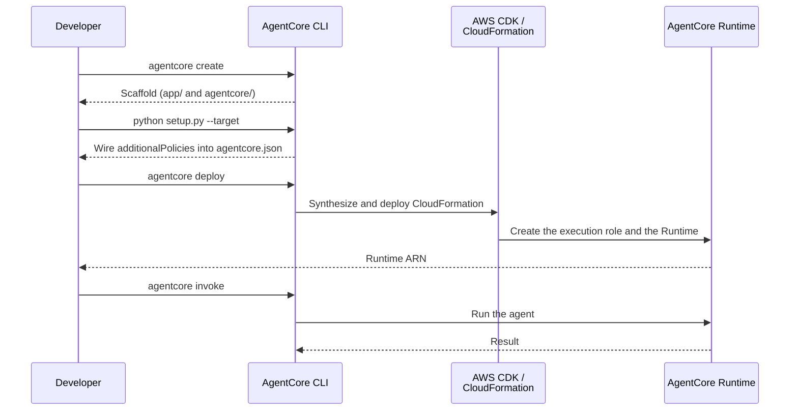

# AgentCore Runtime Integration

[English](README.md) / [日本語](README_ja.md)

This implementation demonstrates **AgentCore Runtime** deployment using the **AgentCore CLI**. `agentcore deploy` creates the execution role and the Runtime together through the AWS CDK, so there is no IAM role script and no `agentcore configure` step.

## Process Overview



## Prerequisites

1. **Agent source code** - the base `agents/CostEstimatorAgent` is used as-is
2. **AWS credentials** - with Bedrock and CloudFormation permissions
3. **Node.js** - required by the CDK (used by `agentcore deploy`)
4. **AgentCore CLI** - `npm install -g @aws/agentcore`
5. **CDK bootstrap** - run `cdk bootstrap` in the target region
6. **Dependencies** - installed via `uv` (see pyproject.toml)

## How to use

### File Structure

Lab 2 deploys the **base agent as-is**, so no agent code lives in this directory.

```
02_runtime/
├── README.md                    # This document
└── invoke_agent.py              # Client that calls InvokeAgentRuntime via boto3
```

The agent implementation lives in `agents/CostEstimatorAgent/app/CostEstimatorAgent/`.

### Step 1: Scaffold the Project

```bash
cd agents
agentcore create \
    --name MyCostEstimatorAgent \
    --framework Strands \
    --model-provider Bedrock \
    --protocol HTTP \
    --build CodeZip \
    --memory none \
    --skip-git
```

This creates `app/` for the agent code and `agentcore/` for the configuration and CDK project.

### Step 2: Copy in the Base Agent Code

```bash
python setup.py --target MyCostEstimatorAgent
```

`setup.py` copies the code and `iam_policies/` from `agents/CostEstimatorAgent/` into the scaffold and wires the IAM policies into `runtimes[0].additionalPolicies` in `agentcore.json`.

### Step 3: Deploy and Invoke

```bash
# Install dependencies
cd MyCostEstimatorAgent/app/MyCostEstimatorAgent
uv sync

# Deploy (the CDK creates the execution role and the Runtime)
cd ../..
agentcore deploy

# Check the deployment
agentcore status

# Test your agent
agentcore invoke 'I want a small EC2 instance for SSH access in us-west-2. What does it cost?'
```

Applications call the agent through boto3.

```bash
cd ../../02_runtime
uv run python invoke_agent.py --agent-arn <runtime-arn>

# Demo showing that conversation continuity is scoped to a session
uv run python invoke_agent.py --agent-arn <runtime-arn> --demo-session
```

`invoke_agent.py` options:

| Flag | Description | Default |
|---|---|---|
| `--agent-arn` | Runtime ARN (see `agentcore status`) | required |
| `--prompt` | Prompt to send | an S3 cost estimate |
| `--session-id` | Runtime session ID (33+ characters) | a fresh UUID |
| `--region` | AWS region | from the profile |
| `--demo-session` | Run a 3-call demo showing session-scoped conversation continuity | — |
| `--demo-first-prompt` | First prompt of `--demo-session` | English default |
| `--demo-followup-prompt` | Follow-up prompt of `--demo-session`, reused for the new session | English default |

The agent answers in the language of the prompt, so pass a translated `--prompt` to run the
check in another language.

### Step 4: Clean Up

```bash
cd ../agents/MyCostEstimatorAgent
agentcore remove all
agentcore deploy   # apply the removal to AWS (tears down the stack)
```

Deletion takes two steps: `agentcore remove all` empties the declarations in
`agentcore.json`, and `agentcore deploy` applies that removal to AWS. **`remove` alone
leaves the AWS resources in place.**

Everything in this directory is managed by the AgentCore CLI, so no cleanup script is
needed. Keep the runtime if you plan to continue with Lab 4 (Observability) or
Lab 5 (Evaluation).

## Key Implementation Pattern

### Declarative Deployment Configuration

Deployment settings are declared in `agentcore/agentcore.json`.

```json
{
  "name": "MyCostEstimatorAgent",
  "managedBy": "CDK",
  "runtimes": [
    {
      "name": "MyCostEstimatorAgent",
      "build": "CodeZip",
      "entrypoint": "main.py",
      "codeLocation": "app/MyCostEstimatorAgent/",
      "runtimeVersion": "PYTHON_3_14",
      "networkMode": "PUBLIC",
      "protocol": "HTTP",
      "additionalPolicies": [
        "iam_policies/code-interpreter-policy.json",
        "iam_policies/pricing-api-policy.json"
      ]
    }
  ]
}
```

### Agent-Specific IAM Permissions via additionalPolicies

Runtime-wide permissions such as `bedrock:InvokeModel`, `logs:*` and `xray:*` are granted automatically by `agentcore deploy`. **Agent-specific permissions are not.** Because this agent uses the Code Interpreter and the AWS Pricing API, `setup.py` wires two policies in.

```python
# agents/setup.py
def configure_additional_policies(agentcore_json_path: Path, policies: list[str]) -> None:
    """Add additionalPolicies to runtimes[0] in agentcore.json."""
    with open(agentcore_json_path, "r") as f:
        config = json.load(f)

    if config.get("runtimes"):
        config["runtimes"][0]["additionalPolicies"] = policies

    with open(agentcore_json_path, "w") as f:
        json.dump(config, f, indent=2)
        f.write("\n")
```

### Runtime Entrypoint Pattern

`main.py` takes the `AWSCostEstimatorAgent` singleton and streams the response.

```python
# agents/CostEstimatorAgent/app/CostEstimatorAgent/main.py
app = BedrockAgentCoreApp()
_agent = None


def get_or_create_agent() -> AWSCostEstimatorAgent:
    """Get or create the cost estimation agent (singleton)."""
    global _agent
    if _agent is None:
        _agent = AWSCostEstimatorAgent(region=REGION)
    return _agent


@app.entrypoint
async def invoke(payload, context):
    """AgentCore Runtime entrypoint with streaming response."""
    agent = get_or_create_agent()
    async for event in agent.stream(prompt):
        # ... handle deltas and yield
```

### Parsing Server-Sent Events

Because the entrypoint yields text deltas, the `InvokeAgentRuntime` response is **Server-Sent Events** (`text/event-stream`) rather than JSON. Each `data: "<string>"` line has to be decoded with `json.loads` and concatenated.

```python
# 02_runtime/invoke_agent.py
response = client.invoke_agent_runtime(
    agentRuntimeArn=agent_arn,
    runtimeSessionId=session_id,
    contentType="application/json",
    payload=json.dumps({"prompt": prompt}).encode(),
    qualifier="DEFAULT",
)

for line in response["response"].iter_lines():
    if not line:
        continue
    decoded = line.decode("utf-8")
    if not decoded.startswith("data: "):
        continue
    print(json.loads(decoded[len("data: "):]), end="", flush=True)
```

## Usage Example

```bash
# One-off estimate
uv run python invoke_agent.py --agent-arn <runtime-arn> \
    --prompt "Estimate the monthly cost of storing 10GB in S3 in us-west-2."

# Continue the conversation in a specific session
uv run python invoke_agent.py --agent-arn <runtime-arn> \
    --session-id <33+ character ID> --prompt "What if I stop it at night?"
```

`--demo-session` makes three calls to show what a session buys you.

```
[1] session=15497370-...  → t3.nano estimate
[2] same session          → It was **t3.nano**.
[3] new session           → I do not retain conversation history.
```

## Integration Benefits

- **One-command deploy** - `agentcore deploy` covers IAM role creation through Runtime creation
- **Declarative configuration** - everything needed lives in `agentcore.json`, no arguments to memorize
- **Infrastructure as Code** - managed by the CDK / CloudFormation, so resources are created and deleted as a stack
- **No Docker required** - the `CodeZip` build packages the code as a zip and uploads it to S3

## References

- [AgentCore Runtime Developer Guide](https://docs.aws.amazon.com/bedrock-agentcore/latest/devguide/agents-tools-runtime.html)
- [Get started with the AgentCore CLI](https://docs.aws.amazon.com/bedrock-agentcore/latest/devguide/runtime-get-started-cli.html)
- [Runtime Permissions Documentation](https://docs.aws.amazon.com/bedrock-agentcore/latest/devguide/runtime-permissions.html)
- [boto3 invoke_agent_runtime](https://docs.aws.amazon.com/boto3/latest/reference/services/bedrock-agentcore/client/invoke_agent_runtime.html)
- [AgentCore CLI](https://github.com/aws/agentcore-cli)

---

**Next Steps**: Integrate the deployed agent into your application and continue with [03_memory](../03_memory/README.md) to add context-aware capabilities to your agents.
