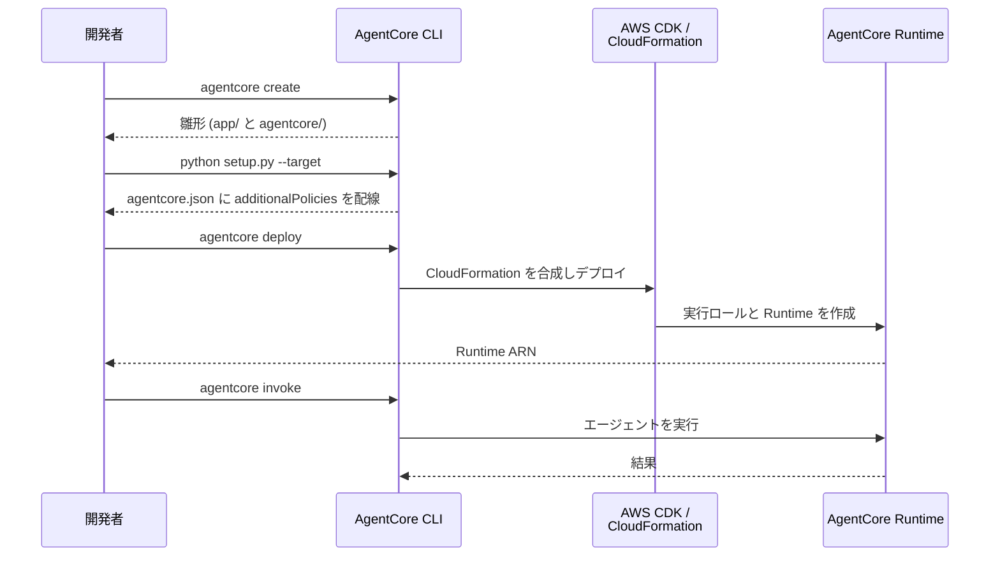

# AgentCore Runtime統合

[English](README.md) / [日本語](README_ja.md)

この実装では、**AgentCore CLI** を使用した **AgentCore Runtime** デプロイメントを実演します。`agentcore deploy` が AWS CDK 経由で実行ロールと Runtime をまとめて作成するため、IAM ロール作成スクリプトや `agentcore configure` は不要です。

## プロセス概要



## 前提条件

1. **エージェントソースコード** - ベースの `agents/CostEstimatorAgent` をそのまま使用
2. **AWS認証情報** - Bedrock と CloudFormation の権限付き
3. **Node.js** - CDK に必要（`agentcore deploy` で使用）
4. **AgentCore CLI** - `npm install -g @aws/agentcore`
5. **CDK ブートストラップ** - デプロイ先リージョンで `cdk bootstrap` 済みであること
6. **依存関係** - `uv`経由でインストール（pyproject.toml参照）

## 使用方法

### ファイル構成

Lab 2 は **ベースのエージェントをそのままデプロイする** ため、agent code はこのディレクトリには置きません。

```
02_runtime/
├── README.md                    # このドキュメント
└── invoke_agent.py              # boto3 (InvokeAgentRuntime) から呼び出すクライアント
```

エージェントの実装は `agents/CostEstimatorAgent/app/CostEstimatorAgent/` にあります。

### ステップ1: プロジェクトの雛形を作成

```bash
cd agents
agentcore create \
    --name MyCostEstimatorAgent \
    --framework Strands \
    --model-provider Bedrock \
    --protocol HTTP \
    --build CodeZip \
    --memory none \
    --skip-git
```

これにより、エージェントコードを置く `app/` と、設定・CDK プロジェクトを置く `agentcore/` が作成されます。

### ステップ2: ベースのエージェントコードを配置

```bash
python setup.py --target MyCostEstimatorAgent
```

`setup.py` が `agents/CostEstimatorAgent/` のコードと `iam_policies/` を雛形へコピーし、`agentcore.json` の `runtimes[0].additionalPolicies` に IAM ポリシーを配線します。

### ステップ3: デプロイして呼び出す

```bash
# 依存関係をインストール
cd MyCostEstimatorAgent/app/MyCostEstimatorAgent
uv sync

# デプロイ（実行ロールと Runtime を CDK が作成）
cd ../..
agentcore deploy

# デプロイ結果を確認
agentcore status

# エージェントをテスト
agentcore invoke '小規模な EC2 インスタンスで SSH 接続用の環境を us-west-2 に準備したい。コストはいくらですか？'
```

アプリケーションからの呼び出しは boto3 で行います。

```bash
cd ../../02_runtime
uv run python invoke_agent.py --agent-arn <runtime-arn>

# セッション単位で会話が継続することを確認するデモ
uv run python invoke_agent.py --agent-arn <runtime-arn> --demo-session
```

`invoke_agent.py` のオプション:

| フラグ | 説明 | デフォルト |
|---|---|---|
| `--agent-arn` | Runtime ARN (`agentcore status` で確認) | 必須 |
| `--prompt` | 送信するプロンプト | S3 のコスト見積り |
| `--session-id` | Runtime セッション ID (33 文字以上) | 新規 UUID |
| `--region` | AWS リージョン | プロファイルの設定 |
| `--demo-session` | セッション単位で会話が継続することを示す 3 回の呼び出しを実行 | — |
| `--demo-first-prompt` | `--demo-session` の 1 回目のプロンプト | 英語の既定文 |
| `--demo-followup-prompt` | `--demo-session` の追い質問。新しいセッションでも同じ文を使う | 英語の既定文 |

エージェントはプロンプトの言語で応答します。日本語で確認する場合は `--prompt` や
`--demo-*-prompt` に日本語を渡してください。

### ステップ4: 後片付け

```bash
cd ../agents/MyCostEstimatorAgent
agentcore remove all
agentcore deploy   # 削除内容を AWS へ適用（スタックを削除）
```

削除は 2 段階です。`agentcore remove all` が `agentcore.json` の宣言を空にし、
`agentcore deploy` がその削除を AWS に適用します。**`remove` だけでは AWS のリソースは
残ったままです。**

このディレクトリのリソースはすべて AgentCore CLI の管理下にあるため、後片付け用の
スクリプトは不要です。Lab 4（Observability）や Lab 5（Evaluation）を続けて行う場合は、
削除せずに残しておいてください。

## 主要な実装パターン

### 宣言的なデプロイ設定

デプロイ設定は `agentcore/agentcore.json` に宣言します。

```json
{
  "name": "MyCostEstimatorAgent",
  "managedBy": "CDK",
  "runtimes": [
    {
      "name": "MyCostEstimatorAgent",
      "build": "CodeZip",
      "entrypoint": "main.py",
      "codeLocation": "app/MyCostEstimatorAgent/",
      "runtimeVersion": "PYTHON_3_14",
      "networkMode": "PUBLIC",
      "protocol": "HTTP",
      "additionalPolicies": [
        "iam_policies/code-interpreter-policy.json",
        "iam_policies/pricing-api-policy.json"
      ]
    }
  ]
}
```

### エージェント固有の IAM 権限は additionalPolicies で宣言

`bedrock:InvokeModel` や `logs:*`、`xray:*` といった Runtime 共通の権限は `agentcore deploy` が自動で付与します。一方、**エージェント固有の権限は自動では付与されません**。Code Interpreter と AWS Pricing API を使うため、`setup.py` が次の2つを配線します。

```python
# agents/setup.py
def configure_additional_policies(agentcore_json_path: Path, policies: list[str]) -> None:
    """Add additionalPolicies to runtimes[0] in agentcore.json."""
    with open(agentcore_json_path, "r") as f:
        config = json.load(f)

    if config.get("runtimes"):
        config["runtimes"][0]["additionalPolicies"] = policies

    with open(agentcore_json_path, "w") as f:
        json.dump(config, f, indent=2)
        f.write("\n")
```

### Runtimeエントリーポイントパターン

`main.py` は `AWSCostEstimatorAgent` の singleton を取り出し、ストリーミングで応答します。

```python
# agents/CostEstimatorAgent/app/CostEstimatorAgent/main.py
app = BedrockAgentCoreApp()
_agent = None


def get_or_create_agent() -> AWSCostEstimatorAgent:
    """Get or create the cost estimation agent (singleton)."""
    global _agent
    if _agent is None:
        _agent = AWSCostEstimatorAgent(region=REGION)
    return _agent


@app.entrypoint
async def invoke(payload, context):
    """AgentCore Runtime entrypoint with streaming response."""
    agent = get_or_create_agent()
    async for event in agent.stream(prompt):
        # ... delta 処理して yield
```

### Server-Sent Events のパース

エントリポイントがテキストの差分を `yield` するため、`InvokeAgentRuntime` のレスポンスは JSON ではなく **Server-Sent Events**（`text/event-stream`）になります。`data: "<文字列>"` の行を `json.loads` でデコードして連結する必要があります。

```python
# 02_runtime/invoke_agent.py
response = client.invoke_agent_runtime(
    agentRuntimeArn=agent_arn,
    runtimeSessionId=session_id,
    contentType="application/json",
    payload=json.dumps({"prompt": prompt}).encode(),
    qualifier="DEFAULT",
)

for line in response["response"].iter_lines():
    if not line:
        continue
    decoded = line.decode("utf-8")
    if not decoded.startswith("data: "):
        continue
    print(json.loads(decoded[len("data: "):]), end="", flush=True)
```

## 使用例

```bash
# 単発の見積り
uv run python invoke_agent.py --agent-arn <runtime-arn> \
    --prompt "us-west-2 で S3 に 10GB 保存した場合の月額を見積もってください。"

# セッションを指定して会話を継続
uv run python invoke_agent.py --agent-arn <runtime-arn> \
    --session-id <33文字以上のID> --prompt "では停止時間を考慮した場合は？"
```

`--demo-session` は 3 回の呼び出しでセッションの効果を示します。

```
[1] session=15497370-...  → t3.nano の見積り
[2] same session          → **t3.nano** です。
[3] new session           → 会話履歴を記憶していません。
```

## 統合の利点

- **1コマンドでデプロイ** - IAM ロール作成から Runtime 作成まで `agentcore deploy` が担う
- **宣言的な設定** - デプロイに必要な情報は `agentcore.json` に集約され、引数を覚える必要がない
- **Infrastructure as Code** - CDK / CloudFormation 管理なので、スタック単位で作成・削除できる
- **Docker 不要** - `CodeZip` ビルドはコードを zip にまとめて S3 経由でデプロイする

## 参考資料

- [AgentCore Runtime開発者ガイド](https://docs.aws.amazon.com/bedrock-agentcore/latest/devguide/agents-tools-runtime.html)
- [AgentCore CLI の利用開始](https://docs.aws.amazon.com/bedrock-agentcore/latest/devguide/runtime-get-started-cli.html)
- [Runtime権限ドキュメント](https://docs.aws.amazon.com/bedrock-agentcore/latest/devguide/runtime-permissions.html)
- [boto3 invoke_agent_runtime](https://docs.aws.amazon.com/boto3/latest/reference/services/bedrock-agentcore/client/invoke_agent_runtime.html)
- [AgentCore CLI](https://github.com/aws/agentcore-cli)

---

**次のステップ**: デプロイしたエージェントをアプリケーションに統合し、[03_memory](../03_memory/README_ja.md) に進んでコンテキスト認識機能を追加しましょう。
