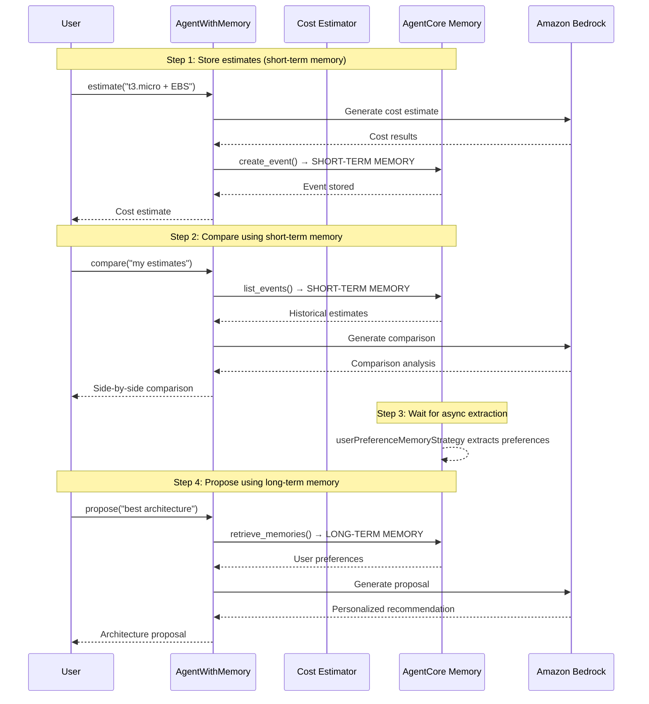

# AgentCore Memory Integration

[English](README.md) / [日本語](README_ja.md)

This implementation demonstrates **AgentCore Memory** capabilities through a cost estimation agent that uses both short-term and long-term memory. The demo integrates the same `AWSCostEstimatorAgent` from Lab 01 (Code Interpreter + MCP pricing) with AgentCore Memory for a real end-to-end workflow.

## Process Overview



## Prerequisites

1. **Cost Estimator deployed** - Complete `01_code_interpreter` setup first
2. **AWS credentials** - With `bedrock-agentcore-control` and `bedrock:InvokeModel` permissions
3. **Dependencies** - Installed via `uv` (see pyproject.toml)

## How to use

### File Structure

```
03_memory/
├── README.md                      # This documentation
└── test_memory.py                 # Main implementation and test suite
```

### Step 1: Run the Demo

```bash
cd 03_memory
uv run python test_memory.py
```

This runs 4 steps sequentially:
1. **Estimate** x2 — generates cost estimates, stores as short-term memory events
2. **Compare** — retrieves events via `list_events()` and generates comparison
3. **Wait** — polls `wait_for_memories()` until async preference extraction completes
4. **Propose** — retrieves preferences via `retrieve_memories()` for personalized recommendation

On first run, memory creation takes ~3 minutes. Subsequent runs reuse existing memory (instant).

### Step 2: Force Recreation (Clean Start)

```bash
cd 03_memory
uv run python test_memory.py --force
```

Deletes existing memory and creates a fresh instance. Use this for a clean start.

## Key Implementation Patterns

### Memory-Enhanced Agent

```python
class AgentWithMemory:
    def __init__(self, actor_id: str, region: str = "us-west-2", force_recreate: bool = False):
        # Initialize AgentCore Memory with user preference strategy
        self.memory = self.memory_client.create_memory_and_wait(
            name="cost_estimator_memory",
            strategies=[{
                "userPreferenceMemoryStrategy": {
                    "name": "UserPreferenceExtractor",
                    "description": "Extracts user preferences for AWS architecture decisions",
                    "namespaces": [f"/preferences/{self.actor_id}"]
                }
            }],
            event_expiry_days=7,
        )
```

### Context Manager Pattern

```python
memory_agent = AgentWithMemory(actor_id="user123")
with memory_agent as agent:
    # Step 1-2: Estimate and compare (short-term memory)
    agent("estimate: t3.micro + EBS")
    agent("estimate: t3.small + ALB + RDS")
    agent("compare my estimates")

    # Step 3: Wait for async preference extraction
    memory_agent.wait_for_long_term_memory(max_wait=180)

    # Step 4: Propose using long-term memory
    agent("propose best architecture")
```

### Memory Storage Pattern

```python
@tool
def estimate(self, architecture_description: str) -> str:
    # Use the Cost Estimator Agent (Code Interpreter + MCP pricing)
    cost_estimator = AWSCostEstimatorAgent(region=self.region)
    result = cost_estimator.estimate_costs(architecture_description)

    # Store interaction → triggers async preference extraction
    self.memory_client.create_event(
        memory_id=self.memory_id,
        actor_id=self.actor_id,
        session_id=self.session_id,
        messages=[
            (architecture_description, "USER"),
            (result, "ASSISTANT")
        ]
    )
    return result
```

## Memory Types Demonstrated

### Short-term Memory (Session Context)
- **API**: `create_event()` to store, `list_events()` to retrieve
- **Purpose**: Store multiple estimates within a session for immediate comparison
- **Use Case**: Compare different EC2 instance types side-by-side

### Long-term Memory (User Preferences)
- **API**: `retrieve_memories()` to retrieve extracted preferences
- **Purpose**: Learn user decision patterns and preferences over time
- **Note**: Extraction is **asynchronous** — use `wait_for_memories()` to poll until ready
- **Use Case**: Recommend architectures based on historical choices

## Usage Examples

### Full Example

```python
from test_memory import AgentWithMemory

memory_agent = AgentWithMemory(actor_id="user123")
with memory_agent as agent:
    # Generate estimates (stored as short-term memory events)
    agent("estimate: 1 EC2 t3.nano instance")
    agent("estimate: 1 EC2 t3.micro with 20GB gp3 EBS")

    # Compare using short-term memory (list_events)
    agent("compare my recent estimates")

    # Wait 60s for async preference extraction (per AWS docs)
    memory_agent.wait_for_long_term_memory(wait_seconds=60)

    # Get personalized recommendation using long-term memory (retrieve_memories)
    agent("propose optimal architecture for my needs")
```

## Memory Benefits

- **Session Continuity** - Compare multiple estimates within the same session
- **Learning Capability** - Agent learns user preferences over time
- **Personalized Recommendations** - Proposals based on historical patterns
- **Cost Optimization** - Memory reuse reduces initialization time
- **Debugging Support** - Event inspection for troubleshooting

## References

- [AgentCore Memory Developer Guide](https://docs.aws.amazon.com/bedrock-agentcore/latest/devguide/memory.html)
- [Memory Strategies Documentation](https://docs.aws.amazon.com/bedrock-agentcore/latest/devguide/memory-strategies.html)
- [Amazon Bedrock Converse API](https://docs.aws.amazon.com/bedrock/latest/userguide/conversation-inference.html)
- [Strands Agents Documentation](https://github.com/aws-samples/strands-agents)

---

**Next Steps**: Integrate memory-enhanced agents into your applications to provide personalized, context-aware user experiences.
