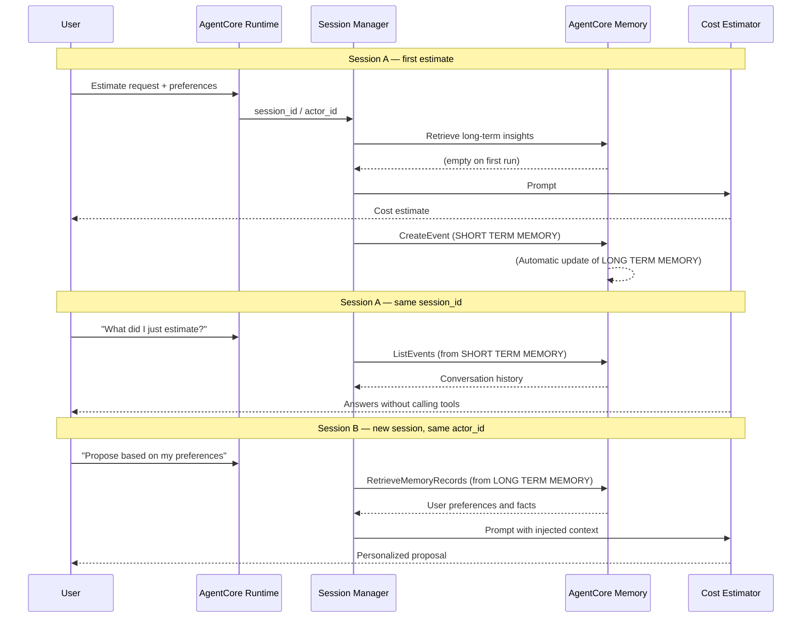

# AgentCore Memory Integration

[English](README.md) / [日本語](README_ja.md)

This implementation demonstrates **AgentCore Memory** capabilities that enhance the AWS cost estimator with both short-term and long-term memory. The Memory resource is declared in `agentcore.json` and created by `agentcore deploy`; wiring it into the Strands Agents **session manager** is enough to get short-term persistence and long-term retrieval automatically.

## Process Overview


```mermaid
sequenceDiagram
    participant User as User
    participant Runtime as AgentCore Runtime
    participant SM as Session Manager
    participant Memory as AgentCore Memory
    participant Agent as Cost Estimator

    Note over User,Agent: Session A — first estimate
    User->>Runtime: Estimate request + preferences
    Runtime->>SM: session_id / actor_id
    SM->>Memory: Retrieve long-term insights
    Memory-->>SM: (empty on first run)
    SM->>Agent: Prompt
    Agent-->>User: Cost estimate
    SM->>Memory: CreateEvent (SHORT TERM MEMORY)
    Memory-->>Memory: (Automatic update of LONG TERM MEMORY)

    Note over User,Agent: Session A — same session_id
    User->>Runtime: "What did I just estimate?"
    SM->>Memory: ListEvents (from SHORT TERM MEMORY)
    Memory-->>SM: Conversation history
    Agent-->>User: Answers without calling tools

    Note over User,Agent: Session B — new session, same actor_id
    User->>Runtime: "Propose based on my preferences"
    SM->>Memory: RetrieveMemoryRecords (from LONG TERM MEMORY)
    Memory-->>SM: User preferences and facts
    SM->>Agent: Prompt with injected context
    Agent-->>User: Personalized proposal
```

## Prerequisites

1. **Runtime deployment understood** - Complete the `02_runtime` setup first
2. **AWS credentials** - with `bedrock-agentcore-control` and `bedrock:InvokeModel` permissions
3. **Node.js** - required by the CDK (used by `agentcore deploy`)
4. **AgentCore CLI** - `npm install -g @aws/agentcore`
5. **Dependencies** - installed via `uv` (see pyproject.toml)

## How to use

### File Structure

`agents/` holds only the base `CostEstimatorAgent`. Lab-specific differences live in `agent/` and are **layered on top of** the base.

```
03_memory/
├── README.md                      # This document
├── agent/                         # Lab 3 code layered over the base
│   ├── main.py                    # Entrypoint resolving session_id / actor_id (overwrites)
│   ├── cost_estimator_agent.py    # Facade building one Agent per (session, actor) (overwrites)
│   └── memory_session.py          # Session manager bridging Memory and Strands (adds)
└── test_memory.py                 # Verifies short-term, long-term memory and actor isolation
```

`config.py`, `__init__.py`, `pyproject.toml` and `iam_policies/` are inherited from the base.

### Step 1: Add memory to the existing project

Add memory to `MyCostEstimatorAgent`, the project deployed in Lab 2. No new project is created.

```bash
cd ../agents/MyCostEstimatorAgent
agentcore add memory \
    --name MyCostEstimatorAgentMemory \
    --strategies SEMANTIC,USER_PREFERENCE,SUMMARIZATION,EPISODIC
```

This declares four memory strategies, each with its namespace templates, under `memories[]`
in `agentcore.json`.

| Strategy | namespaceTemplates |
|---|---|
| `SEMANTIC` | `/users/{actorId}/facts` |
| `USER_PREFERENCE` | `/users/{actorId}/preferences` |
| `SUMMARIZATION` | `/summaries/{actorId}/{sessionId}` |
| `EPISODIC` | `/episodes/{actorId}/{sessionId}` (reflection: `/episodes/{actorId}`) |

> For a brand-new project, `agentcore create --memory longAndShortTerm` declares the same four
> strategies up front. `--memory` accepts `none`, `shortTerm`, or `longAndShortTerm`.

### Step 2: Place the base + overlay and deploy

```bash
cd ../
python setup.py --target MyCostEstimatorAgent --overlay ../03_memory/agent
```

Output:

```
📁 Copying base agent: CostEstimatorAgent → MyCostEstimatorAgent
   __init__.py, config.py, cost_estimator_agent.py, main.py, pyproject.toml
🧩 Applying overlay: 03_memory/agent
   cost_estimator_agent.py, main.py, memory_session.py
🔧 Configuring additionalPolicies: [...]
```

```bash
cd MyCostEstimatorAgent/app/MyCostEstimatorAgent
uv sync
cd ../..
agentcore deploy
```

CDK creates the memory and injects its ID as the `MEMORY_MYCOSTESTIMATORAGENTMEMORY_ID`
environment variable. `memory_session.py` looks for any variable starting with `MEMORY_`, so
renaming the memory needs no code change.

### Step 3: Verify the Memory Behaviour

```bash
cd ../../03_memory
uv run python test_memory.py \
    --agent-arn <runtime-arn> \
    --memory-id <memory-id>
```

The script runs three phases in order (use `--phase short|long|isolation` to run one).

1. **Short-term memory** - two turns in the same session; the agent recalls the previous estimate without calling any tool
2. **Long-term memory** - a new session asks a preference-dependent question; Graviton and the budget carry over
3. **Actor isolation** - a different `actor_id` cannot see that long-term memory

Long-term extraction is asynchronous. The script polls for records for up to `--wait` seconds (300 by default).

Note that `runtimeSessionId` must be at least 33 characters — a shorter value fails with `Value at 'runtimeSessionId' failed to satisfy constraint` — so the script uses UUIDs.

### Step 4: Clean Up

Labs 4 and 5 use the runtime, so keep it and remove only the memory. Mirror the way it was
added: `remove memory`, then `deploy`.

```bash
cd ../agents/MyCostEstimatorAgent
agentcore remove memory --name MyCostEstimatorAgentMemory
agentcore deploy
```

**`remove` alone leaves the AWS resources in place.**

Verify the deletion:

```bash
aws bedrock-agentcore-control list-memories \
  --query 'memories[?starts_with(id,`MyCostEstimatorAgent`)].id'
aws bedrock-agentcore-control list-agent-runtimes \
  --query 'agentRuntimes[?starts_with(agentRuntimeName,`MyCostEstimatorAgent`)].agentRuntimeName'
```

The memory list should be `[]` while the runtime remains. Removing the memory drops the
`MEMORY_*_ID` variable, so the session manager goes inactive and the agent behaves like
Lab 2's memory-less version again.

`test_memory.py` options:

| Flag | Description | Default |
|---|---|---|
| `--agent-arn` | Runtime ARN (see `agentcore status`) | required |
| `--memory-id` | Memory ID (see `agentcore status`) | required |
| `--actor-id` | Actor that owns the memory | `user-alice` |
| `--other-actor-id` | Actor used for the isolation check | `user-bob` |
| `--region` | AWS region | from the profile |
| `--wait` | Seconds to wait for asynchronous long-term extraction | 300 |
| `--phase` | Which phase to run (`all` / `short` / `long` / `isolation`) | `all` |

Each phase's prompt can be overridden. The agent answers in the language of the prompt, so
these are how the verification runs in another language.

| Flag | Phase |
|---|---|
| `--prompt-estimate` | [1] Ask for an estimate and state a general preference |
| `--prompt-recall` | [2] Ask about the previous estimate in the same session |
| `--prompt-preference` | [3] State the preferences long-term memory should extract |
| `--prompt-long-term` | [5] Preference-dependent question in a new session |
| `--prompt-isolation` | [6] Same question asked as a different actor |

## Key Implementation Patterns

### The Session Manager Calls the Memory APIs for You

Passing the `AgentCoreMemorySessionManager` from `memory_session.py` to `Agent` wires the Memory APIs through Strands hooks. `CreateEvent` and `RetrieveMemoryRecords` never appear in the agent code.

| When | API called | Purpose |
|---|---|---|
| Session start | `ListEvents` | Restore the conversation for this session (short-term) |
| Each user turn | `RetrieveMemoryRecords` | Search long-term memory and inject `<user_context>` |
| Each message added | `CreateEvent` | Persist to short-term memory; triggers async extraction |

```python
# 03_memory/agent/memory_session.py
def get_memory_session_manager(session_id, actor_id):
    memory_id = resolve_memory_id()
    if not memory_id:
        return None

    retrieval_config = {
        f"/users/{actor_id}/facts": RetrievalConfig(top_k=3, relevance_score=0.3),
        f"/users/{actor_id}/preferences": RetrievalConfig(top_k=3, relevance_score=0.3),
    }

    return AgentCoreMemorySessionManager(
        AgentCoreMemoryConfig(
            memory_id=memory_id,
            session_id=session_id,
            actor_id=actor_id,
            retrieval_config=retrieval_config,
            async_mode=True,
        ),
        os.environ.get("AWS_REGION"),
    )
```

### Resolving the Memory ID from the Environment

`agentcore deploy` creates the Memory and injects its ID as `MEMORY_<NAME>_ID`. The CLI scaffold hard-codes that name; this implementation discovers any `MEMORY_*_ID` variable so the code does not depend on the project name.

```python
def resolve_memory_id() -> Optional[str]:
    """Resolve the Memory ID injected by agentcore deploy."""
    explicit = os.environ.get("AGENTCORE_MEMORY_ID")
    if explicit:
        return explicit
    for key, value in os.environ.items():
        if key.startswith("MEMORY_") and key.endswith("_ID") and value:
            return value
    return None
```

### One Agent per (session, actor)

The session manager is bound to a session, so each session needs its own `Agent`. The MCP client and the Code Interpreter session are expensive to create, so they stay shared.

```python
# 03_memory/agent/cost_estimator_agent.py
class AWSCostEstimatorAgent:
    def _initialize(self) -> None:
        # Shared resources: built once
        pricing_tools = self._prepare_pricing_tools()
        self._prepare_code_interpreter()
        self._tools = pricing_tools + [self._prepare_cost_calculation_tool()]

    def agent_for(self, session_id, actor_id) -> Agent:
        # Agent: built and cached per (session, actor)
        key = (session_id, actor_id)
        if key not in self._agents:
            self._agents[key] = Agent(
                model=self._load_model(),
                system_prompt=SYSTEM_PROMPT,
                tools=self._tools,
                session_manager=get_memory_session_manager(session_id, actor_id),
                conversation_manager=NullConversationManager(),
            )
        return self._agents[key]
```

### actor_id Comes from the Payload

`agentcore invoke --user-id` travels as the `X-Amzn-Bedrock-AgentCore-Runtime-User-Id` header, which the Runtime does not forward to agent code, so `context.user_id` is empty. `main.py` therefore also accepts `actor_id` in the payload.

```python
# 03_memory/agent/main.py
def _resolve_actor_id(payload: dict, context) -> str:
    return (
        getattr(context, "user_id", None)
        or payload.get("actor_id")
        or DEFAULT_ACTOR_ID
    )
```

### Keep Retrieval Namespaces Aligned with namespaceTemplates

`agentcore deploy` grants `RetrieveMemoryRecords` with an IAM condition that matches **only the `namespaceTemplates`**. An EPISODIC strategy's `reflectionNamespaceTemplates` (`/episodes/{actorId}`) is not covered, so retrieving from it fails with `AccessDeniedException`. That is why `retrieval_config` targets only the two actor-scoped namespaces.

### Keep relevance_score Low

`relevance_score` is a floor on the semantic search score. Extracted preferences typically score around 0.4–0.5, so the scaffold default of 0.5 filters almost everything out. `memory_session.py` uses 0.3.

## Memory Types Demonstrated

### Short-term Memory (Session Context)

- Stores conversation events within the same `session_id` and restores them on the next turn
- Retention is controlled by `eventExpiryDuration` (7–365 days, 30 by default)
- Lets the agent answer about a previous estimate without calling the Pricing API or the Code Interpreter

### Long-term Memory (User Preferences)

- Memory Strategies asynchronously extract facts, preferences, summaries and episodes from conversations
- `{actorId}` in `namespaceTemplates` isolates insights per user
- Enables personalized proposals across sessions

## Usage Examples

### Verify all three memory phases

```bash
uv run python test_memory.py --agent-arn <runtime-arn> --memory-id <memory-id>
```

### Inspect long-term memory directly

```bash
aws bedrock-agentcore retrieve-memory-records \
  --memory-id <memory-id> \
  --namespace "/users/default-user/preferences" \
  --search-criteria '{"searchQuery":"user preferences for AWS instance type and budget","topK":3}'
```

```
{"context":"The user explicitly stated a preference for Graviton (ARM) instances.",
 "preference":"Prefers Graviton (ARM) instances for AWS EC2",...}
{"context":"The user explicitly stated they always use us-west-2.",
 "preference":"Always uses the us-west-2 AWS region",...}
```

### Check Memory Strategy status

```bash
aws bedrock-agentcore-control get-memory --memory-id <memory-id> \
  --query 'memory.strategies[].[type,status,namespaces]'
```

## Memory Benefits

- **Declarative configuration** - Memory resources and strategies are just declared in `agentcore.json`
- **Automated API calls** - the session manager handles `ListEvents` / `CreateEvent` / `RetrieveMemoryRecords`
- **Privacy by design** - `{actorId}` and `{sessionId}` in `namespaceTemplates` isolate memory
- **Personalization** - preferences extracted from past conversations carry into the next session

## References

- [AgentCore Memory Developer Guide](https://docs.aws.amazon.com/bedrock-agentcore/latest/devguide/memory.html)
- [Saving and retrieving long-term insights](https://docs.aws.amazon.com/bedrock-agentcore/latest/devguide/long-term-saving-and-retrieving-insights.html)
- [AgentCore CLI - Memory](https://github.com/aws/agentcore-cli/blob/main/docs/memory.md)
- [Strands Agents - Session Management](https://strandsagents.com/latest/documentation/docs/user-guide/concepts/agents/sessions-state/)

---

**Next Steps**: Integrate the memory-enhanced agent into your application to deliver personalized, context-aware user experiences.
