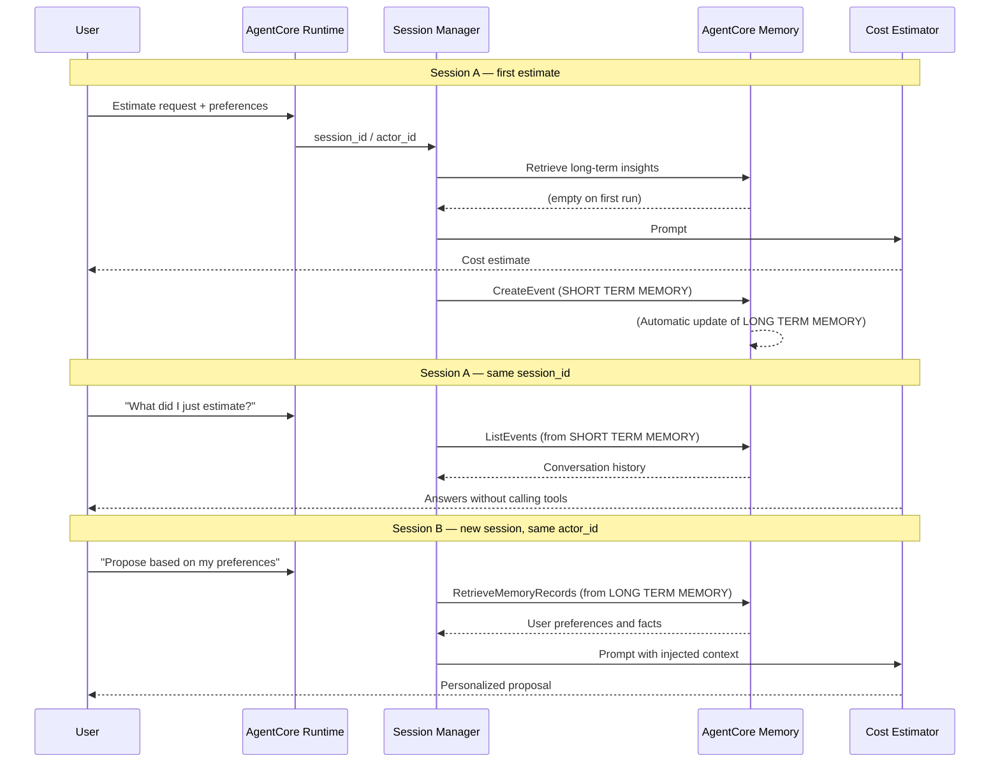

# AgentCore Memory統合

[English](README.md) / [日本語](README_ja.md)

この実装では、短期および長期メモリ機能の両方でAWSコスト見積もりツールを強化する **AgentCore Memory** 機能を実演します。Memory リソースは `agentcore.json` に宣言して `agentcore deploy` が作成し、Strands Agents の **session manager** に配線するだけで、短期記憶の保存と長期記憶の検索が自動で行われます。

## プロセス概要



## 前提条件

1. **Runtime デプロイ手順の理解** - まず`02_runtime`セットアップを完了
2. **AWS認証情報** - `bedrock-agentcore-control`と`bedrock:InvokeModel`権限付き
3. **Node.js** - CDK に必要（`agentcore deploy` で使用）
4. **AgentCore CLI** - `npm install -g @aws/agentcore`
5. **依存関係** - `uv`経由でインストール（pyproject.toml参照）

## 使用方法

### ファイル構成

`agents/` にはベースの `CostEstimatorAgent` だけを置き、Lab 固有の差分は `agent/` に置いてベースへ **被せる（overlay）** 運用です。

```
03_memory/
├── README.md                      # このドキュメント
├── agent/                         # ベースへ被せるLab 3固有のコード
│   ├── main.py                    # session_id / actor_id を解決するエントリポイント（上書き）
│   ├── cost_estimator_agent.py    # Agentを(session, actor)ごとに生成するFacade（上書き）
│   └── memory_session.py          # AgentCore MemoryとStrandsをつなぐsession manager（追加）
└── test_memory.py                 # 短期記憶 / 長期記憶 / actor分離の検証スクリプト
```

`config.py`、`__init__.py`、`pyproject.toml`、`iam_policies/` はベースから引き継ぎます。

### ステップ1: 既存のプロジェクトに Memory を追加

Lab 2 でデプロイした `MyCostEstimatorAgent` に Memory を追加します。新しいプロジェクトは
作りません。

```bash
cd ../agents/MyCostEstimatorAgent
agentcore add memory \
    --name MyCostEstimatorAgentMemory \
    --strategies SEMANTIC,USER_PREFERENCE,SUMMARIZATION,EPISODIC
```

`agentcore.json` の `memories[]` に、4つのMemory Strategyが namespaceTemplates つきで
宣言されます。

| Strategy | namespaceTemplates |
|---|---|
| `SEMANTIC` | `/users/{actorId}/facts` |
| `USER_PREFERENCE` | `/users/{actorId}/preferences` |
| `SUMMARIZATION` | `/summaries/{actorId}/{sessionId}` |
| `EPISODIC` | `/episodes/{actorId}/{sessionId}`（reflection: `/episodes/{actorId}`） |

> 新規プロジェクトを作る場合は `agentcore create --memory longAndShortTerm` で同じ4戦略を
> 最初から宣言できます。`--memory` は `none` / `shortTerm` / `longAndShortTerm` を取ります。

### ステップ2: ベース + overlay を配置してデプロイ

```bash
cd ../
python setup.py --target MyCostEstimatorAgent --overlay ../03_memory/agent
```

実行結果:

```
📁 Copying base agent: CostEstimatorAgent → MyCostEstimatorAgent
   __init__.py, config.py, cost_estimator_agent.py, main.py, pyproject.toml
🧩 Applying overlay: 03_memory/agent
   cost_estimator_agent.py, main.py, memory_session.py
🔧 Configuring additionalPolicies: [...]
```

```bash
cd MyCostEstimatorAgent/app/MyCostEstimatorAgent
uv sync
cd ../..
agentcore deploy
```

Memory リソースは CDK が作成し、その ID が `MEMORY_MYCOSTESTIMATORAGENTMEMORY_ID` という
環境変数として Runtime に注入されます。`memory_session.py` は `MEMORY_` で始まる環境変数を
探すので、Memory 名を変えてもコードの修正は不要です。

### ステップ3: 記憶の動作を確認

```bash
cd ../../03_memory
uv run python test_memory.py \
    --agent-arn <runtime-arn> \
    --memory-id <memory-id>
```

スクリプトは3つのフェーズを順に実行します（`--phase short|long|isolation` で個別実行も可能）。

1. **短期記憶** - 同一セッションで2ターン。ツールを呼ばずに前の見積りを想起します
2. **長期記憶** - 新しいセッションで好みに依存する質問。Gravitonや予算が引き継がれます
3. **actor分離** - 別の `actor_id` では長期記憶が見えないことを確認します

長期記憶の抽出は非同期です。`--wait`（既定300秒）の間、レコードが現れるまでポーリングします。

なお `runtimeSessionId` は33文字以上である必要があります。短いと `Value at 'runtimeSessionId' failed to satisfy constraint` というエラーになるため、スクリプトでは UUID を使っています。

### ステップ4: 後片付け

Runtime は Lab 4 / Lab 5 で使うため残し、Memory だけを削除します。追加したときと対称に
`remove memory` → `deploy` の順で実行します。

```bash
cd ../agents/MyCostEstimatorAgent
agentcore remove memory --name MyCostEstimatorAgentMemory
agentcore deploy
```

**`remove` だけでは AWS のリソースは残ったままです。**

削除できたことを確認します。

```bash
aws bedrock-agentcore-control list-memories \
  --query 'memories[?starts_with(id,`MyCostEstimatorAgent`)].id'
aws bedrock-agentcore-control list-agent-runtimes \
  --query 'agentRuntimes[?starts_with(agentRuntimeName,`MyCostEstimatorAgent`)].agentRuntimeName'
```

Memory は `[]` になり、Runtime は残っているのが正しい状態です。Memory を削除すると
`MEMORY_*_ID` が消えるため session manager は無効になり、Lab 2 と同じ記憶なしの動作に
戻ります。

`test_memory.py` のオプション:

| フラグ | 説明 | デフォルト |
|---|---|---|
| `--agent-arn` | Runtime ARN (`agentcore status` で確認) | 必須 |
| `--memory-id` | Memory ID (`agentcore status` で確認) | 必須 |
| `--actor-id` | 記憶の所有者となる actor | `user-alice` |
| `--other-actor-id` | 分離の確認に使う別 actor | `user-bob` |
| `--region` | AWS リージョン | プロファイルの設定 |
| `--wait` | 長期記憶の非同期抽出を待つ秒数 | 300 |
| `--phase` | 実行する検証段階 (`all` / `short` / `long` / `isolation`) | `all` |

各段階のプロンプトも差し替えられます。エージェントはプロンプトの言語で応答するため、
日本語で検証する場合はこちらを使います。

| フラグ | 対応する段階 |
|---|---|
| `--prompt-estimate` | [1] 見積りを依頼し、一般的な好みを伝える |
| `--prompt-recall` | [2] 同じセッションで直前の見積りについて尋ねる |
| `--prompt-preference` | [3] 長期記憶に抽出させたい好みを述べる |
| `--prompt-long-term` | [5] 新しいセッションで、好みに依存する質問をする |
| `--prompt-isolation` | [6] 別の actor として同じ質問をする |

## 主要な実装パターン

### session manager が Memory API を代行する

`memory_session.py` の `AgentCoreMemorySessionManager` を `Agent` に渡すと、Strands の hook 経由で Memory API が自動的に呼ばれます。エージェント側のコードに `CreateEvent` や `RetrieveMemoryRecords` は現れません。

| タイミング | 呼ばれる API | 役割 |
|---|---|---|
| セッション開始時 | `ListEvents` | 同一セッションの会話履歴を復元（短期記憶） |
| ユーザー発話ごと | `RetrieveMemoryRecords` | 長期記憶を検索し `<user_context>` として注入 |
| メッセージ追加ごと | `CreateEvent` | 短期記憶に保存。長期記憶の抽出も非同期で起動 |

```python
# 03_memory/agent/memory_session.py
def get_memory_session_manager(session_id, actor_id):
    memory_id = resolve_memory_id()
    if not memory_id:
        return None

    retrieval_config = {
        f"/users/{actor_id}/facts": RetrievalConfig(top_k=3, relevance_score=0.3),
        f"/users/{actor_id}/preferences": RetrievalConfig(top_k=3, relevance_score=0.3),
    }

    return AgentCoreMemorySessionManager(
        AgentCoreMemoryConfig(
            memory_id=memory_id,
            session_id=session_id,
            actor_id=actor_id,
            retrieval_config=retrieval_config,
            async_mode=True,
        ),
        os.environ.get("AWS_REGION"),
    )
```

### Memory ID は環境変数から解決する

`agentcore deploy` は Memory を作成し、その ID を `MEMORY_<メモリ名>_ID` という環境変数として注入します。CLI が生成する雛形はこの名前を直接書きますが、プロジェクト名に依存しないよう `MEMORY_` で始まる環境変数を探して解決しています。

```python
def resolve_memory_id() -> Optional[str]:
    """agentcore deploy が注入した Memory ID を解決する。"""
    explicit = os.environ.get("AGENTCORE_MEMORY_ID")
    if explicit:
        return explicit
    for key, value in os.environ.items():
        if key.startswith("MEMORY_") and key.endswith("_ID") and value:
            return value
    return None
```

### Agent は (session, actor) ごとに生成する

session manager はセッションに紐づくため、`Agent` インスタンスもセッションごとに必要です。一方で MCP クライアントや Code Interpreter セッションは生成コストが高いので共有します。

```python
# 03_memory/agent/cost_estimator_agent.py
class AWSCostEstimatorAgent:
    def _initialize(self) -> None:
        # 共有リソース: 1回だけ作る
        pricing_tools = self._prepare_pricing_tools()
        self._prepare_code_interpreter()
        self._tools = pricing_tools + [self._prepare_cost_calculation_tool()]

    def agent_for(self, session_id, actor_id) -> Agent:
        # Agent: (session, actor)ごとに作ってキャッシュ
        key = (session_id, actor_id)
        if key not in self._agents:
            self._agents[key] = Agent(
                model=self._load_model(),
                system_prompt=SYSTEM_PROMPT,
                tools=self._tools,
                session_manager=get_memory_session_manager(session_id, actor_id),
                conversation_manager=NullConversationManager(),
            )
        return self._agents[key]
```

### actor_id はペイロードから受け取る

`agentcore invoke --user-id` は `X-Amzn-Bedrock-AgentCore-Runtime-User-Id` ヘッダーとして送られますが、Runtime はこのヘッダーをエージェントコードに転送しないため `context.user_id` は空です。そのため `main.py` はペイロードの `actor_id` も受け付けます。

```python
# 03_memory/agent/main.py
def _resolve_actor_id(payload: dict, context) -> str:
    return (
        getattr(context, "user_id", None)
        or payload.get("actor_id")
        or DEFAULT_ACTOR_ID
    )
```

### 検索対象の名前空間は namespaceTemplates と揃える

`agentcore deploy` は `RetrieveMemoryRecords` を **`namespaceTemplates` に一致する名前空間に限って** 許可する IAM 条件を付けます。EPISODIC の `reflectionNamespaceTemplates`（`/episodes/{actorId}`）はこの条件に含まれないため、そこから検索すると `AccessDeniedException` になります。`retrieval_config` が actor 単位の2つの名前空間だけを対象にしているのはこのためです。

### relevance_score は低めに設定する

`relevance_score` はセマンティック検索スコアの下限です。抽出された好みのスコアは0.4〜0.5前後になることが多く、CLI が生成する雛形の既定値0.5ではほぼ全て弾かれます。`memory_session.py` では0.3にしています。

## 実演されるメモリタイプ

### 短期メモリ（セッションコンテキスト）

- 同一 `session_id` 内の会話イベントを保存し、次のターンで復元します
- 保持期間は `eventExpiryDuration`（7〜365日、既定30日）で決まります
- 料金APIやCode Interpreterを呼ばずに前の見積りを答えられるようになります

### 長期メモリ（ユーザー設定）

- Memory Strategy が会話から事実・好み・要約・エピソードを非同期で抽出します
- `namespaceTemplates` の `{actorId}` により、ユーザー単位で隔離されます
- セッションを跨いでパーソナライズされた提案ができるようになります

## 使用例

### 記憶の3フェーズを一括で検証

```bash
uv run python test_memory.py --agent-arn <runtime-arn> --memory-id <memory-id>
```

### 長期記憶の中身を直接確認

```bash
aws bedrock-agentcore retrieve-memory-records \
  --memory-id <memory-id> \
  --namespace "/users/default-user/preferences" \
  --search-criteria '{"searchQuery":"user preferences for AWS instance type and budget","topK":3}'
```

```
{"context":"ユーザーが明示的にGraviton（ARM）インスタンスを好むと述べている。",
 "preference":"AWS EC2ではGraviton（ARM）インスタンスを好む",...}
{"context":"ユーザーが明示的に常にus-west-2リージョンを使用すると述べている。",
 "preference":"AWSリージョンは常にus-west-2を使用する",...}
```

### Memory Strategy の状態を確認

```bash
aws bedrock-agentcore-control get-memory --memory-id <memory-id> \
  --query 'memory.strategies[].[type,status,namespaces]'
```

## メモリの利点

- **宣言的な構成** - Memory リソースと Memory Strategy は `agentcore.json` に宣言するだけ
- **API 呼び出しの自動化** - `ListEvents` / `CreateEvent` / `RetrieveMemoryRecords` は session manager が代行
- **プライバシーの担保** - `namespaceTemplates` の `{actorId}` / `{sessionId}` により記憶が隔離される
- **パーソナライズ** - 過去の会話から抽出した好みを、次のセッションに引き継げる

## 参考資料

- [AgentCore Memory開発者ガイド](https://docs.aws.amazon.com/bedrock-agentcore/latest/devguide/memory.html)
- [長期記憶の保存と取得](https://docs.aws.amazon.com/bedrock-agentcore/latest/devguide/long-term-saving-and-retrieving-insights.html)
- [AgentCore CLI - Memory](https://github.com/aws/agentcore-cli/blob/main/docs/memory.md)
- [Strands Agents - Session Management](https://strandsagents.com/latest/documentation/docs/user-guide/concepts/agents/sessions-state/)

---

**次のステップ**: パーソナライズされたコンテキスト認識のユーザー体験を提供するために、メモリ拡張エージェントをアプリケーションに統合しましょう。
