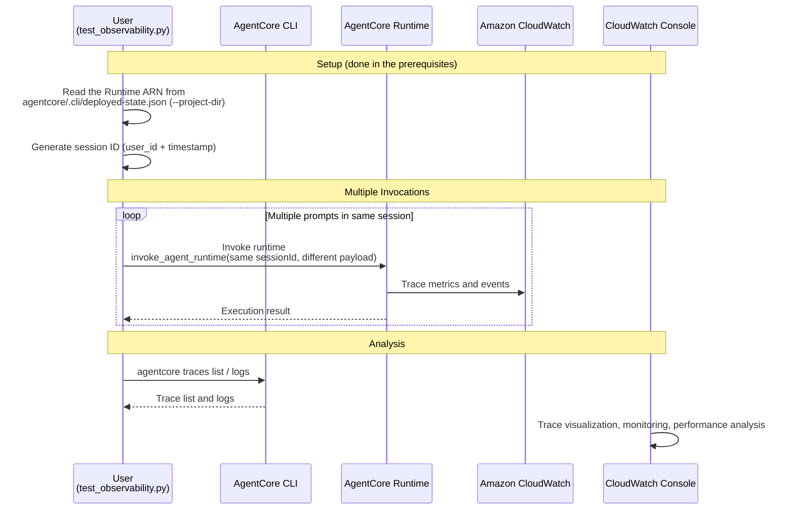

# AgentCore Observability Integration

[English](README.md) / [日本語](README_ja.md)

This implementation demonstrates **AgentCore Observability** with Amazon CloudWatch integration for comprehensive monitoring, tracing, and debugging of AI agents in production. AgentCore provides real-time visibility into agent performance through standardized OpenTelemetry (OTEL) compatible telemetry data. With the AgentCore CLI, `agentcore traces` and `agentcore logs` let you inspect traces and logs without opening the console.

## Process Overview



## Prerequisites

### 1. Enable CloudWatch Transaction Search (One-time Setup)

Transaction Search is an **account- and region-level** setting; `agentcore deploy` does not
enable it. The workshop environment enables it during setup.

Verify it with two checks — the trace destination and the indexing percentage:

```bash
aws xray get-trace-segment-destination
# => {"Destination": "CloudWatchLogs", "Status": "ACTIVE"}
#    When disabled this returns "Destination": "XRay". Status is ACTIVE either way,
#    so judge by Destination.

aws xray get-indexing-rules
# => IndexingRules[0].Rule.Probabilistic.DesiredSamplingPercentage == 100.0 means 100% indexing
```

> Transaction Search takes ~10 minutes to become fully active after being enabled.
> Traces from invocations made before that window may not be indexed.

If `ACTIVE` is not returned, enable it from the CloudWatch console.

1. Open the [CloudWatch console](https://console.aws.amazon.com/cloudwatch)
2. Navigate to **Application Signals (APM)** → **Transaction search**
3. Select **Enable Transaction Search**
4. Select the **ingest spans as structured logs** checkbox
5. (Optional) Adjust the **X-Ray trace indexing** percentage
6. Select **Save**

### 2. AWS Permissions Required

Ensure your AWS credentials include the following permissions:
```json
{
    "Version": "2012-10-17",
    "Statement": [
        {
            "Effect": "Allow",
            "Action": [
                "bedrock-agentcore:*",
                "logs:CreateLogGroup",
                "logs:CreateLogStream",
                "logs:PutLogEvents",
                "logs:DescribeLogGroups",
                "logs:DescribeLogStreams",
                "logs:DescribeResourcePolicies",
                "logs:PutResourcePolicy",
                "cloudwatch:PutMetricData",
                "application-signals:StartDiscovery",
                "xray:PutTraceSegments",
                "xray:PutTelemetryRecords",
                "xray:GetTraceSegmentDestination",
                "xray:UpdateTraceSegmentDestination",
                "xray:UpdateIndexingRule"
            ],
            "Resource": "*"
        }
    ]
}
```

`application-signals:*` and `xray:Update*` are needed to enable Transaction Search, which is
an account- and region-level setting configured once during the workshop prerequisites.

### 3. Enable Tracing for Memory Resources

Memory resources declared in `memories[]` of `agentcore.json` are created by
`agentcore deploy` with tracing configured. Memory operations show up as
`Bedrock AgentCore.*` spans.

For Memory created manually via the SDK, configure the CloudWatch log group by hand
(default log group format: `/aws/bedrock-agentcore/{resource-id}`).

### 4. Install Dependencies

The base agent (`agents/CostEstimatorAgent`) already includes the ADOT SDK and boto3 in its
`pyproject.toml`.

**pyproject.toml:**
```toml
dependencies = [
    "aws-opentelemetry-distro",
    "bedrock-agentcore>=1.0.3",
    "boto3>=1.39.9",
    "strands-agents>=1.13.0",
    "strands-agents-tools>=0.2.1",
    "uv",
]
```

No extra work is needed if you ran `uv sync` when deploying in Lab 2.

## How to use

### File Structure

Lab 4 observes the agent deployed in Lab 2, so no agent code lives in this directory.

```
04_observability/
├── README.md                      # This document
└── test_observability.py          # Invokes the Runtime several times in one session
```

### Step 1: Invoke the Agent Multiple Times

```bash
cd 04_observability
uv run python test_observability.py --project-dir ../agents/MyCostEstimatorAgent
```

The Runtime ARN comes from `agentcore status --json`. You can also pass it directly.

```bash
uv run python test_observability.py --agent-arn <runtime-arn>
```

All three invocations share one session ID, so you get 1 session / 3 traces.

### Step 2: Check Traces and Logs from the CLI

```bash
cd ../agents/MyCostEstimatorAgent

# List traces (the output ends with a CloudWatch console URL)
agentcore traces list --since 30m

# Download a single trace as JSON
agentcore traces get <trace-id> --since 30m --output trace.json

# Application logs
agentcore logs --since 30m --query "Invoking Cost Estimator"
```

### Step 3: Review the Visualization in CloudWatch

Open the **Bedrock AgentCore** tab of
[CloudWatch GenAI Observability](https://console.aws.amazon.com/cloudwatch/home#gen-ai-observability)
and drill down Session → Trace → Span. The URL printed by `agentcore traces list` takes you
straight there.

`test_observability.py` options:

| Flag | Description | Default |
|---|---|---|
| `--agent-arn` | Runtime ARN. Resolved from `--project-dir` when omitted | automatic |
| `--project-dir` | Project whose `deployed-state.json` to read | Lab 2's project |
| `--user-id` | User ID embedded in the session ID | generated |
| `--region` | AWS region | from the profile |
| `--prompt` | Prompt to send. Repeatable | two English defaults |

## Observability Concepts

### Sessions
- **Definition**: Complete interaction context between user and agent
- **Scope**: Entire conversation lifecycle from initialization to termination
- **Provides**: Context persistence, state management, conversation history
- **Metrics**: Session count, duration, user engagement patterns

### Traces
- **Definition**: Detailed record of a single request-response cycle
- **Scope**: Complete execution path from agent invocation to response
- **Provides**: Processing steps, tool invocations, resource utilization
- **Metrics**: Request latency, processing time, error rates

### Spans
- **Definition**: Discrete, measurable units of work within the execution flow
- **Scope**: Granular operations with start/end timestamps
- **Provides**: Operation details, parent-child relationships, status information
- **Metrics**: Operation duration, success/failure rates, resource consumption

A single trace of the cost estimator agent contains spans like these:

```
   6  chat us.anthropic.claude-sonnet-4-6      # Model invocations
   6  execute_event_loop_cycle                  # Agent loop
   3  mcp tools/call get_pricing                # AWS Pricing MCP Server calls
   3  execute_tool get_pricing                  # Strands tool execution
   1  Bedrock AgentCore.InvokeCodeInterpreter   # Cost calculation in the Code Interpreter
   1  execute_tool execute_cost_calculation
```

## Built-in Observability Features

### AgentCore Runtime
- **Default Metrics**: Session count, latency, duration, token usage, error rate
- **Automatic Setup**: CloudWatch log groups created automatically
- **Dashboard**: Available in CloudWatch GenAI Observability page
- **CLI**: `agentcore traces` / `agentcore logs`

### Memory Resources
- **Default Metrics**: Memory operations, retrieval performance
- **Spans**: Memory declared in `agentcore.json` is traced automatically
- **Log Groups**: Manually created Memory requires manual configuration

### Gateway Resources
- **Default Metrics**: Gateway performance, request routing
- **Custom Logs**: Supports user-defined log output
- **Manual Setup**: CloudWatch log groups require manual configuration

### Built-in Tools
- **Default Metrics**: Tool invocation performance
- **Custom Logs**: Supports user-defined log output
- **Manual Setup**: CloudWatch log groups require manual configuration

## Viewing Observability Data

### CloudWatch GenAI Observability Dashboard
Access: [CloudWatch GenAI Observability](https://console.aws.amazon.com/cloudwatch/home#gen-ai-observability)

**Features:**
- Trace visualization with execution flow
- Performance graphs and metrics
- Error breakdown and analysis
- Session and request analytics
- Custom span metrics visualization

### AgentCore CLI
- `agentcore traces list` — recent traces plus a console URL
- `agentcore traces get <trace-id>` — download a trace as JSON
- `agentcore logs` — stream or search CloudWatch Logs (`--level` / `--query` / `--since`)

### CloudWatch Logs
- Raw telemetry data storage
- Structured log format (includes `traceId` / `sessionId` so logs and traces cross-reference)
- Query capabilities with CloudWatch Insights
- Export options via AWS CLI/SDK

## References

- [AgentCore Observability Developer Guide](https://docs.aws.amazon.com/bedrock-agentcore/latest/devguide/observability.html)
- [AgentCore Observability telemetry](https://docs.aws.amazon.com/bedrock-agentcore/latest/devguide/observability-telemetry.html)
- [CloudWatch GenAI Observability](https://docs.aws.amazon.com/AmazonCloudWatch/latest/monitoring/GenAI-observability.html)
- [AgentCore CLI - Transaction Search](https://github.com/aws/agentcore-cli/blob/main/docs/transaction_search.md)
- [AWS Distro for OpenTelemetry](https://aws-otel.github.io/docs/introduction)
- [OpenTelemetry Semantic Conventions for GenAI](https://opentelemetry.io/docs/specs/semconv/gen-ai/)
- [CloudWatch Transaction Search](https://docs.aws.amazon.com/AmazonCloudWatch/latest/monitoring/CloudWatch-Transaction-Search.html)

---

**Next Steps**: Enable observability in your AgentCore applications to gain comprehensive insights into agent performance, troubleshoot issues effectively, and optimize production deployments. Continue with [05_evaluation](../05_evaluation/README.md) to add quality assurance for your agents, or proceed to [06_identity](../06_identity/README.md) to add OAuth 2.0 authentication for secure external operations.
