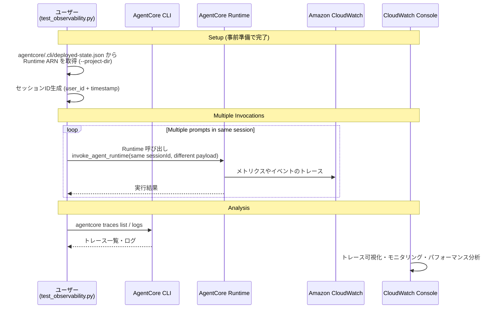

# AgentCore Observability統合

[English](README.md) / [日本語](README_ja.md)

この実装では、本番環境でのAIエージェントの包括的なモニタリング、トレーシング、デバッグのためのAmazon CloudWatch統合を備えた **AgentCore Observability** を実演します。AgentCoreは、標準化されたOpenTelemetry (OTEL) 互換のテレメトリデータを通じて、エージェントパフォーマンスへのリアルタイムの可視性を提供します。AgentCore CLI を使う場合、`agentcore traces` と `agentcore logs` でコンソールを開かずにトレースとログを確認できます。

## プロセス概要



## 前提条件

### 1. CloudWatchトランザクション検索を有効化（初回セットアップ）

Transaction Search は **AWS アカウントとリージョン単位の設定**で、`agentcore deploy` では
有効化されません。ワークショップ環境では事前準備の段階で有効化されています。

有効化を確認するには、トレースの送信先と索引化の割合の 2 つを見ます。

```bash
aws xray get-trace-segment-destination
# => {"Destination": "CloudWatchLogs", "Status": "ACTIVE"}
#    無効の場合は "Destination": "XRay"。Status は両方 ACTIVE になるので Destination で判断する

aws xray get-indexing-rules
# => IndexingRules[0].Rule.Probabilistic.DesiredSamplingPercentage == 100.0 なら索引化は 100%
```

期待どおりでない場合は、CloudWatch コンソールの
**Application Signals (APM) → トランザクション検索** から
**Enable Transaction Search** を実行してください
([手順](https://docs.aws.amazon.com/AmazonCloudWatch/latest/monitoring/Enable-TransactionSearch.html))。

> 有効化から完全に有効になるまで約 10 分かかります。
> それより前の呼び出しのトレースは索引化されない場合があります。

1. [CloudWatchコンソール](https://console.aws.amazon.com/cloudwatch)を開く
2. **Application Signals (APM)** → **Transaction search**に移動
3. **Enable Transaction Search**を選択
4. **構造化ログとしてスパンを取り込む**チェックボックスを選択
5. (オプション)**X-Rayトレースインデックス**の割合を調整
6. **保存**を選択

### 2. 必要なAWS権限

AWS認証情報に以下の権限が含まれていることを確認してください:
```json
{
    "Version": "2012-10-17",
    "Statement": [
        {
            "Effect": "Allow",
            "Action": [
                "bedrock-agentcore:*",
                "logs:CreateLogGroup",
                "logs:CreateLogStream",
                "logs:PutLogEvents",
                "logs:DescribeLogGroups",
                "logs:DescribeLogStreams",
                "logs:DescribeResourcePolicies",
                "logs:PutResourcePolicy",
                "cloudwatch:PutMetricData",
                "application-signals:StartDiscovery",
                "xray:PutTraceSegments",
                "xray:PutTelemetryRecords",
                "xray:GetTraceSegmentDestination",
                "xray:UpdateTraceSegmentDestination",
                "xray:UpdateIndexingRule"
            ],
            "Resource": "*"
        }
    ]
}
```

Transaction Search はアカウント / リージョン単位の設定なので、有効化には
`application-signals:*` と `xray:Update*` の権限が必要です (事前準備で実施済み)。

### 3. メモリリソースのトレーシングを有効化

`agentcore.json` の `memories[]` で宣言した Memory リソースは、`agentcore deploy` が
トレーシング用のログ設定まで含めて作成します。Memory の操作は
`Bedrock AgentCore.*` の Span として記録されます。

SDK で手動作成した Memory の場合は、CloudWatch ログループを手動で設定します
(デフォルトのログループ形式: `/aws/bedrock-agentcore/{resource-id}`)。

### 4. 依存関係をインストール

ベースのエージェント (`agents/CostEstimatorAgent`) の `pyproject.toml` には
ADOT SDK と boto3 が含まれています。

**pyproject.toml:**
```toml
dependencies = [
    "aws-opentelemetry-distro",
    "bedrock-agentcore>=1.0.3",
    "boto3>=1.39.9",
    "strands-agents>=1.13.0",
    "strands-agents-tools>=0.2.1",
    "uv",
]
```

Lab 2 のデプロイ時に `uv sync` していれば追加作業は不要です。

## 使用方法

### ファイル構成

Lab 4 は Lab 2 でデプロイしたエージェントをそのまま観測するため、agent code は
このディレクトリには置きません。

```
04_observability/
├── README.md                      # このドキュメント
└── test_observability.py          # Runtime を同一セッションで複数回呼び出すスクリプト
```

### ステップ1: エージェントを複数回呼び出す

```bash
cd 04_observability
uv run python test_observability.py --project-dir ../agents/MyCostEstimatorAgent
```

Runtime ARN は `agentcore status --json` から取得します。ARN を直接渡すこともできます。

```bash
uv run python test_observability.py --agent-arn <runtime-arn>
```

同一セッション ID で 3 回呼び出すため、1 セッション / 3 トレースが記録されます。

### ステップ2: CLI からトレースとログを確認

```bash
cd ../agents/MyCostEstimatorAgent

# トレース一覧 (末尾に CloudWatch のコンソール URL も表示される)
agentcore traces list --since 30m

# 個別トレースを JSON でダウンロード
agentcore traces get <trace-id> --since 30m --output trace.json

# アプリケーションログ
agentcore logs --since 30m --query "Invoking Cost Estimator"
```

### ステップ3: CloudWatch で可視化を確認

[CloudWatch GenAI Observability](https://console.aws.amazon.com/cloudwatch/home#gen-ai-observability)
の **Bedrock AgentCore** タブから、Session → Trace → Span をドリルダウンします。
`agentcore traces list` の出力末尾の URL からも直接遷移できます。

`test_observability.py` のオプション:

| フラグ | 説明 | デフォルト |
|---|---|---|
| `--agent-arn` | Runtime ARN。省略時は `--project-dir` から解決 | 自動 |
| `--project-dir` | `deployed-state.json` を読むプロジェクトのパス | Lab 2 のプロジェクト |
| `--user-id` | セッション ID に埋め込むユーザー ID | 自動生成 |
| `--region` | AWS リージョン | プロファイルの設定 |
| `--prompt` | 送信するプロンプト。複数回指定できる | 英語の既定文 2 件 |

## 可観測性の概念

### セッション
- **定義**: ユーザーとエージェント間の完全なインタラクションコンテキスト
- **スコープ**: 初期化から終了までの会話のライフサイクル全体
- **提供内容**: コンテキストの永続性、状態管理、会話履歴
- **メトリクス**: セッション数、継続時間、ユーザーエンゲージメントパターン

### トレース
- **定義**: 単一のリクエスト-レスポンスサイクルの詳細な記録
- **スコープ**: エージェント呼び出しからレスポンスまでの完全な実行パス
- **提供内容**: 処理ステップ、ツール呼び出し、リソース使用率
- **メトリクス**: リクエストレイテンシ、処理時間、エラー率

### スパン
- **定義**: 実行フロー内の離散的で測定可能な作業単位
- **スコープ**: 開始/終了タイムスタンプを持つ細かい操作
- **提供内容**: 操作の詳細、親子関係、ステータス情報
- **メトリクス**: 操作期間、成功/失敗率、リソース使用量

コスト見積りエージェントの 1 トレースには、次のような Span が記録されます。

```
   6  chat us.anthropic.claude-sonnet-4-6      # モデル呼び出し
   6  execute_event_loop_cycle                  # エージェントのループ
   3  mcp tools/call get_pricing                # AWS Pricing MCP Server への問い合わせ
   3  execute_tool get_pricing                  # Strands のツール実行
   1  Bedrock AgentCore.InvokeCodeInterpreter   # Code Interpreter でのコスト計算
   1  execute_tool execute_cost_calculation
```

## 組み込み可観測性機能

### AgentCore Runtime
- **デフォルトメトリクス**: セッション数、レイテンシ、継続時間、トークン使用量、エラー率
- **自動セットアップ**: CloudWatchログループが自動的に作成される
- **ダッシュボード**: CloudWatch GenAI Observabilityページで利用可能
- **CLI**: `agentcore traces` / `agentcore logs`

### メモリリソース
- **デフォルトメトリクス**: メモリ操作、取得パフォーマンス
- **スパン**: `agentcore.json` で宣言した Memory は自動でトレースされる
- **ログループ**: 手動作成した Memory は手動設定が必要

### ゲートウェイリソース
- **デフォルトメトリクス**: ゲートウェイパフォーマンス、リクエストルーティング
- **カスタムログ**: ユーザー定義のログ出力をサポート
- **手動セットアップ**: CloudWatchログループは手動設定が必要

### 組み込みツール
- **デフォルトメトリクス**: ツール呼び出しパフォーマンス
- **カスタムログ**: ユーザー定義のログ出力をサポート
- **手動セットアップ**: CloudWatchログループは手動設定が必要

## 可観測性データの表示

### CloudWatch GenAI Observabilityダッシュボード
アクセス方法:[CloudWatch GenAI Observability](https://console.aws.amazon.com/cloudwatch/home#gen-ai-observability)

**機能:**
- 実行フローを含むトレース可視化
- パフォーマンスグラフとメトリクス
- エラーの内訳と分析
- セッションとリクエスト分析
- カスタムスパンメトリクスの可視化

### AgentCore CLI
- `agentcore traces list` — 直近のトレース一覧とコンソール URL
- `agentcore traces get <trace-id>` — トレースを JSON でダウンロード
- `agentcore logs` — CloudWatch Logs のストリーミング・検索 (`--level` / `--query` / `--since`)

### CloudWatchログ
- 生のテレメトリデータストレージ
- 構造化されたログ形式 (`traceId` / `sessionId` を含むためトレースと相互に辿れる)
- CloudWatch Insightsによるクエリ機能
- AWS CLI/SDKによるエクスポートオプション

## 参考資料

- [AgentCore Observability開発者ガイド](https://docs.aws.amazon.com/bedrock-agentcore/latest/devguide/observability.html)
- [AgentCore Observability のテレメトリ](https://docs.aws.amazon.com/bedrock-agentcore/latest/devguide/observability-telemetry.html)
- [CloudWatch GenAI Observability](https://docs.aws.amazon.com/AmazonCloudWatch/latest/monitoring/GenAI-observability.html)
- [AgentCore CLI - Transaction Search](https://github.com/aws/agentcore-cli/blob/main/docs/transaction_search.md)
- [AWS Distro for OpenTelemetry](https://aws-otel.github.io/docs/introduction)
- [GenAI向けOpenTelemetryセマンティック規約](https://opentelemetry.io/docs/specs/semconv/gen-ai/)
- [CloudWatchトランザクション検索](https://docs.aws.amazon.com/AmazonCloudWatch/latest/monitoring/CloudWatch-Transaction-Search.html)

---

**次のステップ**: AgentCoreアプリケーションで可観測性を有効にして、エージェントパフォーマンスへの包括的な洞察を得て、効果的に問題をトラブルシューティングし、本番デプロイメントを最適化しましょう。
