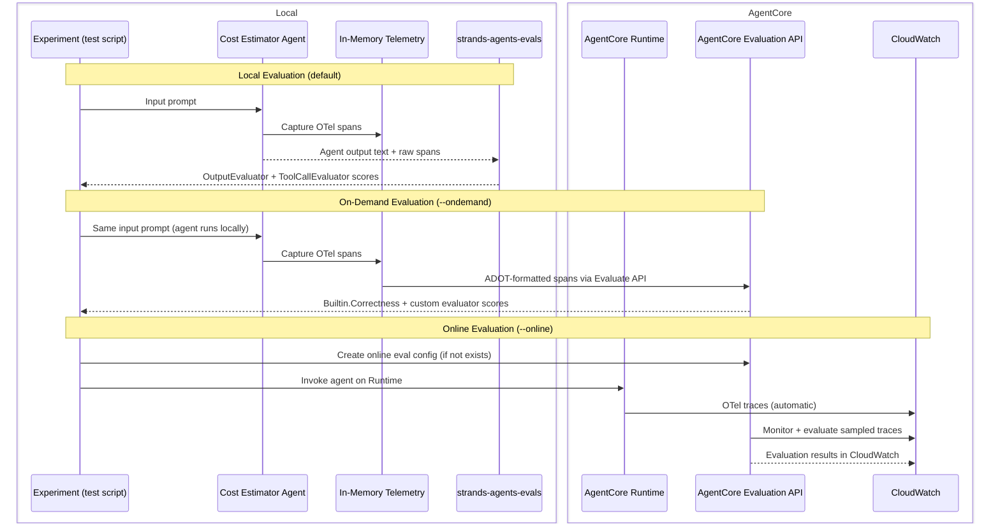
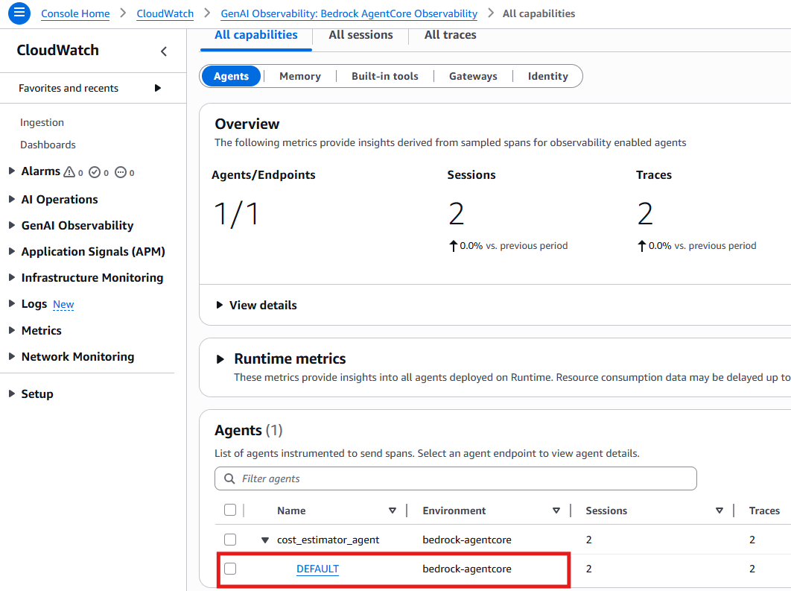
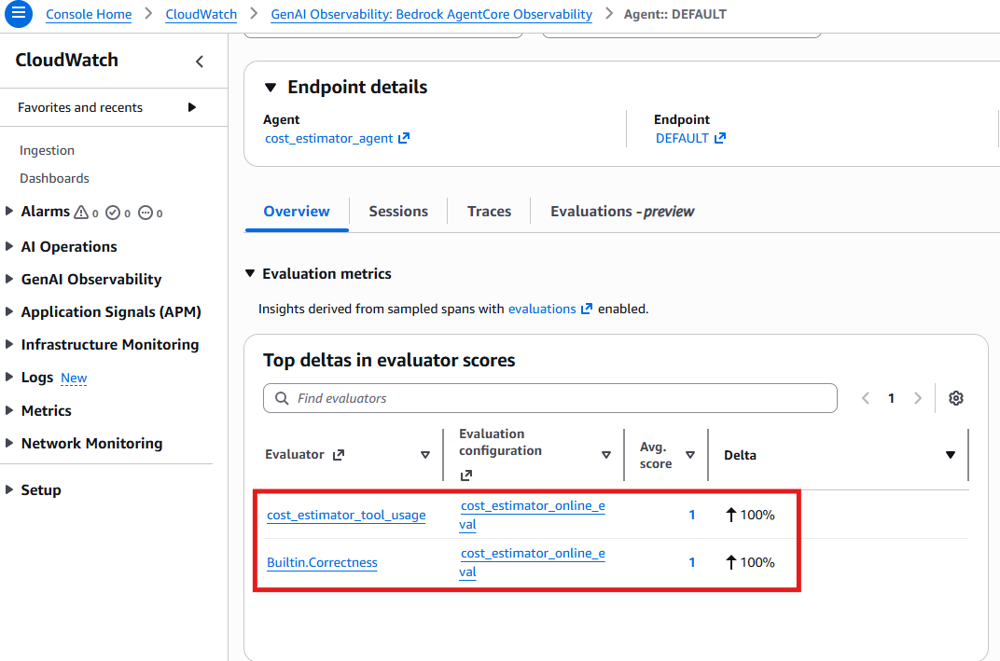

# Evaluate Your Agent - Measure What Matters

[English](README.md) / [日本語](README_ja.md)

Before tuning prompts or adding tools, define what success looks like. Without measurable goals, teams wander in endless iteration. In this section, we introduce the **evaluation-first mindset** that designs evaluation scenarios first, then use them to guide development.

We apply **local evaluation** (strands-agents-evals), **on-demand evaluation** (AgentCore Evaluate API), and **online evaluation** (continuous monitoring on AgentCore Runtime) to the cost estimator agent built in step 01.

## Evaluation Scenario Design

A cost estimation agent should preserve quality, cost, and delivery time — the so-called "QCD" balance. The agent should call tools in a necessary and sufficient manner to maintain accuracy while keeping cost and latency low. Output quality also matters for the business user. In this scenario, we define the following two measurements. (In practice, you will choose goals and metrics by talking with stakeholders.)

We can leverage [built-in metrics](https://docs.aws.amazon.com/bedrock-agentcore/latest/devguide/built-in-evaluators-overview.html) and add custom metrics depending on the scenario. The following table summarizes each dimension, what success and failure look like, and the evaluators used in local development and after deployment to AgentCore Runtime.

| Dimension | Success Factor | Risk Factor | Local | On-Demand / Online |
|-----------|---------------|-------------|-------|-------------------|
| **Tool usage** | Agent calls `get_pricing` API to retrieve real prices | Agent skips tools and hallucinates prices from training data | **ToolCallEvaluator** (custom) | Custom evaluator (`llmAsAJudge`) |
| **Output quality** | Response contains specific costs with service breakdown | Response is vague or missing cost figures | **OutputEvaluator** (rubric) | `Builtin.Correctness` |

### Choosing the Right Evaluator

Built-in evaluators ship with [fixed prompt templates](https://docs.aws.amazon.com/bedrock-agentcore/latest/devguide/prompt-templates-builtin.html) and run at one of three levels. Each level determines what data the judge model receives via placeholder variables ([details](https://docs.aws.amazon.com/bedrock-agentcore/latest/devguide/create-evaluator.html)):

| Level | `context` | Evaluated target | Built-in evaluators |
|-------|-----------|-----------------|---------------------|
| **Session** | **All turns** (prompts, responses, tool calls) | Entire session | GoalSuccessRate |
| **Trace** | **Previous turns** + current turn's prompt and tool calls | `assistant_turn` (current response) | Correctness, Helpfulness, Faithfulness, [etc.](https://docs.aws.amazon.com/bedrock-agentcore/latest/devguide/prompt-templates-builtin.html) |
| **Tool** | **Previous turns** + current turn's prompt + tool calls **before** the target | `tool_turn` (one tool call) | ToolParameterAccuracy, ToolSelectionAccuracy |

Two limitations shape our evaluator design.

1. **Tool-level evaluators cannot catch missing tool calls.** `Builtin.ToolSelectionAccuracy` judges whether each tool call the agent *made* was appropriate. But when an agent hallucinates (skipping tools entirely), there are zero tool calls to judge that means evaluator  returns a passing score silently. To detect the *absence* of tool calls, we need a Trace-level evaluator that sees the full agent turn.
2. **AgentCore Evaluators only support [LLM-as-a-Judge](https://docs.aws.amazon.com/bedrock-agentcore/latest/devguide/create-evaluator.html) (as of February 2026).** Custom evaluators on AgentCore use a prompt template sent to a judge model and they cannot run arbitrary code like inspecting OTel spans programmatically.

Because of these limitations, we use different evaluators locally and remotely. A **code-based `ToolCallEvaluator`** locally which inspects OTel spans directly and a **custom Trace-level LLM-as-a-Judge evaluator** on AgentCore which asks the judge model whether pricing tools were called before producing cost figures.


## Process Overview



## Prerequisites

1. **Step 01 completed** - The cost estimator agent in `01_code_interpreter/` must work
2. **Step 02 completed** (for `--online`) - The agent must be deployed to AgentCore Runtime
3. **AWS credentials** - With Bedrock and AgentCore access permissions
4. **Dependencies** - Installed via `uv sync` (strands-agents-evals is already in pyproject.toml)

## How to use

This script supports three evaluation modes. Choose the one that matches your stage:

| Mode | Command | Agent runs | Results in |
|------|---------|-----------|-----------|
| **Local** | `uv run python test_evaluation.py` | Local | Terminal |
| **On-Demand** | `uv run python test_evaluation.py --ondemand` | Local | Terminal |
| **Online** | `uv run python test_evaluation.py --online` | AgentCore Runtime | CloudWatch console |

- **Local** evaluates with strands-agents-evals (code-based evaluators). Best for fast development iteration.
- **On-Demand** runs the agent locally but scores with AgentCore's managed evaluators via the Evaluate API. Tests the same dimensions with production-grade evaluation.
- **Online** sets up continuous monitoring. The agent runs on Runtime, traces flow to CloudWatch, and the online evaluation config automatically samples and evaluates interactions. Results appear in the CloudWatch console.

### File Structure

```
05_evaluation/
├── README.md                              # This documentation
├── README_ja.md                           # Japanese documentation
├── test_evaluation.py                     # Main script: local, on-demand (--ondemand), or online (--online)
├── evaluators/
│   ├── __init__.py                        # Export custom evaluators
│   └── tool_call_evaluator.py             # Checks agent used required pricing tools
└── clean_resources.py                     # Cleanup: online eval config + custom evaluator
```

### Local Evaluation (default)

Run both evaluators locally against the agent running on your machine:

```bash
cd 05_evaluation
uv run python test_evaluation.py
```

The `Experiment` orchestrates the following for each test case:

1. **OutputEvaluator** (built-in) - An LLM-as-judge scores the agent's output against a rubric. The rubric checks whether the response contains specific dollar amounts, lists the requested AWS services, and provides a total cost figure. No custom code is needed - just write a rubric string.
2. **ToolCallEvaluator** (custom) - Inspects OTel spans to verify the agent actually called `get_pricing` rather than hallucinating prices. This evaluator demonstrates how to extend the base `Evaluator` class for metrics that go beyond output text - such as checking tool usage, latency, or token counts.

Both evaluators return an `EvaluationReport` containing scores, pass/fail results, and reasons.

### On-Demand Evaluation (`--ondemand`)

Score locally-generated spans with AgentCore's managed evaluators:

```bash
cd 05_evaluation
uv run python test_evaluation.py --ondemand
```

This measures the same two dimensions using AgentCore Evaluation API: `Builtin.Correctness` for output quality and a **custom evaluator** registered via `CreateEvaluator` API for tool usage. The agent still runs locally — only the scoring uses AgentCore. Results are returned in the API response and displayed in the terminal.

### Online Evaluation (`--online`)

Set up continuous monitoring and invoke the agent on AgentCore Runtime:

```bash
cd 05_evaluation
uv run python test_evaluation.py --online
```

This mode:
1. Reads the agent config from step 02 (`.bedrock_agentcore.yaml`)
2. Creates a custom evaluator (or reuses an existing one)
3. Creates an [online evaluation config](https://docs.aws.amazon.com/bedrock-agentcore/latest/devguide/create-online-evaluations.html) (or reuses an existing one)
4. Invokes the agent on AgentCore Runtime for each test case
5. Prints the CloudWatch console URL to view evaluation results

Unlike on-demand evaluation, the agent runs **on AgentCore Runtime** and traces are emitted to **CloudWatch automatically**. The online evaluation config monitors these traces and evaluates them — results appear in the CloudWatch console, not in the terminal.

Each test case takes 2-5 minutes (MCP pricing tools + Code Interpreter), so expect 5-15 minutes total.

Once the evaluation completes, open the CloudWatch console URL printed in the terminal. Navigate to **GenAI Observability > Bedrock AgentCore Observability > All capabilities**, then click the **DEFAULT** endpoint under your agent:



Select the **Evaluations** tab to see the evaluation metrics. The **Top deltas in evaluator scores** table shows each evaluator's average score and trend:



## Key Implementation Patterns

### Running Evaluation with Experiment

`Experiment` is the central orchestrator. You give it **test cases** (what to evaluate), a **task function** (how to run the agent), and **evaluators** (how to score the result):

```
Case (input + expectations)
  → task_fn (runs the agent, produces output + trajectory)
    → Evaluators (score the result against expectations)
      → EvaluationReport (scores, pass/fail, reasons)
```

```python
from strands_evals import Case, Experiment

# 1. Define test cases — what to evaluate
cases = [
    Case(
        name="single-ec2",
        input="One EC2 t3.micro instance running 24/7 in us-east-1",
        expected_trajectory=["get_pricing"],
    ),
]

# 2. Define a task function — how to run the agent
#    Receives a Case, returns {"output": str, "trajectory": spans}
def task_fn(case):
    agent = AWSCostEstimatorAgent()
    output = agent.estimate_costs(case.input)
    return {"output": output, "trajectory": spans}

# 3. Define evaluators — how to score the result
evaluators = [output_evaluator, tool_evaluator]

# 4. Run: Experiment calls task_fn for each case, then passes the
#    result to every evaluator. Evaluators never call the agent directly.
experiment = Experiment(cases=cases, evaluators=evaluators)
reports = experiment.run_evaluations(task_fn)
```

The same `Experiment` flow works for both local and on-demand evaluation — only the evaluators change. Online evaluation does not use `Experiment` because evaluation happens asynchronously in CloudWatch.

### Evaluators: Built-in and Custom

**OutputEvaluator** (built-in) scores the agent's text output against a rubric. No custom code needed:

```python
from strands_evals.evaluators import OutputEvaluator

output_evaluator = OutputEvaluator(rubric="""\
Score 1.0 if the response contains specific dollar amounts and lists services.
Score 0.0 if no meaningful cost estimate is provided.
""")
```

**ToolCallEvaluator** (custom) inspects OTel spans to check agent behavior beyond the output text. Extend the base `Evaluator` class:

```python
from strands_evals.evaluators.evaluator import Evaluator

class ToolCallEvaluator(Evaluator[str, str]):
    def evaluate(self, evaluation_case):
        # Inspect OTel spans for execute_tool operations
        for span in evaluation_case.actual_trajectory:
            attrs = span.attributes or {}
            if attrs.get("gen_ai.operation.name") == "execute_tool":
                tool_name = attrs.get("gen_ai.tool.name", "")
                # ... check against required_tools
```

### On-Demand / Online: AgentCore Evaluation API with Custom Evaluator

For on-demand and online evaluation, register a custom evaluator via the control plane API. On-demand passes its ID to the `Evaluate` API directly; online passes it to the online evaluation config:

```python
import boto3
from bedrock_agentcore.evaluation.integrations.strands_agents_evals import (
    create_strands_evaluator,
)

# Register a custom TRACE-level evaluator that detects missing tool calls
control = boto3.client("bedrock-agentcore-control")
resp = control.create_evaluator(
    evaluatorName="cost_estimator_tool_usage",
    level="TRACE",
    evaluatorConfig={
        "llmAsAJudge": {
            "instructions": "Did the agent call a pricing tool before producing costs?",
            "ratingScale": {
                "numerical": [
                    {"value": 0, "label": "No", "definition": "No pricing tool was called"},
                    {"value": 1, "label": "Yes", "definition": "Pricing tool was used"},
                ]
            },
        }
    },
)

# On-demand: pass evaluator IDs to the Evaluate API via Experiment
correctness = AgentCoreEvaluator("Builtin.Correctness", test_pass_score=0.7)
tool_usage = AgentCoreEvaluator(resp["evaluatorId"], test_pass_score=0.7)

# Online: pass evaluator IDs to an online evaluation config
from bedrock_agentcore_starter_toolkit import Evaluation

eval_client = Evaluation()
eval_client.create_online_config(
    config_name="cost_estimator_online_eval",
    agent_id="agent_cost-estimator-XXXX",  # from step 02
    sampling_rate=100.0,
    evaluator_list=["Builtin.Correctness", resp["evaluatorId"]],
    auto_create_execution_role=True,
    enable_on_create=True,
)
```

## References

- [strands-agents/evals](https://github.com/strands-agents/evals) - Evaluation framework for Strands Agents
- [AgentCore Evaluation Developer Guide](https://docs.aws.amazon.com/bedrock-agentcore/latest/devguide/)
- [Evaluation-First Agent Design (Qiita)](https://qiita.com/icoxfog417/items/4f90fb5a62e1bafb1bfb) - Methodology for designing evaluation scenarios

---

**Next Steps**: Continue with [06_identity](../06_identity/README.md) to add OAuth 2.0 authentication for secure external operations.
