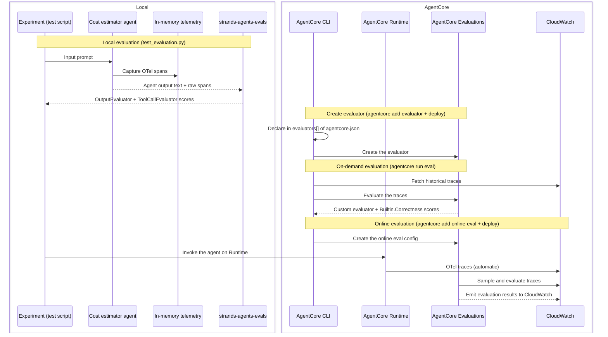

# Evaluate Your Agent - Measure What Matters

[English](README.md) / [日本語](README_ja.md)

Before tuning prompts or adding tools, define what success means. Without measurable goals, teams wander through endless iterations. This section introduces an **evaluation-first mindset**: design the evaluation scenario first, then use it to guide development.

The cost estimator agent is evaluated with **local evaluation** (strands-agents-evals), **on-demand evaluation** (`agentcore run eval`), and **online evaluation** (continuous monitoring on AgentCore Runtime). With the AgentCore CLI, evaluators and online eval configs are declared in `agentcore.json` and created by `agentcore deploy`.

## Evaluation Scenario Design

The cost estimator agent has to balance quality, cost, and delivery — "QCD". It should call tools just enough to stay accurate while keeping cost and latency low. Output quality also matters to business users. This scenario defines two measurement dimensions. (On a real project you would choose goals and metrics through conversations with stakeholders.)

Use [built-in metrics](https://docs.aws.amazon.com/bedrock-agentcore/latest/devguide/built-in-evaluators-overview.html) and add custom metrics where the scenario calls for it. The table below summarizes success and failure for each dimension, along with the evaluators used during local development and after deploying to AgentCore Runtime.

| Dimension | Success factor | Risk factor | Local | On-demand / Online |
|---------------|---------|-----------|---------|------------------------|
| **Tool usage** | The agent calls the `get_pricing` API to retrieve real prices | The agent skips the tool and hallucinates prices from training data | **ToolCallEvaluator** (custom) | Custom evaluator (`llmAsAJudge`) |
| **Output quality** | The response contains concrete per-service costs | The response is vague or cost figures are missing | **OutputEvaluator** (rubric) | `Builtin.Correctness` |

### Choosing the Right Evaluator

Built-in evaluators come with [fixed prompt templates](https://docs.aws.amazon.com/bedrock-agentcore/latest/devguide/prompt-templates-builtin.html) and run at one of three levels. The level determines what data the judge model receives through placeholder variables ([details](https://docs.aws.amazon.com/bedrock-agentcore/latest/devguide/create-evaluator.html)):

| Level | `context` | Evaluated | Built-in evaluators |
|--------|-----------|---------|-----------------|
| **SESSION** | **All turns** (prompts, responses, tool calls) | The whole session | GoalSuccessRate |
| **TRACE** | **Previous turns** + this turn's prompt and tool calls | `assistant_turn` (the current response) | Correctness, Helpfulness, Faithfulness, [others](https://docs.aws.amazon.com/bedrock-agentcore/latest/devguide/prompt-templates-builtin.html) |
| **TOOL_CALL** | **Previous turns** + this turn's prompt + tool calls **before** the target | `tool_turn` (a single tool call) | ToolParameterAccuracy, ToolSelectionAccuracy |

Evaluator design has two constraints.

1. **TOOL_CALL level evaluators cannot detect missing tool calls.** `Builtin.ToolSelectionAccuracy` judges whether each tool call the agent *made* was appropriate. But when the agent hallucinates (skipping tools entirely) there are zero calls to judge, so the evaluator silently returns a passing score. Detecting the *absence* of tool calls requires a TRACE-level evaluator that can see the agent's full turn.
2. **AgentCore evaluators only support [LLM-as-a-Judge](https://docs.aws.amazon.com/bedrock-agentcore/latest/devguide/create-evaluator.html) (as of February 2026).** Custom AgentCore evaluators use a prompt template sent to a judge model, so they cannot run arbitrary code such as programmatically inspecting OTel spans.

Because of these constraints, local and remote use different evaluators. Locally we use a **code-based `ToolCallEvaluator`** that inspects OTel spans directly; on AgentCore we use a **custom TRACE-level LLM-as-a-Judge evaluator** that asks the judge model whether a pricing tool was called before cost figures were produced.


## Process Overview


```mermaid
sequenceDiagram
    box Local
        participant Exp as Experiment (test script)
        participant Agent as Cost estimator agent
        participant OTel as In-memory telemetry
        participant Eval as strands-agents-evals
    end
    box AgentCore
        participant CLI as AgentCore CLI
        participant RT as AgentCore Runtime
        participant AC as AgentCore Evaluations
        participant CW as CloudWatch
    end

    Note over Exp,Eval: Local evaluation (test_evaluation.py)
    Exp->>Agent: Input prompt
    Agent->>OTel: Capture OTel spans
    Agent-->>Eval: Agent output text + raw spans
    Eval-->>Exp: OutputEvaluator + ToolCallEvaluator scores

    Note over CLI,AC: Create evaluator (agentcore add evaluator + deploy)
    CLI->>CLI: Declare in evaluators[] of agentcore.json
    CLI->>AC: Create the evaluator

    Note over CLI,AC: On-demand evaluation (agentcore run eval)
    CLI->>CW: Fetch historical traces
    CLI->>AC: Evaluate the traces
    AC-->>CLI: Custom evaluator + Builtin.Correctness scores

    Note over CLI,CW: Online evaluation (agentcore add online-eval + deploy)
    CLI->>AC: Create the online eval config
    Exp->>RT: Invoke the agent on Runtime
    RT->>CW: OTel traces (automatic)
    AC->>CW: Sample and evaluate traces
    AC-->>CW: Emit evaluation results to CloudWatch
```

## Prerequisites

1. **Step 02 complete** - the agent is deployed to AgentCore Runtime (`agents/MyCostEstimatorAgent/`)
2. **Step 04 complete** - on-demand evaluation targets historical traces, so Transaction Search must be enabled and traces recorded
3. **AWS credentials** - with Bedrock and AgentCore access
4. **AgentCore CLI** - `npm install -g @aws/agentcore`
5. **Dependencies** - installed with `uv sync` (strands-agents-evals is in pyproject.toml)

## How to use

The three evaluations serve different stages. Pick the one that fits:

| Mode | Command | Where the agent runs | Where results appear |
|--------|---------|-------------------|------------|
| **Local** | `uv run python test_evaluation.py` | Locally | Terminal |
| **On-demand** | `agentcore run eval` | AgentCore Runtime (historical traces) | Terminal / `agentcore evals history` |
| **Online** | `agentcore add online-eval` + `agentcore deploy` | AgentCore Runtime (live) | CloudWatch console |

- **Local** evaluates with strands-agents-evals (code-based evaluators). Best for fast development iteration.
- **On-demand** scores historical traces from the deployed agent with AgentCore's managed evaluators. Useful for debugging or re-evaluating a specific period.
- **Online** sets up continuous monitoring. The agent runs on Runtime, traces flow to CloudWatch, and the online eval config samples and evaluates interactions automatically. Results appear in the CloudWatch console.

### File Structure

```
05_evaluation/
├── README.md                              # This document
├── README_ja.md                           # Japanese documentation
├── test_evaluation.py                     # Local evaluation script
└── evaluators/
    ├── __init__.py                        # Custom evaluator exports
    ├── tool_call_evaluator.py             # Local: inspects spans for required pricing tools
    └── tool_usage_evaluator.json          # AgentCore: LLM-as-a-Judge evaluator config
```

On-demand and online evaluation are handled by the AgentCore CLI, so no script is needed for
them. The agent itself is the base `agents/CostEstimatorAgent`.

### Local Evaluation

Run both evaluators against the agent on your machine:

```bash
cd 05_evaluation
uv run python test_evaluation.py

# Run a single case
uv run python test_evaluation.py --case single-ec2
```

```
Captured 9 OTel spans for case: single-ec2
Overall score: 1.00
╭──────────────────────────── 📊 Evaluation Report ────────────────────────────╮
│ Overall Score: 1.00           Pass Rate: 1.0                                 │
╰──────────────────────────────────────────────────────────────────────────────╯
```

### On-Demand Evaluation

Declare and deploy the evaluator from the Lab 2 project directory.

```bash
cd ../agents/MyCostEstimatorAgent

agentcore add evaluator \
    --name cost_estimator_tool_usage \
    --level TRACE \
    --config ../../05_evaluation/evaluators/tool_usage_evaluator.json

agentcore deploy
```

Run the evaluation against historical traces.

```bash
agentcore run eval \
    --runtime MyCostEstimatorAgent \
    --evaluator cost_estimator_tool_usage Builtin.Correctness \
    --days 1
```

```
Agent: MyCostEstimatorAgent | Aug 4, 2026, 12:46 AM | Sessions: 1 | Lookback: 1d

  cost_estimator_tool_usage: 1.00
  Builtin.Correctness: 0.83
```

Use `agentcore evals history` to review past runs. Results are stored in
`agentcore/.cli/eval-results/`.

> Traces take 5–10 minutes to become available for evaluation. If you get `Sessions: 0`,
> increase `--days` or wait a little and retry.

### Online Evaluation

```bash
agentcore add online-eval \
    --name cost_estimator_online_eval \
    --runtime MyCostEstimatorAgent \
    --evaluator cost_estimator_tool_usage Builtin.Correctness \
    --sampling-rate 100 \
    --enable-on-create

agentcore deploy
```

```
Online Eval Configs
  cost_estimator_online_eval: Deployed (2 evaluators, 100% sampling — ACTIVE (ENABLED))
```

With this in place, live traffic is evaluated automatically.

```bash
cd ../../04_observability
uv run python test_observability.py --project-dir ../agents/MyCostEstimatorAgent
```

Review results in the **Evaluations** tab of
[CloudWatch GenAI Observability](https://console.aws.amazon.com/cloudwatch/home#gen-ai-observability).
You can also pause and resume.

```bash
agentcore pause online-eval cost_estimator_online_eval
agentcore resume online-eval cost_estimator_online_eval
```

### Clean Up

Online evaluation keeps invoking an LLM, so remove it once you are done.

```bash
cd ../agents/MyCostEstimatorAgent
agentcore remove online-eval --name cost_estimator_online_eval -y
agentcore remove evaluator --name cost_estimator_tool_usage -y
agentcore deploy
```

The evaluator and the online eval config are declared inside Lab 2's project
(`MyCostEstimatorAgent`), so removing just those two leaves the runtime in place.

> An evaluator cannot be removed while an online eval config references it (you get
> `Evaluator ... is referenced by online eval config(s)`). Remove `online-eval` first.

## Key Implementation Patterns

### Running Evaluation with Experiment

`Experiment` orchestrates **test cases**, a **task function**, and **evaluators**.

```python
from strands_evals import Case, Experiment

# 1. Define test cases — what to evaluate
cases = [
    Case(
        name="single-ec2",
        input="One EC2 t3.micro instance running 24/7 in us-east-1",
        expected_trajectory=["get_pricing"],
    ),
]

# 2. Define a task function — how to run the agent
#    Receives a Case, returns {"output": str, "trajectory": spans}
def task_fn(case):
    agent = AWSCostEstimatorAgent()
    output = agent.estimate_costs(case.input)
    return {"output": output, "trajectory": spans}

# 3. Define evaluators — how to score the result
evaluators = [output_evaluator, tool_evaluator]

# 4. Run: Experiment calls task_fn for each case, then passes the
#    result to every evaluator. Evaluators never call the agent directly.
experiment = Experiment(cases=cases, evaluators=evaluators)
reports = experiment.run_evaluations(task_fn)
```

### Importing the Base Agent Locally

The agent lives in `agents/CostEstimatorAgent/app/CostEstimatorAgent/` and uses flat imports
(`from config import ...`), so that directory has to be on `sys.path`.

```python
AGENT_DIR = (
    Path(__file__).resolve().parent.parent
    / "agents" / "CostEstimatorAgent" / "app" / "CostEstimatorAgent"
)
sys.path.insert(0, str(AGENT_DIR))
from cost_estimator_agent import AWSCostEstimatorAgent
```

The base `AWSCostEstimatorAgent` exposes `async stream()` for the Runtime, plus a synchronous
`estimate_costs()` convenience wrapper for local evaluation.

### Evaluators: Built-in and Custom

**OutputEvaluator** (built-in) scores the output against a rubric.

```python
from strands_evals.evaluators import OutputEvaluator

output_evaluator = OutputEvaluator(rubric="""\
Score 1.0 if the response contains specific dollar amounts and lists services.
Score 0.0 if no meaningful cost estimate is provided.
""")
```

**ToolCallEvaluator** (custom) walks the OTel spans to inspect tool calls.

```python
from strands_evals.evaluators.evaluator import Evaluator

class ToolCallEvaluator(Evaluator[str, str]):
    def evaluate(self, evaluation_case):
        for span in evaluation_case.actual_trajectory:
            attrs = span.attributes or {}
            if attrs.get("gen_ai.operation.name") == "execute_tool":
                tool_name = attrs.get("gen_ai.tool.name", "")
                # ... match against required_tools
```

### On-Demand / Online: Evaluators Declared in agentcore.json

`agentcore add evaluator` declares the evaluator in the `evaluators[]` array of
`agentcore.json`, and `agentcore deploy` creates it. There is no need to call
`create_evaluator` through boto3.

```json
{
  "evaluators": [
    {
      "name": "cost_estimator_tool_usage",
      "level": "TRACE",
      "config": {
        "llmAsAJudge": {
          "model": "us.anthropic.claude-sonnet-4-6",
          "instructions": "... {context} ... {assistant_turn} ...",
          "ratingScale": {
            "numerical": [
              { "value": 0, "label": "No", "definition": "No pricing tool was called" },
              { "value": 1, "label": "Yes", "definition": "Pricing tool was used" }
            ]
          }
        }
      }
    }
  ],
  "onlineEvalConfigs": [
    {
      "name": "cost_estimator_online_eval",
      "runtime": "MyCostEstimatorAgent",
      "evaluators": ["cost_estimator_tool_usage", "Builtin.Correctness"],
      "samplingRate": 100,
      "enableOnCreate": true
    }
  ]
}
```

`{context}` and `{assistant_turn}` are placeholders replaced with real data at evaluation time.
Which placeholders are available depends on the level.

| Placeholder | Available at |
|---|---|
| `{context}` | SESSION, TRACE, TOOL_CALL |
| `{assistant_turn}` | TRACE |
| `{available_tools}` | SESSION, TOOL_CALL |
| `{tool_turn}` | TOOL_CALL |

## References

- [Built-in evaluators overview](https://docs.aws.amazon.com/bedrock-agentcore/latest/devguide/built-in-evaluators-overview.html)
- [Create an evaluator](https://docs.aws.amazon.com/bedrock-agentcore/latest/devguide/create-evaluator.html)
- [Online evaluations](https://docs.aws.amazon.com/bedrock-agentcore/latest/devguide/create-online-evaluations.html)
- [AgentCore CLI - Evaluations](https://github.com/aws/agentcore-cli/blob/main/docs/evals.md)
- [strands-agents/evals](https://github.com/strands-agents/evals) - Evaluation framework for Strands Agents

---

**Next Steps**: Continue with [06_identity](../06_identity/README.md) to add OAuth 2.0 authentication for secure external operations.
