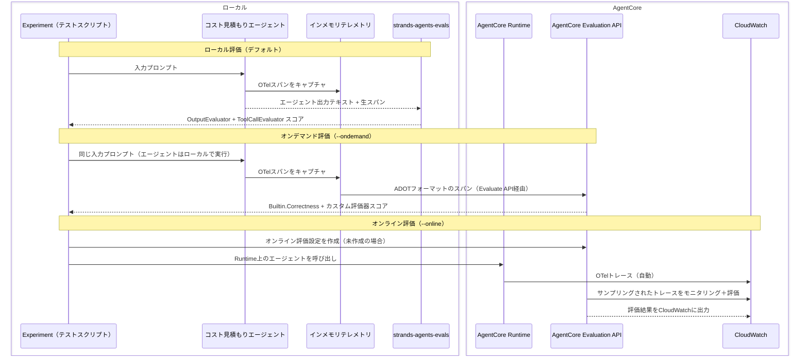

# エージェントを評価する - 重要な指標を測定する

[English](README.md) / [日本語](README_ja.md)

プロンプトの調整やツールの追加を行う前に、成功の定義を明確にしましょう。測定可能な目標がなければ、チームは終わりのないイテレーションを彷徨うことになります。このセクションでは、まず評価シナリオを設計し、それを開発の指針として活用する**評価ファーストの考え方**を紹介します。

ステップ01で構築したコスト見積もりエージェントに対して、**ローカル評価**（strands-agents-evals）、**オンデマンド評価**（AgentCore Evaluate API）、**オンライン評価**（AgentCore Runtime上の継続的モニタリング）を適用します。

## 評価シナリオの設計

コスト見積もりエージェントは品質・コスト・納期のいわゆる「QCD」バランスを維持する必要があります。エージェントは精度を保ちつつコストとレイテンシを低く抑えるため、必要十分な形でツールを呼び出すべきです。出力品質もビジネスユーザーにとって重要です。このシナリオでは以下の2つの測定軸を定義します。（実際のプロジェクトでは、ステークホルダーとの対話を通じて目標と指標を選択します。）

[ビルトインメトリクス](https://docs.aws.amazon.com/bedrock-agentcore/latest/devguide/built-in-evaluators-overview.html)を活用しつつ、シナリオに応じてカスタムメトリクスを追加できます。以下の表は、各ディメンションの成功・失敗の定義と、ローカル開発時およびAgentCore Runtimeデプロイ後に使用する評価器をまとめたものです。

| ディメンション | 成功要因 | リスク要因 | ローカル | オンデマンド / オンライン |
|---------------|---------|-----------|---------|------------------------|
| **ツール使用** | エージェントが`get_pricing` APIを呼び出して実際の価格を取得する | エージェントがツールをスキップし、学習データから価格をハルシネーションする | **ToolCallEvaluator**（カスタム） | カスタム評価器（`llmAsAJudge`） |
| **出力品質** | レスポンスにサービス別の具体的なコストが含まれている | レスポンスが曖昧、またはコスト数値が欠落している | **OutputEvaluator**（ルーブリック） | `Builtin.Correctness` |

### 適切な評価器の選択

ビルトイン評価器には[固定のプロンプトテンプレート](https://docs.aws.amazon.com/bedrock-agentcore/latest/devguide/prompt-templates-builtin.html)が付属しており、3つのレベルのいずれかで実行されます。各レベルは、ジャッジモデルがプレースホルダー変数を通じて受け取るデータを決定します（[詳細](https://docs.aws.amazon.com/bedrock-agentcore/latest/devguide/create-evaluator.html)）：

| レベル | `context` | 評価対象 | ビルトイン評価器 |
|--------|-----------|---------|-----------------|
| **Session** | **全ターン**（プロンプト、レスポンス、ツール呼び出し） | セッション全体 | GoalSuccessRate |
| **Trace** | **前のターン** + 現在のターンのプロンプトとツール呼び出し | `assistant_turn`（現在のレスポンス） | Correctness, Helpfulness, Faithfulness, [他](https://docs.aws.amazon.com/bedrock-agentcore/latest/devguide/prompt-templates-builtin.html) |
| **Tool** | **前のターン** + 現在のターンのプロンプト + 対象**より前の**ツール呼び出し | `tool_turn`（1つのツール呼び出し） | ToolParameterAccuracy, ToolSelectionAccuracy |

評価器の設計には2つの制約があります。

1. **Tool レベルの評価器はツール呼び出しの欠落を検知できない。** `Builtin.ToolSelectionAccuracy`はエージェントが*実行した*各ツール呼び出しが適切かどうかを判定します。しかし、エージェントがハルシネーション（ツールを完全にスキップ）した場合、判定すべきツール呼び出しがゼロとなり、評価器はサイレントに合格スコアを返します。ツール呼び出しの*欠落*を検知するには、エージェントの完全なターンを参照できるTraceレベルの評価器が必要です。
2. **AgentCore評価器は[LLM-as-a-Judge](https://docs.aws.amazon.com/bedrock-agentcore/latest/devguide/create-evaluator.html)のみサポート（2026年2月現在）。** AgentCoreのカスタム評価器はジャッジモデルに送信されるプロンプトテンプレートを使用するため、OTelスパンをプログラムで検査するような任意のコード実行はできません。

これらの制約により、ローカルとリモートで異なる評価器を使用します。ローカルではOTelスパンを直接検査する**コードベースの`ToolCallEvaluator`**を、AgentCore上ではコスト数値を生成する前に料金ツールが呼び出されたかをジャッジモデルに問い合わせる**カスタムTraceレベルLLM-as-a-Judge評価器**を使用します。


## プロセス概要



## 前提条件

1. **ステップ01完了** - `01_code_interpreter/`のコスト見積もりエージェントが動作すること
2. **ステップ02完了**（`--online`実行時） - エージェントがAgentCore Runtimeにデプロイ済みであること
3. **AWS認証情報** - BedrockとAgentCoreのアクセス権限付き
4. **依存関係** - `uv sync`でインストール（strands-agents-evalsはpyproject.tomlに含まれています）

## 使用方法

このスクリプトは3つの評価モードをサポートしています。ステージに合ったモードを選択してください：

| モード | コマンド | エージェント実行場所 | 結果の確認先 |
|--------|---------|-------------------|------------|
| **ローカル** | `uv run python test_evaluation.py` | ローカル | ターミナル |
| **オンデマンド** | `uv run python test_evaluation.py --ondemand` | ローカル | ターミナル |
| **オンライン** | `uv run python test_evaluation.py --online` | AgentCore Runtime | CloudWatchコンソール |

- **ローカル**はstrands-agents-evals（コードベースの評価器）で評価します。高速な開発イテレーションに最適です。
- **オンデマンド**はエージェントをローカルで実行しますが、Evaluate APIを通じてAgentCoreのマネージド評価器でスコアリングします。本番グレードの評価で同じディメンションをテストできます。
- **オンライン**は継続的モニタリングを設定します。エージェントはRuntime上で実行され、トレースはCloudWatchに流れ、オンライン評価設定が自動的にインタラクションをサンプリング・評価します。結果はCloudWatchコンソールに表示されます。

### ファイル構成

```
05_evaluation/
├── README.md                              # 英語ドキュメント
├── README_ja.md                           # このドキュメント
├── test_evaluation.py                     # メインスクリプト：ローカル、オンデマンド（--ondemand）、オンライン（--online）
├── evaluators/
│   ├── __init__.py                        # カスタム評価器のエクスポート
│   └── tool_call_evaluator.py             # 必要な料金ツールの使用を検査
└── clean_resources.py                     # クリーンアップ：オンライン評価設定 + カスタム評価器
```

### ローカル評価（デフォルト）

ローカルマシン上のエージェントに対して両方の評価器を実行します：

```bash
cd 05_evaluation
uv run python test_evaluation.py
```

`Experiment`は各テストケースに対して以下を実行します：

1. **OutputEvaluator**（ビルトイン） - LLM-as-judgeがルーブリックに基づいてエージェントの出力を採点します。ルーブリックはレスポンスに具体的なドル金額が含まれているか、要求されたAWSサービスがリストされているか、合計コストが提示されているかをチェックします。カスタムコードは不要で、ルーブリック文字列を書くだけです。
2. **ToolCallEvaluator**（カスタム） - OTelスパンを検査して、エージェントが価格をハルシネーションせずに実際に`get_pricing`を呼び出したか検証します。この評価器は、出力テキスト以外のメトリクス（ツール使用状況、レイテンシ、トークン数など）を評価するために基底`Evaluator`クラスを拡張する方法を示しています。

両方の評価器はスコア、合格/不合格の結果、理由を含む`EvaluationReport`を返します。

### オンデマンド評価（`--ondemand`）

ローカルで生成したスパンをAgentCoreのマネージド評価器でスコアリングします：

```bash
cd 05_evaluation
uv run python test_evaluation.py --ondemand
```

AgentCore Evaluation APIを使用して同じ2つのディメンションを測定します：出力品質には`Builtin.Correctness`を、ツール使用には`CreateEvaluator` APIで登録した**カスタム評価器**を使用します。エージェントはローカルで実行され、スコアリングのみAgentCoreを使用します。結果はAPIレスポンスで返却され、ターミナルに表示されます。

### オンライン評価（`--online`）

継続的モニタリングを設定し、AgentCore Runtime上のエージェントを呼び出します：

```bash
cd 05_evaluation
uv run python test_evaluation.py --online
```

このモードでは：
1. ステップ02のエージェント設定（`.bedrock_agentcore.yaml`）を読み込む
2. カスタム評価器を作成する（既存の場合は再利用）
3. [オンライン評価設定](https://docs.aws.amazon.com/bedrock-agentcore/latest/devguide/create-online-evaluations.html)を作成する（既存の場合は再利用）
4. 各テストケースに対してAgentCore Runtime上のエージェントを呼び出す
5. 評価結果を確認するためのCloudWatchコンソールURLを表示する

オンデマンド評価とは異なり、エージェントは**AgentCore Runtime上で**実行され、トレースは**自動的にCloudWatch**に送信されます。オンライン評価設定がこれらのトレースをモニタリング・評価し、結果はターミナルではなくCloudWatchコンソールに表示されます。

各テストケースは2〜5分かかります（MCP料金ツール + Code Interpreter）。合計5〜15分を見込んでください。

評価が完了したら、ターミナルに表示されたCloudWatchコンソールURLを開きます。**GenAI Observability > Bedrock AgentCore Observability > All capabilities** に移動し、エージェントの **DEFAULT** エンドポイントをクリックします：


**Evaluations** タブを選択すると評価メトリクスが表示されます。**Top deltas in evaluator scores** テーブルに各評価器の平均スコアと推移が表示されます：


## 主要な実装パターン

### Experimentによる評価の実行

`Experiment`は中心的なオーケストレーターです。**テストケース**（何を評価するか）、**タスク関数**（エージェントの実行方法）、**評価器**（結果の採点方法）を指定します：

```
Case（入力 + 期待値）
  → task_fn（エージェントを実行し、出力 + トラジェクトリを生成）
    → Evaluators（期待値に対して結果を採点）
      → EvaluationReport（スコア、合格/不合格、理由）
```

```python
from strands_evals import Case, Experiment

# 1. テストケースの定義 — 何を評価するか
cases = [
    Case(
        name="single-ec2",
        input="One EC2 t3.micro instance running 24/7 in us-east-1",
        expected_trajectory=["get_pricing"],
    ),
]

# 2. タスク関数の定義 — エージェントの実行方法
#    Caseを受け取り、{"output": str, "trajectory": spans}を返す
def task_fn(case):
    agent = AWSCostEstimatorAgent()
    output = agent.estimate_costs(case.input)
    return {"output": output, "trajectory": spans}

# 3. 評価器の定義 — 結果の採点方法
evaluators = [output_evaluator, tool_evaluator]

# 4. 実行: Experimentは各ケースに対してtask_fnを呼び出し、
#    結果をすべての評価器に渡す。評価器がエージェントを直接呼び出すことはない。
experiment = Experiment(cases=cases, evaluators=evaluators)
reports = experiment.run_evaluations(task_fn)
```

同じ`Experiment`フローがローカルとオンデマンドの両方で機能します — 変わるのは評価器だけです。オンライン評価は非同期でCloudWatch上で行われるため`Experiment`を使用しません。

### 評価器：ビルトインとカスタム

**OutputEvaluator**（ビルトイン）はルーブリックに基づいてエージェントのテキスト出力を採点します。カスタムコードは不要です：

```python
from strands_evals.evaluators import OutputEvaluator

output_evaluator = OutputEvaluator(rubric="""\
Score 1.0 if the response contains specific dollar amounts and lists services.
Score 0.0 if no meaningful cost estimate is provided.
""")
```

**ToolCallEvaluator**（カスタム）はOTelスパンを検査して、出力テキスト以外のエージェント動作をチェックします。基底`Evaluator`クラスを拡張します：

```python
from strands_evals.evaluators.evaluator import Evaluator

class ToolCallEvaluator(Evaluator[str, str]):
    def evaluate(self, evaluation_case):
        # OTelスパンからexecute_toolオペレーションを検査
        for span in evaluation_case.actual_trajectory:
            attrs = span.attributes or {}
            if attrs.get("gen_ai.operation.name") == "execute_tool":
                tool_name = attrs.get("gen_ai.tool.name", "")
                # ... required_toolsと照合
```

### オンデマンド / オンライン: カスタム評価器を使ったAgentCore Evaluation API

オンデマンドとオンライン評価では、コントロールプレーンAPIでカスタム評価器を登録します。オンデマンドではそのIDを`Evaluate` APIに直接渡し、オンラインではオンライン評価設定に渡します：

```python
import boto3
from bedrock_agentcore.evaluation.integrations.strands_agents_evals import (
    create_strands_evaluator,
)

# ツール呼び出しの欠落を検知するカスタムTRACEレベル評価器を登録
control = boto3.client("bedrock-agentcore-control")
resp = control.create_evaluator(
    evaluatorName="cost_estimator_tool_usage",
    level="TRACE",
    evaluatorConfig={
        "llmAsAJudge": {
            "instructions": "Did the agent call a pricing tool before producing costs?",
            "ratingScale": {
                "numerical": [
                    {"value": 0, "label": "No", "definition": "No pricing tool was called"},
                    {"value": 1, "label": "Yes", "definition": "Pricing tool was used"},
                ]
            },
        }
    },
)

# オンデマンド: 評価器IDをExperiment経由でEvaluate APIに渡す
correctness = AgentCoreEvaluator("Builtin.Correctness", test_pass_score=0.7)
tool_usage = AgentCoreEvaluator(resp["evaluatorId"], test_pass_score=0.7)

# オンライン: 評価器IDをオンライン評価設定に渡す
from bedrock_agentcore_starter_toolkit import Evaluation

eval_client = Evaluation()
eval_client.create_online_config(
    config_name="cost_estimator_online_eval",
    agent_id="agent_cost-estimator-XXXX",  # ステップ02から取得
    sampling_rate=100.0,
    evaluator_list=["Builtin.Correctness", resp["evaluatorId"]],
    auto_create_execution_role=True,
    enable_on_create=True,
)
```

## 参考資料

- [strands-agents/evals](https://github.com/strands-agents/evals) - Strands Agentsの評価フレームワーク
- [AgentCore Evaluation開発者ガイド](https://docs.aws.amazon.com/bedrock-agentcore/latest/devguide/)
- [評価ファーストのエージェント設計（Qiita）](https://qiita.com/icoxfog417/items/4f90fb5a62e1bafb1bfb) - 評価シナリオ設計の方法論

---

**次のステップ**: [06_identity](../06_identity/README.md) に進んで、安全な外部操作のためのOAuth 2.0認証を追加しましょう。
