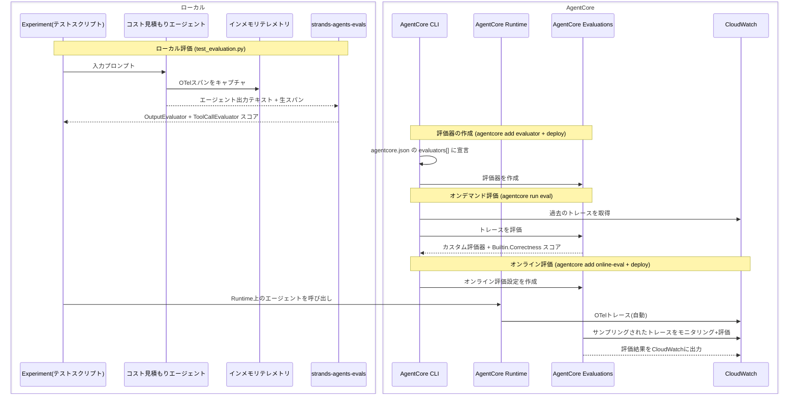

# エージェントを評価する - 重要な指標を測定する

[English](README.md) / [日本語](README_ja.md)

プロンプトの調整やツールの追加を行う前に、成功の定義を明確にしましょう。測定可能な目標がなければ、チームは終わりのないイテレーションを彷徨うことになります。このセクションでは、まず評価シナリオを設計し、それを開発の指針として活用する**評価ファーストの考え方**を紹介します。

コスト見積もりエージェントに対して、**ローカル評価** (strands-agents-evals)、**オンデマンド評価** (`agentcore run eval`)、**オンライン評価** (AgentCore Runtime上の継続的モニタリング) を適用します。AgentCore CLI では評価器とオンライン評価設定を `agentcore.json` に宣言し、`agentcore deploy` で作成します。

## 評価シナリオの設計

コスト見積もりエージェントは品質・コスト・納期のいわゆる「QCD」バランスを維持する必要があります。エージェントは精度を保ちつつコストとレイテンシを低く抑えるため、必要十分な形でツールを呼び出すべきです。出力品質もビジネスユーザーにとって重要です。このシナリオでは以下の2つの測定軸を定義します。 (実際のプロジェクトでは、ステークホルダーとの対話を通じて目標と指標を選択します。)

[ビルトインメトリクス](https://docs.aws.amazon.com/bedrock-agentcore/latest/devguide/built-in-evaluators-overview.html)を活用しつつ、シナリオに応じてカスタムメトリクスを追加できます。以下の表は、各ディメンションの成功・失敗の定義と、ローカル開発時およびAgentCore Runtimeデプロイ後に使用する評価器をまとめたものです。

| ディメンション | 成功要因 | リスク要因 | ローカル | オンデマンド / オンライン |
|---------------|---------|-----------|---------|------------------------|
| **ツール使用** | エージェントが`get_pricing` APIを呼び出して実際の価格を取得する | エージェントがツールをスキップし、学習データから価格をハルシネーションする | **ToolCallEvaluator** (カスタム) | カスタム評価器 (`llmAsAJudge`) |
| **出力品質** | レスポンスにサービス別の具体的なコストが含まれている | レスポンスが曖昧、またはコスト数値が欠落している | **OutputEvaluator** (ルーブリック) | `Builtin.Correctness` |

### 適切な評価器の選択

ビルトイン評価器には[固定のプロンプトテンプレート](https://docs.aws.amazon.com/bedrock-agentcore/latest/devguide/prompt-templates-builtin.html)が付属しており、3つのレベルのいずれかで実行されます。各レベルは、ジャッジモデルがプレースホルダー変数を通じて受け取るデータを決定します([詳細](https://docs.aws.amazon.com/bedrock-agentcore/latest/devguide/create-evaluator.html)):

| レベル | `context` | 評価対象 | ビルトイン評価器 |
|--------|-----------|---------|-----------------|
| **SESSION** | **全ターン** (プロンプト、レスポンス、ツール呼び出し) | セッション全体 | GoalSuccessRate |
| **TRACE** | **前のターン** + 現在のターンのプロンプトとツール呼び出し | `assistant_turn` (現在のレスポンス) | Correctness, Helpfulness, Faithfulness, [他](https://docs.aws.amazon.com/bedrock-agentcore/latest/devguide/prompt-templates-builtin.html) |
| **TOOL_CALL** | **前のターン** + 現在のターンのプロンプト + 対象**より前の**ツール呼び出し | `tool_turn` (1つのツール呼び出し) | ToolParameterAccuracy, ToolSelectionAccuracy |

評価器の設計には2つの制約があります。

1. **TOOL_CALL レベルの評価器はツール呼び出しの欠落を検知できない。** `Builtin.ToolSelectionAccuracy`はエージェントが*実行した*各ツール呼び出しが適切かどうかを判定します。しかし、エージェントがハルシネーション (ツールを完全にスキップ) した場合、判定すべきツール呼び出しがゼロとなり、評価器はサイレントに合格スコアを返します。ツール呼び出しの*欠落*を検知するには、エージェントの完全なターンを参照できるTRACEレベルの評価器が必要です。
2. **AgentCore評価器は[LLM-as-a-Judge](https://docs.aws.amazon.com/bedrock-agentcore/latest/devguide/create-evaluator.html)のみサポート(2026年2月現在)。** AgentCoreのカスタム評価器はジャッジモデルに送信されるプロンプトテンプレートを使用するため、OTelスパンをプログラムで検査するような任意のコード実行はできません。

これらの制約により、ローカルとリモートで異なる評価器を使用します。ローカルではOTelスパンを直接検査する**コードベースの`ToolCallEvaluator`**を、AgentCore上ではコスト数値を生成する前に料金ツールが呼び出されたかをジャッジモデルに問い合わせる**カスタムTRACEレベルLLM-as-a-Judge評価器**を使用します。


## プロセス概要


```mermaid
sequenceDiagram
    box ローカル
        participant Exp as Experiment(テストスクリプト)
        participant Agent as コスト見積もりエージェント
        participant OTel as インメモリテレメトリ
        participant Eval as strands-agents-evals
    end
    box AgentCore
        participant CLI as AgentCore CLI
        participant RT as AgentCore Runtime
        participant AC as AgentCore Evaluations
        participant CW as CloudWatch
    end

    Note over Exp,Eval: ローカル評価 (test_evaluation.py)
    Exp->>Agent: 入力プロンプト
    Agent->>OTel: OTelスパンをキャプチャ
    Agent-->>Eval: エージェント出力テキスト + 生スパン
    Eval-->>Exp: OutputEvaluator + ToolCallEvaluator スコア

    Note over CLI,AC: 評価器の作成 (agentcore add evaluator + deploy)
    CLI->>CLI: agentcore.json の evaluators[] に宣言
    CLI->>AC: 評価器を作成

    Note over CLI,AC: オンデマンド評価 (agentcore run eval)
    CLI->>CW: 過去のトレースを取得
    CLI->>AC: トレースを評価
    AC-->>CLI: カスタム評価器 + Builtin.Correctness スコア

    Note over CLI,CW: オンライン評価 (agentcore add online-eval + deploy)
    CLI->>AC: オンライン評価設定を作成
    Exp->>RT: Runtime上のエージェントを呼び出し
    RT->>CW: OTelトレース(自動)
    AC->>CW: サンプリングされたトレースをモニタリング+評価
    AC-->>CW: 評価結果をCloudWatchに出力
```

## 前提条件

1. **ステップ02完了** - エージェントがAgentCore Runtimeにデプロイ済みであること (`agents/MyCostEstimatorAgent/`)
2. **ステップ04完了** - オンデマンド評価は過去のトレースを対象にするため、Transaction Searchが有効でトレースが記録されていること
3. **AWS認証情報** - BedrockとAgentCoreのアクセス権限付き
4. **AgentCore CLI** - `npm install -g @aws/agentcore`
5. **依存関係** - `uv sync`でインストール (strands-agents-evalsはpyproject.tomlに含まれています)

## 使用方法

3つの評価は次のように使い分けます。ステージに合ったモードを選択してください:

| モード | コマンド | エージェント実行場所 | 結果の確認先 |
|--------|---------|-------------------|------------|
| **ローカル** | `uv run python test_evaluation.py` | ローカル | ターミナル |
| **オンデマンド** | `agentcore run eval` | AgentCore Runtime (過去のトレース) | ターミナル / `agentcore evals history` |
| **オンライン** | `agentcore add online-eval` + `agentcore deploy` | AgentCore Runtime (ライブ) | CloudWatchコンソール |

- **ローカル**はstrands-agents-evals (コードベースの評価器) で評価します。高速な開発イテレーションに最適です。
- **オンデマンド**はデプロイ済みエージェントの過去のトレースを、AgentCoreのマネージド評価器でスコアリングします。デバッグや特定期間の再評価に使えます。
- **オンライン**は継続的モニタリングを設定します。エージェントはRuntime上で実行され、トレースはCloudWatchに流れ、オンライン評価設定が自動的にインタラクションをサンプリング・評価します。結果はCloudWatchコンソールに表示されます。

### ファイル構成

```
05_evaluation/
├── README.md                              # 英語ドキュメント
├── README_ja.md                           # このドキュメント
├── test_evaluation.py                     # ローカル評価スクリプト
└── evaluators/
    ├── __init__.py                        # カスタム評価器のエクスポート
    ├── tool_call_evaluator.py             # ローカル用: Spanを検査して料金ツールの使用を確認
    └── tool_usage_evaluator.json          # AgentCore用: LLM-as-a-Judgeの評価器設定
```

オンデマンド評価とオンライン評価は AgentCore CLI が担うため、それらを実行するスクリプトは
不要になりました。エージェント自体はベースの `agents/CostEstimatorAgent` を使います。

### ローカル評価

ローカルマシン上のエージェントに対して両方の評価器を実行します:

```bash
cd 05_evaluation
uv run python test_evaluation.py

# 1ケースだけ実行
uv run python test_evaluation.py --case single-ec2
```

```
Captured 9 OTel spans for case: single-ec2
Overall score: 1.00
╭──────────────────────────── 📊 Evaluation Report ────────────────────────────╮
│ Overall Score: 1.00           Pass Rate: 1.0                                 │
╰──────────────────────────────────────────────────────────────────────────────╯
```

### オンデマンド評価

Lab 2 のプロジェクトディレクトリで、評価器を宣言してデプロイします。

```bash
cd ../agents/MyCostEstimatorAgent

agentcore add evaluator \
    --name cost_estimator_tool_usage \
    --level TRACE \
    --config ../../05_evaluation/evaluators/tool_usage_evaluator.json

agentcore deploy
```

過去のトレースに対して評価を実行します。

```bash
agentcore run eval \
    --runtime MyCostEstimatorAgent \
    --evaluator cost_estimator_tool_usage Builtin.Correctness \
    --days 1
```

```
Agent: MyCostEstimatorAgent | Aug 4, 2026, 12:46 AM | Sessions: 1 | Lookback: 1d

  cost_estimator_tool_usage: 1.00
  Builtin.Correctness: 0.83
```

履歴は `agentcore evals history` で確認できます。結果は
`agentcore/.cli/eval-results/` に保存されます。

> トレースは呼び出しから5〜10分ほど遅れて評価対象になります。`Sessions: 0` になる場合は
> `--days` を増やすか、少し待ってから再実行してください。

### オンライン評価

```bash
agentcore add online-eval \
    --name cost_estimator_online_eval \
    --runtime MyCostEstimatorAgent \
    --evaluator cost_estimator_tool_usage Builtin.Correctness \
    --sampling-rate 100 \
    --enable-on-create

agentcore deploy
```

```
Online Eval Configs
  cost_estimator_online_eval: Deployed (2 evaluators, 100% sampling — ACTIVE (ENABLED))
```

この状態でエージェントを呼び出すと、ライブトラフィックが自動で評価されます。

```bash
cd ../../04_observability
uv run python test_observability.py --project-dir ../agents/MyCostEstimatorAgent
```

結果は [CloudWatch GenAI Observability](https://console.aws.amazon.com/cloudwatch/home#gen-ai-observability)
の **Evaluations** タブで確認します。一時停止・再開もできます。

```bash
agentcore pause online-eval cost_estimator_online_eval
agentcore resume online-eval cost_estimator_online_eval
```

### 後片付け

オンライン評価は継続的に LLM を呼ぶため、確認が終わったら削除します。

```bash
cd ../agents/MyCostEstimatorAgent
agentcore remove online-eval --name cost_estimator_online_eval -y
agentcore remove evaluator --name cost_estimator_tool_usage -y
agentcore deploy
```

評価器とオンライン評価設定は Lab 2 のプロジェクト (`MyCostEstimatorAgent`) の中に宣言されて
いるため、この 2 つだけを個別に削除すれば Runtime は残ります。

> 評価器がオンライン評価設定から参照されている間は削除できません (`Evaluator ... is
> referenced by online eval config (s) ` エラーになります)。`online-eval` を先に削除して
> ください。

## 主要な実装パターン

### Experimentによる評価の実行

`Experiment`は**テストケース**、**タスク関数**、**評価器**をオーケストレーションします。

```python
from strands_evals import Case, Experiment

# 1. テストケースの定義 — 何を評価するか
cases = [
    Case(
        name="single-ec2",
        input="One EC2 t3.micro instance running 24/7 in us-east-1",
        expected_trajectory=["get_pricing"],
    ),
]

# 2. タスク関数の定義 — エージェントの実行方法
#    Caseを受け取り、{"output": str, "trajectory": spans}を返す
def task_fn(case):
    agent = AWSCostEstimatorAgent()
    output = agent.estimate_costs(case.input)
    return {"output": output, "trajectory": spans}

# 3. 評価器の定義 — 結果の採点方法
evaluators = [output_evaluator, tool_evaluator]

# 4. 実行: Experimentは各ケースに対してtask_fnを呼び出し、
#    結果をすべての評価器に渡す。評価器がエージェントを直接呼び出すことはない。
experiment = Experiment(cases=cases, evaluators=evaluators)
reports = experiment.run_evaluations(task_fn)
```

### ベースのエージェントをローカルから読み込む

エージェントは `agents/CostEstimatorAgent/app/CostEstimatorAgent/` にあり、
フラットな import (`from config import ...`) を使うため、そのディレクトリを
`sys.path` に追加します。

```python
AGENT_DIR = (
    Path(__file__).resolve().parent.parent
    / "agents" / "CostEstimatorAgent" / "app" / "CostEstimatorAgent"
)
sys.path.insert(0, str(AGENT_DIR))
from cost_estimator_agent import AWSCostEstimatorAgent
```

ベースの `AWSCostEstimatorAgent` は Runtime 用に `async stream()` を持ちますが、
ローカル評価から使いやすいよう同期版の `estimate_costs()` も用意しています。

### 評価器: ビルトインとカスタム

**OutputEvaluator** (ビルトイン) はルーブリックに基づいて出力を採点します。

```python
from strands_evals.evaluators import OutputEvaluator

output_evaluator = OutputEvaluator(rubric="""\
Score 1.0 if the response contains specific dollar amounts and lists services.
Score 0.0 if no meaningful cost estimate is provided.
""")
```

**ToolCallEvaluator** (カスタム) はOTelスパンを走査してツール呼び出しを検査します。

```python
from strands_evals.evaluators.evaluator import Evaluator

class ToolCallEvaluator(Evaluator[str, str]):
    def evaluate(self, evaluation_case):
        for span in evaluation_case.actual_trajectory:
            attrs = span.attributes or {}
            if attrs.get("gen_ai.operation.name") == "execute_tool":
                tool_name = attrs.get("gen_ai.tool.name", "")
                # ... required_toolsと照合
```

### オンデマンド / オンライン: agentcore.json に宣言する評価器

AgentCore 上の評価器は `agentcore add evaluator` で `agentcore.json` の
`evaluators[]` に宣言され、`agentcore deploy` で作成されます。boto3 で
`create_evaluator` を呼ぶ必要はありません。

```json
{
  "evaluators": [
    {
      "name": "cost_estimator_tool_usage",
      "level": "TRACE",
      "config": {
        "llmAsAJudge": {
          "model": "us.anthropic.claude-sonnet-4-6",
          "instructions": "... {context} ... {assistant_turn} ...",
          "ratingScale": {
            "numerical": [
              { "value": 0, "label": "No", "definition": "No pricing tool was called" },
              { "value": 1, "label": "Yes", "definition": "Pricing tool was used" }
            ]
          }
        }
      }
    }
  ],
  "onlineEvalConfigs": [
    {
      "name": "cost_estimator_online_eval",
      "runtime": "MyCostEstimatorAgent",
      "evaluators": ["cost_estimator_tool_usage", "Builtin.Correctness"],
      "samplingRate": 100,
      "enableOnCreate": true
    }
  ]
}
```

`{context}` と `{assistant_turn}` は評価時に実データへ置換されるプレースホルダです。
使えるプレースホルダはレベルによって決まります。

| プレースホルダ | 利用可能なレベル |
|---|---|
| `{context}` | SESSION, TRACE, TOOL_CALL |
| `{assistant_turn}` | TRACE |
| `{available_tools}` | SESSION, TOOL_CALL |
| `{tool_turn}` | TOOL_CALL |

## 参考資料

- [ビルトイン評価器の概要](https://docs.aws.amazon.com/bedrock-agentcore/latest/devguide/built-in-evaluators-overview.html)
- [評価器の作成](https://docs.aws.amazon.com/bedrock-agentcore/latest/devguide/create-evaluator.html)
- [オンライン評価](https://docs.aws.amazon.com/bedrock-agentcore/latest/devguide/create-online-evaluations.html)
- [AgentCore CLI - Evaluations](https://github.com/aws/agentcore-cli/blob/main/docs/evals.md)
- [strands-agents/evals](https://github.com/strands-agents/evals) - Strands Agentsの評価フレームワーク

---

**次のステップ**: [06_identity](../06_identity/README.md) に進んで、安全な外部操作のためのOAuth 2.0認証を追加しましょう。
