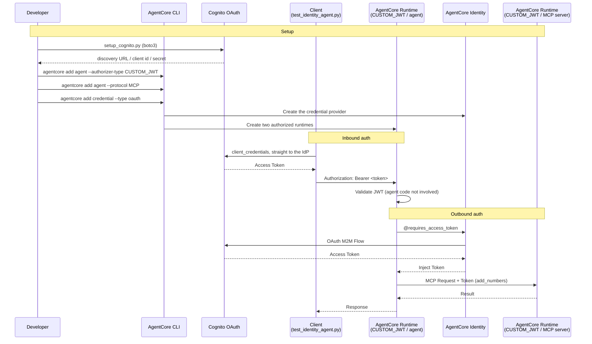

# AgentCore Identity Integration

[English](README.md) / [日本語](README_ja.md)

This implementation demonstrates **AgentCore Identity** controlling access to an AgentCore Runtime with OAuth. With the AgentCore CLI, both the Runtime's inbound authorizer (`authorizerType`) and the outbound credential provider (`credentials[]`) are declared in `agentcore.json` and created by `agentcore deploy`. The only piece the CLI cannot create is the identity provider (Cognito), so that is the only part built with boto3.

## Process Overview



## Prerequisites

1. **Understanding of step 02** - familiarity with `agentcore create` through `agentcore deploy`
2. **AWS credentials** - with `cognito-idp` and `bedrock-agentcore-control` permissions
3. **AgentCore CLI** - `npm install -g @aws/agentcore`
4. **Dependencies** - installed with `uv sync`

## How to use

### File Structure

```
06_identity/
├── README.md                    # This document
├── README_ja.md                 # Japanese documentation
├── setup_cognito.py             # Create and delete the Cognito authorization server
├── agent/                       # Lab 6 code layered on top of the base agent
│   ├── main.py                  # Entrypoint that calls the MCP server (override)
│   └── pyproject.toml           # Adds the mcp dependency (override)
├── test_identity_agent.py       # Verify inbound denial/allow and outbound auth
└── clean_resources.py           # Removes what Lab 6 added, plus Cognito
```

`config.py` and `iam_policies/` come from the base agent
(`agents/CostEstimatorAgent/`).

Lab 6's agent and MCP server are added to the `agents/MyCostEstimatorAgent` project from Lab 2. A project can declare several AgentCore Runtimes, so there is no dedicated project here. Lab 2's agent stays on `IAM`.

### Step 1: Create the Authorization Server (Cognito)

```bash
uv run python setup_cognito.py
```

The AgentCore CLI cannot create an identity provider, so Cognito is created with boto3.
The script creates a user pool, a resource server (scope `agentcore/invoke`), a domain, and
an M2M app client, then writes the settings to `inbound_authorizer.json`.

### Step 2: Add Two Runtimes and the Credential Provider to Lab 2's Project

Lab 2's agent stays callable over IAM SigV4, so the authorized agent goes into a
**separate project**.

```bash
cd ../agents
cd ../agents/MyCostEstimatorAgent
```

**Inbound auth** — the agent runtime that requires a JWT:

```bash
agentcore add agent \
    --name MySecureAgent \
    --language Python --framework Strands --model-provider Bedrock \
    --memory none \
    --authorizer-type CUSTOM_JWT \
    --discovery-url <discovery-url> \
    --allowed-clients <client-id>
```

**The callee** — `--protocol MCP` scaffolds a FastMCP server. Protect it with the same
Cognito:

```bash
agentcore add agent \
    --name MyMcpServer \
    --language Python --protocol MCP --build CodeZip \
    --memory none \
    --authorizer-type CUSTOM_JWT \
    --discovery-url <discovery-url> \
    --allowed-clients <client-id>
```

> Do not omit `--memory none` — an MCP server is stateless and needs no memory.
> `setup.py` also tidies up credential declarations that end up unused.

`--authorizer-type` is optional and defaults to `AWS_IAM`. Left on IAM, any AgentCore Runtime in
the same account can call the server with its execution role — no token involved. CUSTOM_JWT is
chosen here **to make outbound auth necessary**: only when a token is required does
`@requires_access_token` mean anything.

| MCP server inbound | How the agent calls it |
|---|---|
| `AWS_IAM` (default) | SigV4 with the execution role. No token |
| `CUSTOM_JWT` (chosen here) | Token required, so AgentCore Identity comes into play |

In production the same reasoning applies: IAM only works inside the AWS account boundary. Opening
a tool to another account or an outside system calls for OAuth.

**Outbound auth** — the credential provider the agent uses to reach the MCP server:

```bash
agentcore add credential \
    --name CostEstimatorOutboundIdentity \
    --type oauth \
    --discovery-url <discovery-url> \
    --client-id <client-id> \
    --client-secret <client-secret> \
    --scopes agentcore/invoke
```

### Step 3: Place the Agent Code and Deploy

```bash
cd ../
python setup.py --target MyCostEstimatorAgent --agent MySecureAgent \
    --overlay ../06_identity/agent
cd MyCostEstimatorAgent
for d in MySecureAgent MyMcpServer; do (cd app/$d && uv sync); done
agentcore deploy
```

The MCP server's ARN only exists after a deploy, so this takes **two rounds**. After the
first deploy, write the ARN into `envVars` and deploy again.

```bash
python - <<'PY'
import json
from pathlib import Path

state = json.load(open("agentcore/.cli/deployed-state.json"))
arn = next(iter(state["targets"].values()))["resources"]["runtimes"]["MyMcpServer"]["runtimeArn"]

path = Path("agentcore/agentcore.json")
config = json.load(path.open())
for runtime in config["runtimes"]:
    if runtime["name"] == "MySecureAgent":
        runtime["envVars"] = [{"name": "MCP_RUNTIME_ARN", "value": arn}]
path.write_text(json.dumps(config, indent=2) + "\n")
PY

agentcore deploy
```

### Step 4: Verify Inbound and Outbound Auth

```bash
cd ../../06_identity
uv run python test_identity_agent.py
```

The call without a token is rejected with `AccessDeniedException`; the same call with a
Cognito token succeeds. The arithmetic itself is done by the MCP server.

The outbound auth trail shows up in the logs:

```bash
cd ../agents/MyCostEstimatorAgent
agentcore logs --runtime MySecureAgent --since 10m \
  | grep -E 'GetResourceOauth2Token|MCP call'
```

```
Bedrock AgentCore.GetResourceOauth2Token
  aws.auth.credential_provider: "CostEstimatorOutboundIdentity"
MCP call add_numbers via provider CostEstimatorOutboundIdentity
```

> `agentcore logs` needs `--runtime` when a project holds more than one runtime.

## Key Implementation Patterns

### Inbound Is a Runtime Setting; Outbound Is Code

These two play different roles.

| | What you declare | Agent code |
|---|---|---|
| **Inbound** | `authorizerType: CUSTOM_JWT` (a runtime setting) | **Nothing**. The runtime validates the JWT |
| **Outbound** | `credentials[]` (a credential provider) | `@requires_access_token` |

Inbound auth never appears in the agent code. It is declared under
`runtimes[].authorizerConfiguration` in `agentcore.json`.

```json
{
  "name": "MySecureAgent",
  "protocol": "HTTP",
  "authorizerType": "CUSTOM_JWT",
  "authorizerConfiguration": {
    "customJwtAuthorizer": {
      "discoveryUrl": "https://cognito-idp.<region>.amazonaws.com/<pool-id>/.well-known/openid-configuration",
      "allowedClients": ["<client-id>"]
    }
  }
}
```

Cognito M2M tokens carry no `aud` claim, so use `--allowed-clients`, not
`--allowed-audience`.

### Resolve the Credential Provider Name from the Environment

`agentcore deploy` injects `CREDENTIAL_<NAME>_NAME` for every declared credential, so the
name never has to be hard-coded.

```python
OAUTH_PROVIDER = next(
    (v for k, v in os.environ.items()
     if k.startswith("CREDENTIAL_") and k.endswith("_NAME")),
    "",
)
```

### @requires_access_token Belongs in the Runtime's Code

The decorator fetches the token from AgentCore Identity and injects it as `access_token`.
There is no token acquisition or refresh code to write.

```python
@requires_access_token(
    provider_name=OAUTH_PROVIDER,
    scopes=[OAUTH_SCOPE],
    auth_flow="M2M",
    force_authentication=False,
)
def _call_mcp(tool_name: str, arguments: dict, access_token: str = "") -> str:
    def transport():
        return streamablehttp_client(
            mcp_invocation_url(MCP_RUNTIME_ARN),
            headers={"Authorization": f"Bearer {access_token}"},
        )

    with MCPClient(transport) as client:
        result = client.call_tool_sync(
            tool_use_id=f"{tool_name}-1", name=tool_name, arguments=arguments
        )
        return json.dumps(result, default=str)
```

### Keep the Token Away from the Model

Define the tool the model sees separately and delegate to an inner function. A tool whose
signature includes `access_token` invites the model to invent a value for it.

```python
@tool(name="add_numbers", description="Add two integers using the remote MCP server")
def add_numbers(a: int, b: int) -> str:
    return _call_mcp("add_numbers", {"a": a, "b": b})
```

### The Client Talks to the IdP Directly

An inbound-auth client does not use AgentCore Identity. It requests a token from the
authorization server with the client-credentials flow.

`boto3`'s `invoke_agent_runtime` has no parameter for a bearer token, so the header is
injected with a `before-send` hook, which also skips SigV4 signing.

```python
if bearer_token:
    def _inject_bearer(request, **_):
        request.headers["Authorization"] = f"Bearer {bearer_token}"

    client.meta.events.register(
        "before-send.bedrock-agentcore.InvokeAgentRuntime", _inject_bearer
    )
```

### Clean Up by Name, Not with `remove all`

Lab 6's resources share a project with Lab 2's agent, so `agentcore remove all` is off
limits — it would drop Lab 2's agent too. Remove each resource by name instead.

```bash
agentcore remove agent --name MySecureAgent -y
agentcore remove agent --name MyMcpServer -y
agentcore remove credential --name CostEstimatorOutboundIdentity -y
agentcore deploy -y
```

`clean_resources.py` runs exactly this sequence and then verifies Lab 2's agent survived.

### Read Runtime ARNs from deployed-state.json

Read `agentcore/.cli/deployed-state.json`, which `agentcore deploy` writes.

```python
def load_runtime_arn(project_dir: Path, runtime_name: str) -> str:
    state_path = project_dir / "agentcore" / ".cli" / "deployed-state.json"
    with state_path.open() as f:
        state = json.load(f)

    for target in state.get("targets", {}).values():
        runtimes = target.get("resources", {}).get("runtimes", {})
        if runtime_name in runtimes:
            return runtimes[runtime_name]["runtimeArn"]
```

## Usage Example

```bash
# Run with the default English prompt
uv run python test_identity_agent.py

# Answer in another language by passing the prompt in it
uv run python test_identity_agent.py \
    --prompt '17 と 25 を足すといくつですか? ツールを使ってください。'
```

To inspect the outbound auth trail:

```bash
cd ../agents/MyCostEstimatorAgent
agentcore logs --runtime MySecureAgent --since 10m \
  | grep -E 'GetResourceOauth2Token|MCP call'
```

## Security Benefits

- **Declarative auth configuration** - inbound and outbound settings live in `agentcore.json` and are easy to review
- **Centralized credential management** - the client secret is stored in the Token Vault and Secrets Manager, never in code
- **Automatic token refresh** - `@requires_access_token` handles acquisition and renewal
- **Least privilege** - the scope (`agentcore/invoke`) and `allowedClients` narrow who can call the Runtime
- **Works with existing IdPs** - any OIDC provider can be pointed at through its discovery URL

## References

- [AgentCore Identity Developer Guide](https://docs.aws.amazon.com/bedrock-agentcore/latest/devguide/identity.html)
- [Inbound and Outbound Auth for AgentCore Runtime](https://docs.aws.amazon.com/bedrock-agentcore/latest/devguide/runtime-oauth.html)
- [CreateOauth2CredentialProvider](https://docs.aws.amazon.com/bedrock-agentcore-control/latest/APIReference/API_CreateOauth2CredentialProvider.html)
- [AgentCore Identity Workload Identity](https://docs.aws.amazon.com/bedrock-agentcore/latest/devguide/identity-manage-agent-ids.html)
- [AgentCore CLI](https://github.com/aws/agentcore-cli)
- [MCP Authorization](https://modelcontextprotocol.io/specification/draft/basic/authorization)

---

**Next Steps**: Integrate the identity-protected agent into your application using the patterns shown here, or continue with [07_gateway](../07_gateway/README.md) to expose your agent through an MCP-compatible API.
