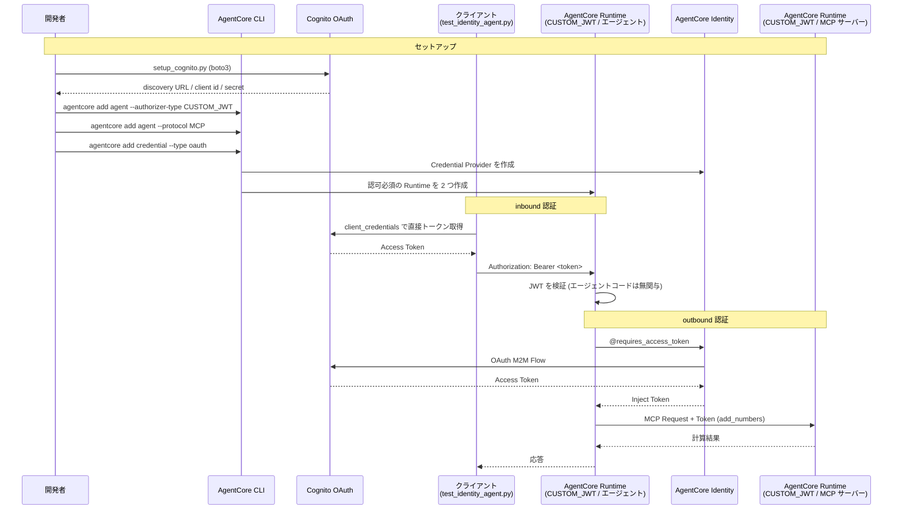

# AgentCore Identity統合

[English](README.md) / [日本語](README_ja.md)

この実装では、AgentCore Runtime へのアクセスを OAuth で制御する **AgentCore Identity** を実演します。AgentCore CLI では、Runtime の inbound 認証 (`authorizerType`) と outbound の Credential Provider (`credentials[]`) の両方を `agentcore.json` に宣言し、`agentcore deploy` で作成します。CLI が扱えないのは ID プロバイダー (Cognito) だけで、そこだけを boto3 で作成します。

## プロセス概要



## 前提条件

1. **ステップ02の理解** - `agentcore create` から `agentcore deploy` までの流れを把握していること
2. **AWS認証情報** - `cognito-idp` と `bedrock-agentcore-control` の権限付き
3. **AgentCore CLI** - `npm install -g @aws/agentcore`
4. **依存関係** - `uv sync`でインストール

## 使用方法

### ファイル構成

```
06_identity/
├── README.md                    # 英語ドキュメント
├── README_ja.md                 # このドキュメント
├── setup_cognito.py             # 認可サーバー (Cognito) の作成と削除
├── agent/                       # ベースへ被せる Lab 6 固有のコード
│   ├── main.py                  # MCP サーバーを呼ぶエントリポイント (上書き)
│   └── pyproject.toml           # mcp 依存を追加 (上書き)
├── test_identity_agent.py       # 認可の有無と outbound 認証の検証
└── clean_resources.py           # Lab 6 が追加した Runtime + Cognito の削除
```

`config.py`、`iam_policies/` はベース (`agents/CostEstimatorAgent/`) から引き継ぎます。

Lab 6 のエージェントと MCP サーバーは、Lab 2 で作った `agents/MyCostEstimatorAgent` プロジェクトに追加します。1 つのプロジェクトに複数の AgentCore Runtime を宣言できるため、専用のプロジェクトは作りません。Lab 2 のエージェントは `IAM` のまま残ります。

### ステップ1: 認可サーバー (Cognito) を作成

```bash
uv run python setup_cognito.py
```

AgentCore CLI は ID プロバイダーを作成できないため、Cognito は boto3 で作成します。
User pool、リソースサーバー (`agentcore/invoke` スコープ)、ドメイン、M2M アプリクライアントの
4 つが作られ、設定は `inbound_authorizer.json` に保存されます。

### ステップ2: Lab 2 のプロジェクトに 2 つの Runtime と Credential Provider を追加

Lab 2 のエージェントは IAM SigV4 で呼べる状態のまま残すため、認可付きのエージェントは
**別プロジェクト**として作成します。

```bash
cd ../agents
cd ../agents/MyCostEstimatorAgent
```

**inbound 認証**: JWT が必須のエージェント Runtime。

```bash
agentcore add agent \
    --name MySecureAgent \
    --language Python --framework Strands --model-provider Bedrock \
    --memory none \
    --authorizer-type CUSTOM_JWT \
    --discovery-url <discovery-url> \
    --allowed-clients <client-id>
```

**呼び出し先**: `--protocol MCP` を指定すると FastMCP ベースの MCP サーバーの雛形が生成されます。
これにも同じ Cognito で認可をかけます。

```bash
agentcore add agent \
    --name MyMcpServer \
    --language Python --protocol MCP --build CodeZip \
    --memory none \
    --authorizer-type CUSTOM_JWT \
    --discovery-url <discovery-url> \
    --allowed-clients <client-id>
```

> `--memory none` を忘れないでください。MCP サーバーは状態を持たないため Memory は不要です。
> なお `setup.py` は、宣言されたが使われない credential を片付けます。

`--authorizer-type` は省略でき、既定は `AWS_IAM` です。IAM のままなら同じアカウント内の
AgentCore Runtime から実行ロールの権限で呼べるため、トークンは要りません。ここで CUSTOM_JWT を
選ぶのは **outbound 認証を成立させるため** です。トークンが必須になって初めて
`@requires_access_token` が意味を持ちます。

| MCP サーバーの inbound | エージェント側の呼び出し方 |
|---|---|
| `AWS_IAM` (既定) | 実行ロールで SigV4 署名。トークン不要 |
| `CUSTOM_JWT` (ここでの選択) | トークンが必須。AgentCore Identity が必要になる |

実運用でも、IAM は AWS アカウントの境界の中でしか働きません。社外や別アカウントに
ツールを開放するなら OAuth が必要です。

**outbound 認証**: エージェントが MCP サーバーのトークンを取得するための Credential Provider。

```bash
agentcore add credential \
    --name CostEstimatorOutboundIdentity \
    --type oauth \
    --discovery-url <discovery-url> \
    --client-id <client-id> \
    --client-secret <client-secret> \
    --scopes agentcore/invoke
```

### ステップ3: エージェントコードを配置してデプロイ

```bash
cd ../
python setup.py --target MyCostEstimatorAgent --agent MySecureAgent \
    --overlay ../06_identity/agent
cd MyCostEstimatorAgent
for d in MySecureAgent MyMcpServer; do (cd app/$d && uv sync); done
agentcore deploy
```

MCP サーバーの ARN はデプロイ後にしか分からないため、**2 段階に分けてデプロイ**します。
1 回目のデプロイ後に ARN を `envVars` へ書き、もう一度デプロイします。

```bash
python - <<'PY'
import json
from pathlib import Path

state = json.load(open("agentcore/.cli/deployed-state.json"))
arn = next(iter(state["targets"].values()))["resources"]["runtimes"]["MyMcpServer"]["runtimeArn"]

path = Path("agentcore/agentcore.json")
config = json.load(path.open())
for runtime in config["runtimes"]:
    if runtime["name"] == "MySecureAgent":
        runtime["envVars"] = [{"name": "MCP_RUNTIME_ARN", "value": arn}]
path.write_text(json.dumps(config, indent=2) + "\n")
PY

agentcore deploy
```

### ステップ4: 認可の有無と outbound 認証を確認

```bash
cd ../../06_identity
uv run python test_identity_agent.py
```

トークンなしの呼び出しは `AccessDeniedException` で拒否され、Cognito から取得した
トークンを付けると通ります。答えの計算は MCP サーバーが行っています。

outbound 認証の証跡はログで確認できます。

```bash
cd ../agents/MyCostEstimatorAgent
agentcore logs --runtime MySecureAgent --since 10m \
  | grep -E 'GetResourceOauth2Token|MCP call'
```

```
Bedrock AgentCore.GetResourceOauth2Token
  aws.auth.credential_provider: "CostEstimatorOutboundIdentity"
MCP call add_numbers via provider CostEstimatorOutboundIdentity
```

> 複数の Runtime があるプロジェクトでは `agentcore logs` に `--runtime` が必要です。

## 主要な実装パターン

### inbound は Runtime の設定、outbound はコードの実装

この 2 つは役割が違います。

| | 何を宣言するか | エージェントコード |
|---|---|---|
| **inbound** | `authorizerType: CUSTOM_JWT` (Runtime の設定) | **記述なし**。Runtime が JWT を検証する |
| **outbound** | `credentials[]` (Credential Provider) | `@requires_access_token` を書く |

inbound 認証はエージェントのコードに一切現れません。`agentcore.json` の
`runtimes[].authorizerConfiguration` に宣言するだけです。

```json
{
  "name": "MySecureAgent",
  "protocol": "HTTP",
  "authorizerType": "CUSTOM_JWT",
  "authorizerConfiguration": {
    "customJwtAuthorizer": {
      "discoveryUrl": "https://cognito-idp.<region>.amazonaws.com/<pool-id>/.well-known/openid-configuration",
      "allowedClients": ["<client-id>"]
    }
  }
}
```

Cognito の M2M トークンには `aud` クレームがないため、`--allowed-audience` ではなく
`--allowed-clients` を使います。

### Credential Provider 名は環境変数から解決する

`agentcore deploy` は宣言した credential ごとに `CREDENTIAL_<名前>_NAME` という環境変数を
Runtime に注入します。コードに名前を書き込む必要はありません。

```python
OAUTH_PROVIDER = next(
    (v for k, v in os.environ.items()
     if k.startswith("CREDENTIAL_") and k.endswith("_NAME")),
    "",
)
```

### @requires_access_token は Runtime 上のコードに書く

デコレーターが AgentCore Identity からトークンを取得し、`access_token` 引数として渡します。
取得・更新のコードは書きません。

```python
@requires_access_token(
    provider_name=OAUTH_PROVIDER,
    scopes=[OAUTH_SCOPE],
    auth_flow="M2M",
    force_authentication=False,
)
def _call_mcp(tool_name: str, arguments: dict, access_token: str = "") -> str:
    def transport():
        return streamablehttp_client(
            mcp_invocation_url(MCP_RUNTIME_ARN),
            headers={"Authorization": f"Bearer {access_token}"},
        )

    with MCPClient(transport) as client:
        result = client.call_tool_sync(
            tool_use_id=f"{tool_name}-1", name=tool_name, arguments=arguments
        )
        return json.dumps(result, default=str)
```

### トークンをモデルに見せない

モデルに渡すツールは別に定義し、内部関数へ委譲します。`access_token` を引数に持つ関数を
そのままツールにすると、モデルがトークンを推測して埋めようとします。

```python
@tool(name="add_numbers", description="Add two integers using the remote MCP server")
def add_numbers(a: int, b: int) -> str:
    return _call_mcp("add_numbers", {"a": a, "b": b})
```

### クライアント側は認可サーバーから直接トークンを取得する

inbound 認証のクライアントは AgentCore Identity を使いません。認可サーバーに
client-credentials フローで直接リクエストします。

`boto3` の `invoke_agent_runtime` にはトークンを渡す引数がないため、`before-send` フックで
`Authorization` ヘッダーを差し込みます (SigV4 署名も行われなくなります)。

```python
if bearer_token:
    def _inject_bearer(request, **_):
        request.headers["Authorization"] = f"Bearer {bearer_token}"

    client.meta.events.register(
        "before-send.bedrock-agentcore.InvokeAgentRuntime", _inject_bearer
    )
```

### 後片付けは個別削除で行う

Lab 6 のリソースは Lab 2 のプロジェクトに同居しているため、`agentcore remove all` は使えません。Lab 2 のエージェントまで消えてしまいます。名前を指定して個別に削除します。

```bash
agentcore remove agent --name MySecureAgent -y
agentcore remove agent --name MyMcpServer -y
agentcore remove credential --name CostEstimatorOutboundIdentity -y
agentcore deploy -y
```

`clean_resources.py` がこの順序で実行し、Lab 2 のエージェントが残っていることを検証します。

### Runtime の ARN は deployed-state.json から取得する

`agentcore deploy` が書き出す `agentcore/.cli/deployed-state.json` を読みます。

```python
def load_runtime_arn(project_dir: Path, runtime_name: str) -> str:
    state_path = project_dir / "agentcore" / ".cli" / "deployed-state.json"
    with state_path.open() as f:
        state = json.load(f)

    for target in state.get("targets", {}).values():
        runtimes = target.get("resources", {}).get("runtimes", {})
        if runtime_name in runtimes:
            return runtimes[runtime_name]["runtimeArn"]
```

## 使用例

```bash
# 既定のプロンプト (英語) で実行
uv run python test_identity_agent.py

# 日本語で応答させる
uv run python test_identity_agent.py \
    --prompt '17 と 25 を足すといくつですか? ツールを使ってください。'
```

outbound 認証のログを確認する場合:

```bash
cd ../agents/MyCostEstimatorAgent
agentcore logs --runtime MySecureAgent --since 10m \
  | grep -E 'GetResourceOauth2Token|MCP call'
```

## セキュリティの利点

- **宣言的な認可設定** - inbound / outbound の設定が `agentcore.json` に集約され、レビューしやすい
- **クレデンシャルの集中管理** - client secret は Token Vault と Secrets Manager に保管され、コードに現れない
- **トークンの自動更新** - `@requires_access_token` が取得と更新を担う
- **最小権限** - スコープ (`agentcore/invoke`) と `allowedClients` で呼び出し元を絞れる
- **既存の IdP と連携** - Cognito 以外の OIDC プロバイダーも discovery URL で指定できる

## 参考資料

- [AgentCore Identity開発者ガイド](https://docs.aws.amazon.com/bedrock-agentcore/latest/devguide/identity.html)
- [AgentCore Runtime の Inbound / Outbound Auth](https://docs.aws.amazon.com/bedrock-agentcore/latest/devguide/runtime-oauth.html)
- [CreateOauth2CredentialProvider](https://docs.aws.amazon.com/bedrock-agentcore-control/latest/APIReference/API_CreateOauth2CredentialProvider.html)
- [AgentCore Identity Workload Identity](https://docs.aws.amazon.com/bedrock-agentcore/latest/devguide/identity-manage-agent-ids.html)
- [AgentCore CLI](https://github.com/aws/agentcore-cli)
- [MCP Authorization](https://modelcontextprotocol.io/specification/draft/basic/authorization)

---

**次のステップ**: ここで実演されたパターンを使用して、Identity保護エージェントをアプリケーションに統合するか、[07_gateway](../07_gateway/README.md)に進んでMCP互換APIを通じてエージェントを公開しましょう。
