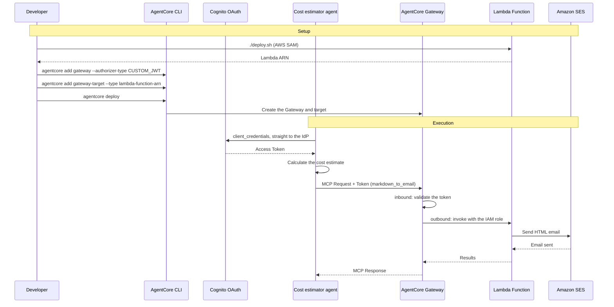

# AgentCore Outbound Gateway Integration

[English](README.md) / [日本語](README_ja.md)

This implementation demonstrates **AgentCore Gateway** exposing an AWS Lambda function as an MCP tool. With the AgentCore CLI, the Gateway and its targets are declared in `agentcore.json` and created by `agentcore deploy`. The Lambda function itself is outside the CLI's scope, so it is deployed with AWS SAM.

## Process Overview



## Prerequisites

1. **Step 06 complete** - the Cognito authorization server exists (`06_identity/inbound_authorizer.json`)
2. **AWS SAM CLI** - required to deploy the Lambda ([install guide](https://docs.aws.amazon.com/serverless-application-model/latest/developerguide/install-sam-cli.html))
3. **AgentCore CLI** - `npm install -g @aws/agentcore`
4. **A verified SES sender address** - required to test email delivery
5. **Dependencies** - installed with `uv sync`

## How to use

### File Structure

Cost estimation uses the base agent (`agents/CostEstimatorAgent/`), so no agent code lives here.

```
07_gateway/
├── README.md                      # This document
├── src/app.py                     # Lambda implementation (Markdown → HTML email)
├── src/requirements.txt           # Lambda dependencies
├── template.yaml                  # AWS SAM template
├── deploy.sh                      # Deploys the Lambda and prints the CLI commands
├── tool_schema.json               # Tool schema exposed through the Gateway
└── test_gateway.py                # Gateway test
```

### Step 1: Deploy the Lambda Function

```bash
cd 07_gateway
./deploy.sh your@email.address
```

The Lambda ARN and the AgentCore CLI commands for the next step are printed. A SES verification
email is sent to the sender address — click the link to complete verification.

### Step 2: Declare the Gateway and Target

The Gateway does not need an agent of its own, so create the project with `--no-agent`.

```bash
cd ../agents
agentcore create --name MyGatewayProject --no-agent --skip-git
cd MyGatewayProject

# Inbound: JWT authorization (reuse the Cognito from 06_identity)
agentcore add gateway \
    --name AWSCostEstimatorGateway \
    --protocol-type MCP \
    --authorizer-type CUSTOM_JWT \
    --discovery-url <discovery-url> \
    --allowed-clients <client-id>

# Outbound: expose the Lambda as an MCP tool
agentcore add gateway-target \
    --name AWSCostEstimatorGatewayTarget \
    --gateway AWSCostEstimatorGateway \
    --type lambda-function-arn \
    --lambda-arn <lambda-arn> \
    --tool-schema-file ../../07_gateway/tool_schema.json
agentcore deploy
```

> Do not pass `--no-semantic-search`. CloudFormation only accepts `SEMANTIC` for `SearchType`,
> so the deploy fails with `NONE is not a valid enum value`.

### Step 3: Test the Gateway Integration

First list the tools without sending an email.

```bash
cd ../../07_gateway
uv run python test_gateway.py --list-tools
```

```
Found 2 tool(s) on the Gateway:
  - x_amz_bedrock_agentcore_search
  - AWSCostEstimatorGatewayTarget___markdown_to_email
```

The tool from `tool_schema.json` is exposed as `<target name>___<tool name>`.
`x_amz_bedrock_agentcore_search` is the tool-discovery tool the Gateway adds automatically when
semantic search is enabled.

```bash
# Test with an architecture description and an email address
uv run python test_gateway.py --architecture "Recommendation email delivery for 1000 members" --address your@email.address
```

### Step 4: Clean Up

```bash
uv run python clean_resources.py           # refuses: Lab 8 uses this gateway
uv run python clean_resources.py --force   # actually delete
```

The gateway, target, and credential (plus the policy engine if you ran Lab 8) are removed
with the CLI, and the SAM-deployed Lambda is deleted along with its CloudFormation stack.
Pass `--keep-lambda` to keep the Lambda.

Lab 8 (Policy) attaches a policy engine to this gateway and embeds the gateway ARN in its
Cedar policy, so `--force` is required.

## Key Implementation Patterns

### Lambda Function with a Markdown-to-Email Tool

The Lambda is invoked by the Gateway as an MCP tool. The tool name is available in
`context.client_context.custom['bedrockAgentCoreToolName']`.

```python
def lambda_handler(event, context):
    """Handle markdown_to_email tool invocation from Gateway

    context.client_context contains Gateway metadata:
        ClientContext(custom={
            'bedrockAgentCoreGatewayId': '...',
            'bedrockAgentCoreTargetId': '...',
            'bedrockAgentCoreToolName': 'markdown_to_email',
            ...
        })
    """
    html_content = markdown.markdown(
        event["markdown_text"],
        extensions=['tables', 'nl2br']
    )
    # ... send with SES
```

### Declaring the Gateway and Target in agentcore.json

The Gateway and its target are declared in `agentcore.json`.

```json
{
  "agentCoreGateways": [
    {
      "name": "AWSCostEstimatorGateway",
      "protocolType": "MCP",
      "targets": [
        {
          "name": "AWSCostEstimatorGatewayTarget",
          "targetType": "lambdaFunctionArn",
          "lambdaFunctionArn": {
            "lambdaArn": "arn:aws:lambda:<region>:<account>:function:...",
            "toolSchemaFile": "../../07_gateway/tool_schema.json"
          }
        }
      ],
      "authorizerType": "CUSTOM_JWT",
      "authorizerConfiguration": {
        "customJwtAuthorizer": {
          "discoveryUrl": "https://cognito-idp.<region>.amazonaws.com/<pool-id>/.well-known/openid-configuration",
          "allowedClients": ["<client-id>"]
        }
      },
      "enableSemanticSearch": true,
      "exceptionLevel": "NONE"
    }
  ]
}
```

For a Lambda target the outbound call uses the Gateway's IAM role, so no explicit configuration is
needed. For external services (GitHub and the like) use `--outbound-auth oauth` with
`--credential-name` to attach a credential provider.

`agentcore add gateway-target --type` also supports:

| type | Purpose |
|---|---|
| `lambda-function-arn` | AWS Lambda |
| `api-gateway` | An API Gateway REST API |
| `open-api-schema` | An API described by an OpenAPI schema |
| `smithy-model` | An API described by a Smithy model |
| `mcp-server` | An existing MCP server |
| `http-runtime` | An AgentCore Runtime in the project |
| `connector` | Bedrock Knowledge Bases / web search |
| `passthrough` | Any HTTPS endpoint |

### Reading the Gateway URL from deployed-state.json

A hand-written `outbound_gateway.json` is no longer needed. The URL comes from
`agentcore/.cli/deployed-state.json`, written by `agentcore deploy`.

```python
def load_gateway_url(project_dir: Path) -> str:
    state_path = project_dir / "agentcore" / ".cli" / "deployed-state.json"
    with state_path.open() as f:
        state = json.load(f)

    for target in state.get("targets", {}).values():
        resources = target.get("resources", {})
        # The CLI nests gateways under resources.mcp.gateways; older versions
        # put them directly under resources.gateways.
        for container in (resources, resources.get("mcp", {})):
            for gateway in (container.get("gateways") or {}).values():
                url = (gateway.get("gatewayUrl") or "").rstrip("/")
                if url:
                    # The stored URL already ends in /mcp
                    return url if url.endswith("/mcp") else url + "/mcp"
```

> `agentcore status --json` exposes the same data, but reading the file is more robust: under
> `uv run` the project venv's bin directory comes first on PATH, so any Python package that
> installs a command named `agentcore` would shadow the npm CLI.

### Strands Agent Integration with an MCP Client

```python
access_token = asyncio.run(get_access_token())

def create_transport():
    return streamablehttp_client(
        GATEWAY_URL,
        headers={"Authorization": f"Bearer {access_token}"}
    )

mcp_client = MCPClient(create_transport)
with mcp_client:
    tools = [cost_estimator_tool] + collect_gateway_tools(mcp_client)
    agent = Agent(
        system_prompt=(
            "Your are a professional solution architect. Please estimate cost of AWS platform."
            "1. Please summarize customer's requirement to `architecture_description` in 10~50 words."
            "2. Pass `architecture_description` to 'cost_estimator_tool'."
            "3. Send estimation by `markdown_to_email`."
        ),
        tools=tools
    )
    agent(f"requirements: {architecture_description}, address: {address}")
```

The tool list is paginated, so keep fetching until `pagination_token` is `None`.

```python
def collect_gateway_tools(mcp_client: MCPClient) -> list:
    tools = []
    pagination_token = None
    while True:
        page = mcp_client.list_tools_sync(pagination_token=pagination_token)
        tools.extend(page)
        pagination_token = page.pagination_token
        if pagination_token is None:
            return tools
```

## Usage Example

```bash
# Deploy the Lambda function with the SES sender email
./deploy.sh your@email.address

# Create the Gateway with Cognito auth (run the printed commands)
cd ../agents/MyGatewayProject && agentcore deploy

# Check the exposed tools
cd ../../07_gateway && uv run python test_gateway.py --list-tools

# Test with a Strands Agent - estimate the cost and email the result
uv run python test_gateway.py --architecture "Recommendation email delivery for 1000 members" --address your@email.address
```

## Integration Benefits

- **Declarative configuration** - the Gateway and its targets live in `agentcore.json` and are easy to review
- **MCP-enable existing APIs** - Lambda, API Gateway, OpenAPI and more become MCP tools with no code change
- **Secure exposure** - inbound uses OAuth (CUSTOM_JWT); outbound can use an IAM role or OAuth
- **Multiple targets** - register several targets on one Gateway to present a single MCP endpoint
- **Infrastructure as Code** - managed by the CDK / CloudFormation, created and deleted as a stack

## Configuration Files

### agentcore.json (`agentCoreGateways[]`)

The Gateway and target declaration, written by `agentcore add gateway` / `add gateway-target`.

### agentcore/.cli/deployed-state.json

The deployment result written by `agentcore deploy`. The Gateway URL lives at
`targets.<target>.resources.gateways.<name>.gatewayUrl`.
The MCP endpoint is that URL plus `/mcp`.

### Identity Integration

To pass the Gateway's inbound auth, put an access token from the authorization server in the
`Authorization` header. **AgentCore Identity is not involved.**

AgentCore Gateway completes both ends of its own auth: inbound (validating the caller's JWT)
and outbound (invoking the Lambda target with its own IAM role). `@requires_access_token` is
only needed when an agent running *on* AgentCore Runtime has to fetch a token for an external
resource itself — see Lab 6.

```python
def get_access_token(cognito: dict) -> str:
    response = requests.post(
        cognito["token_endpoint"],
        data={
            "grant_type": "client_credentials",
            "client_id": cognito["client_id"],
            "client_secret": cognito["client_secret"],
            "scope": cognito["scope"],
        },
        headers={"Content-Type": "application/x-www-form-urlencoded"},
        timeout=30,
    )
    response.raise_for_status()
    return response.json()["access_token"]


def build_mcp_client(gateway_url: str, access_token: str) -> MCPClient:
    def transport():
        return streamablehttp_client(
            gateway_url, headers={"Authorization": f"Bearer {access_token}"}
        )

    return MCPClient(transport)
```

## Tool Schema

`tool_schema.json` holds the MCP tool definition. It stays a file, separate from the code,
and is passed via `--tool-schema-file`.

```json
[
  {
    "name": "markdown_to_email",
    "description": "Convert Markdown content to email format and send it via Amazon SES",
    "inputSchema": {
      "type": "object",
      "properties": {
        "markdown_text": { "type": "string", "description": "Markdown content to convert to email format" },
        "email_address": { "type": "string", "description": "Recipient email address" },
        "subject": { "type": "string", "description": "Title of email" }
      },
      "required": ["markdown_text", "email_address"]
    }
  }
]
```

## References

- [AgentCore Gateway Developer Guide](https://docs.aws.amazon.com/bedrock-agentcore/latest/devguide/gateway.html)
- [AgentCore CLI - Gateway](https://github.com/aws/agentcore-cli/blob/main/docs/gateway.md)
- [AWS SAM documentation](https://docs.aws.amazon.com/serverless-application-model/)
- [Model Context Protocol](https://modelcontextprotocol.io/)
- [Amazon SES documentation](https://docs.aws.amazon.com/ses/)

---

**Next Steps**: Use the Gateway as an MCP server in your application, or continue with [08_policy](../08_policy/README.md) to add fine-grained tool access control.
