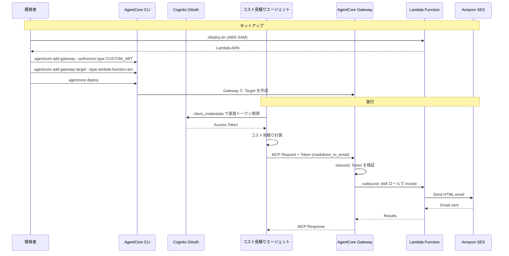

# AgentCore Outbound Gateway統合

[English](README.md) / [日本語](README_ja.md)

この実装では、AWS Lambda を MCP ツールとして公開する **AgentCore Gateway** を実演します。AgentCore CLI では Gateway と Target を `agentcore.json` に宣言し、`agentcore deploy` で作成します。Lambda 自体は CLI の管理対象外なので AWS SAM でデプロイします。

## プロセス概要



## 前提条件

1. **ステップ06完了** - Cognito 認可サーバーが構築済みであること (`06_identity/inbound_authorizer.json`)
2. **AWS SAM CLI** - Lambda のデプロイに必要 ([インストール手順](https://docs.aws.amazon.com/serverless-application-model/latest/developerguide/install-sam-cli.html))
3. **AgentCore CLI** - `npm install -g @aws/agentcore`
4. **検証済みの SES 送信元アドレス** - メール送信のテストに必要
5. **依存関係** - `uv sync`でインストール

## 使用方法

### ファイル構成

コスト見積りにはベースのエージェント (`agents/CostEstimatorAgent/`) を使うため、
このディレクトリには agent code を置きません。

```
07_gateway/
├── README.md                      # このドキュメント
├── src/app.py                     # AWS Lambda の実装 (Markdown → HTML メール)
├── src/requirements.txt           # Lambda の依存関係
├── template.yaml                  # AWS SAM の template
├── deploy.sh                      # Lambda をデプロイし、続く CLI コマンドを出力
├── tool_schema.json               # Gateway に公開するツールのスキーマ
└── test_gateway.py                # Gateway のテスト
```

### ステップ1: Lambda関数をデプロイ

```bash
cd 07_gateway
./deploy.sh your@email.address
```

Lambda の ARN と、続くステップで実行する AgentCore CLI のコマンドが出力されます。
送信元アドレスの SES 検証メールが届くので、リンクをクリックして認証を完了してください。

### ステップ2: Gateway と Target を宣言

Gateway はエージェントを持たないため、プロジェクトは `--no-agent` で作成します。

```bash
cd ../agents
agentcore create --name MyGatewayProject --no-agent --skip-git
cd MyGatewayProject

# Inbound: JWT 認可 (06_identity の Cognito を再利用)
agentcore add gateway \
    --name AWSCostEstimatorGateway \
    --protocol-type MCP \
    --authorizer-type CUSTOM_JWT \
    --discovery-url <discovery-url> \
    --allowed-clients <client-id>

# Outbound: Lambda を MCP ツールとして公開
agentcore add gateway-target \
    --name AWSCostEstimatorGatewayTarget \
    --gateway AWSCostEstimatorGateway \
    --type lambda-function-arn \
    --lambda-arn <lambda-arn> \
    --tool-schema-file ../../07_gateway/tool_schema.json

agentcore deploy
```

> `--no-semantic-search` は指定しないでください。CloudFormation は `SearchType` に
> `SEMANTIC` のみ許可しており、`NONE is not a valid enum value` で失敗します。

### ステップ3: Gateway統合をテスト

まずメールを送らずにツール一覧を確認します。

```bash
cd ../../07_gateway
uv run python test_gateway.py --list-tools
```

```
Found 2 tool(s) on the Gateway:
  - x_amz_bedrock_agentcore_search
  - AWSCostEstimatorGatewayTarget___markdown_to_email
```

`tool_schema.json` のツールが `<Target 名>___<ツール名>` として公開されています。
`x_amz_bedrock_agentcore_search` はセマンティック検索が有効な場合に Gateway が
自動で追加するツール検索用のツールです。

```bash
# アーキテクチャの説明とメールアドレスでテスト
uv run python test_gateway.py --architecture "会員1000人への推薦メール配信" --address your@email.address
```

### ステップ4: 後片付け

```bash
uv run python clean_resources.py           # Lab 8 が使うため既定では拒否
uv run python clean_resources.py --force   # 実際に削除
```

Gateway / target / credential (Lab 8 まで進んだ場合は Policy Engine も) は CLI で削除され、
SAM でデプロイした Lambda は CloudFormation スタックごと削除されます。Lambda を残したい場合は
`--keep-lambda` を付けてください。

Lab 8 (Policy) はこの Gateway に Policy Engine をアタッチし、Cedar ポリシーに Gateway の ARN を
埋め込むため、`--force` なしでは削除しません。

## 主要な実装パターン

### Markdown-to-Emailツールを持つLambda関数

Lambda は Gateway から MCP ツールとして呼び出されます。ツール名は
`context.client_context.custom['bedrockAgentCoreToolName']` で取得できます。

```python
def lambda_handler(event, context):
    """Handle markdown_to_email tool invocation from Gateway

    context.client_context contains Gateway metadata:
        ClientContext(custom={
            'bedrockAgentCoreGatewayId': '...',
            'bedrockAgentCoreTargetId': '...',
            'bedrockAgentCoreToolName': 'markdown_to_email',
            ...
        })
    """
    html_content = markdown.markdown(
        event["markdown_text"],
        extensions=['tables', 'nl2br']
    )
    # ... send with SES
```

### Gateway と Target を agentcore.json に宣言する

AgentCore Gateway と Target は `agentcore.json` に宣言します。

```json
{
  "agentCoreGateways": [
    {
      "name": "AWSCostEstimatorGateway",
      "protocolType": "MCP",
      "targets": [
        {
          "name": "AWSCostEstimatorGatewayTarget",
          "targetType": "lambdaFunctionArn",
          "lambdaFunctionArn": {
            "lambdaArn": "arn:aws:lambda:<region>:<account>:function:...",
            "toolSchemaFile": "../../07_gateway/tool_schema.json"
          }
        }
      ],
      "authorizerType": "CUSTOM_JWT",
      "authorizerConfiguration": {
        "customJwtAuthorizer": {
          "discoveryUrl": "https://cognito-idp.<region>.amazonaws.com/<pool-id>/.well-known/openid-configuration",
          "allowedClients": ["<client-id>"]
        }
      },
      "enableSemanticSearch": true,
      "exceptionLevel": "NONE"
    }
  ]
}
```

Outbound の認証は Lambda の場合 Gateway の IAM Role が使われるため、明示的な設定は
不要です。外部サービス (GitHub など) の場合は `--outbound-auth oauth` と
`--credential-name` で Credential Provider を紐付けます。

`agentcore add gateway-target --type` は Lambda 以外にも次を指定できます。

| type | 用途 |
|---|---|
| `lambda-function-arn` | AWS Lambda |
| `api-gateway` | API Gateway の REST API |
| `open-api-schema` | OpenAPI スキーマで定義された API |
| `smithy-model` | Smithy モデルで定義された API |
| `mcp-server` | 既存の MCP サーバー |
| `http-runtime` | プロジェクト内の AgentCore Runtime |
| `connector` | Bedrock Knowledge Bases / Web 検索 |
| `passthrough` | 任意の HTTPS エンドポイント |

### Gateway URL を deployed-state.json から取得する

自前の `outbound_gateway.json` は不要になりました。`agentcore deploy` が書き出す
`agentcore/.cli/deployed-state.json` から取得します。

```python
def load_gateway_url(project_dir: Path) -> str:
    state_path = project_dir / "agentcore" / ".cli" / "deployed-state.json"
    with state_path.open() as f:
        state = json.load(f)

    for target in state.get("targets", {}).values():
        resources = target.get("resources", {})
        # The CLI nests gateways under resources.mcp.gateways; older versions
        # put them directly under resources.gateways.
        for container in (resources, resources.get("mcp", {})):
            for gateway in (container.get("gateways") or {}).values():
                url = (gateway.get("gatewayUrl") or "").rstrip("/")
                if url:
                    # The stored URL already ends in /mcp
                    return url if url.endswith("/mcp") else url + "/mcp"
```

> `agentcore status --json` でも同じ情報が取れますが、ファイルを直接読むほうが確実です。
> `uv run` 配下ではプロジェクトの venv が PATH の先頭に来るため、venv に `agentcore` という
> 名前のコマンドを入れる Python パッケージがあると npm 版の CLI が隠れてしまいます。

### MCPクライアントとのStrands Agent統合

```python
access_token = asyncio.run(get_access_token())

def create_transport():
    return streamablehttp_client(
        GATEWAY_URL,
        headers={"Authorization": f"Bearer {access_token}"}
    )

mcp_client = MCPClient(create_transport)
with mcp_client:
    tools = [cost_estimator_tool] + collect_gateway_tools(mcp_client)
    agent = Agent(
        system_prompt=(
            "Your are a professional solution architect. Please estimate cost of AWS platform."
            "1. Please summarize customer's requirement to `architecture_description` in 10~50 words."
            "2. Pass `architecture_description` to 'cost_estimator_tool'."
            "3. Send estimation by `markdown_to_email`."
        ),
        tools=tools
    )
    agent(f"requirements: {architecture_description}, address: {address}")
```

ツール一覧はページングされるため、`pagination_token` が `None` になるまで取得します。

```python
def collect_gateway_tools(mcp_client: MCPClient) -> list:
    tools = []
    pagination_token = None
    while True:
        page = mcp_client.list_tools_sync(pagination_token=pagination_token)
        tools.extend(page)
        pagination_token = page.pagination_token
        if pagination_token is None:
            return tools
```

## 使用例

```bash
# SES送信者メールでLambda関数をデプロイ
./deploy.sh your@email.address

# Cognito認証でGatewayを作成 (出力されたコマンドを実行)
cd ../agents/MyGatewayProject && agentcore deploy

# ツール一覧を確認
cd ../../07_gateway && uv run python test_gateway.py --list-tools

# Strands Agentでテスト - コストを見積もってメールで結果を送信
uv run python test_gateway.py --architecture "会員1000人への推薦メール配信" --address your@email.address
```

## 統合の利点

- **宣言的な構成** - Gateway と Target が `agentcore.json` に集約され、レビューしやすい
- **既存 API の MCP 化** - Lambda / API Gateway / OpenAPI などをコード変更なしに MCP 化できる
- **セキュアな公開** - Inbound は OAuth (CUSTOM_JWT)、Outbound は IAM Role や OAuth を選べる
- **複数 Target の統合** - 1 つの Gateway に複数の Target を登録し、単一の MCP エンドポイントにまとめられる
- **Infrastructure as Code** - CDK / CloudFormation 管理なのでスタック単位で作成・削除できる

## 設定ファイル

### agentcore.json (`agentCoreGateways[]`)

Gateway と Target の宣言。`agentcore add gateway` / `add gateway-target` が書き込みます。

### agentcore/.cli/deployed-state.json

`agentcore deploy` が書き出すデプロイ結果。Gateway の URL は
`targets.<target>.resources.gateways.<name>.gatewayUrl` にあります。
MCP エンドポイントはこの URL に `/mcp` を付けたものです。

### Identity統合

AgentCore Gateway の inbound は、認可サーバーから取得したアクセストークンを
`Authorization` ヘッダーに載せることで通過します。**AgentCore Identity は使いません。**

AgentCore Gateway は inbound (呼び出し元の JWT 検証) と outbound (Lambda の呼び出し) の
両方を自分で完結させます。`@requires_access_token` が必要になるのは、AgentCore Runtime 上の
エージェントが自分で外部リソースのトークンを取る場合だけです (Lab 6 参照)。

```python
def get_access_token(cognito: dict) -> str:
    response = requests.post(
        cognito["token_endpoint"],
        data={
            "grant_type": "client_credentials",
            "client_id": cognito["client_id"],
            "client_secret": cognito["client_secret"],
            "scope": cognito["scope"],
        },
        headers={"Content-Type": "application/x-www-form-urlencoded"},
        timeout=30,
    )
    response.raise_for_status()
    return response.json()["access_token"]


def build_mcp_client(gateway_url: str, access_token: str) -> MCPClient:
    def transport():
        return streamablehttp_client(
            gateway_url, headers={"Authorization": f"Bearer {access_token}"}
        )

    return MCPClient(transport)
```

## ツールスキーマ

`tool_schema.json` が MCP のツール定義です。コードから分離したファイルとして扱い、
`--tool-schema-file` で渡します。

```json
[
  {
    "name": "markdown_to_email",
    "description": "Convert Markdown content to email format and send it via Amazon SES",
    "inputSchema": {
      "type": "object",
      "properties": {
        "markdown_text": { "type": "string", "description": "Markdown content to convert to email format" },
        "email_address": { "type": "string", "description": "Recipient email address" },
        "subject": { "type": "string", "description": "Title of email" }
      },
      "required": ["markdown_text", "email_address"]
    }
  }
]
```

## 参考資料

- [AgentCore Gateway開発者ガイド](https://docs.aws.amazon.com/bedrock-agentcore/latest/devguide/gateway.html)
- [AgentCore CLI - Gateway](https://github.com/aws/agentcore-cli/blob/main/docs/gateway.md)
- [AWS SAM ドキュメント](https://docs.aws.amazon.com/serverless-application-model/)
- [Model Context Protocol](https://modelcontextprotocol.io/)
- [Amazon SES ドキュメント](https://docs.aws.amazon.com/ses/)

---

**次のステップ**: アプリケーションでGatewayをMCPサーバーとして使用するか、[08_policy](../08_policy/README_ja.md)に進んできめ細かいツールアクセス制御を追加しましょう。
