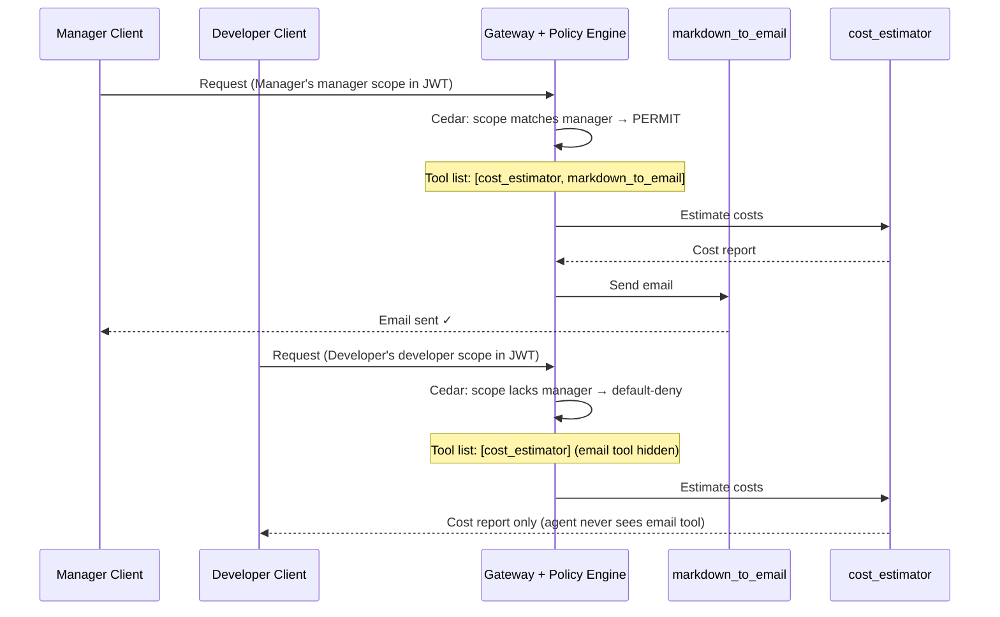

# AgentCore Policy: Fine-Grained Tool Access Control with Cedar

[English](README.md) / [日本語](README_ja.md)

In [07_gateway](../07_gateway/README.md), we built a `markdown_to_email` tool that sends AWS cost estimation reports via email. This is powerful — but also risky. Should **every** user of the agent be allowed to send emails to external clients?

Consider this scenario in an enterprise:
- A **Developer** creates cost estimations for internal review and planning
- A **Manager** reviews the estimation and sends it to a client as a formal proposal

The Developer should NOT be able to send emails to clients directly — only Managers have the authority to communicate estimations externally.

Without fine-grained control, any authenticated user who can invoke the Gateway can use ALL tools — including `markdown_to_email`. IAM alone cannot help here because IAM operates at the **AWS service level** (e.g., "can this principal call the Gateway API?"), not at the **tool level** (e.g., "can this principal use the email tool?").

This is exactly the problem **AgentCore Policy** solves.

## AgentCore Policy Overview

AgentCore Policy is a **deterministic, Cedar-based authorization layer** that sits between the Gateway and its tools. Unlike guardrails (which are probabilistic), Policy uses formal logic to make allow/deny decisions at the tool-call level.

### IAM vs AgentCore Policy

| Aspect | IAM | AgentCore Policy |
|--------|-----|------------------|
| **Scope** | AWS service-level access | Tool-level within Gateway |
| **Question it answers** | "Can this principal call the Gateway?" | "Can this principal use *this specific tool*?" |
| **Language** | JSON policy documents | Cedar (human-readable, formally verifiable) |
| **Granularity** | API actions (`bedrock:InvokeModel`) | Individual tools (`markdown_to_email`) |
| **Context** | AWS identity, resource tags | OAuth scopes, user attributes, tool input parameters |
| **Generation** | Manual or IAM Access Analyzer | NL2Cedar (natural language to Cedar) |

**Key insight**: IAM and Policy are complementary. IAM controls *who can invoke the Gateway*. Policy controls *what tools each caller can use* within the Gateway.

### Understanding Cedar Policies in AgentCore

#### 1. AgentCore Policy Uses Cedar

AgentCore Policy uses **[Cedar](https://www.cedarpolicy.com/)**, an open-source policy language developed by AWS. Cedar is designed for authorization — it answers the question "is this request allowed?" with deterministic, formally verifiable logic. AgentCore adopts Cedar as its native policy language, so writing tool-level access control means writing Cedar policies.

#### 2. Cedar Policy Structure

Every Cedar policy has two parts: an **effect** (`permit` or `forbid`) with a **scope**, and optional **conditions** (`when` / `unless`):

```cedar
permit (                           -- Effect: permit or forbid
  principal is <PrincipalType>,    -- WHO is making the request?
  action == <Action>,              -- WHAT tool/operation are they calling?
  resource == <Resource>           -- WHERE (which Gateway) is the request targeting?
)
when {                             -- WHEN: additional conditions (optional)
  <condition expressions>
};
```

Cedar has two effects:
- **`permit`** — Allow the action when conditions are met
- **`forbid`** — Deny the action (always overrides `permit`)

The default behavior is **deny-all**: without any matching `permit` policy, all tool calls are blocked. This is the safest default for security.

#### 3. How Principal, Action, and Resource Map in AgentCore

When a tool call arrives at the Gateway, AgentCore automatically constructs the Cedar authorization request from two sources:

1. **JWT token** → determines the **principal** (who) and its **tags** (claims)
2. **MCP tool call** → determines the **action** (what tool) and **context** (tool arguments)

| Cedar Element | Source | AgentCore Mapping |
|:---|:---|:---|
| **principal** | JWT `sub` claim → entity ID, all other claims → tags | `AgentCore::OAuthUser::"<sub>"` with tags: `{ "username": "...", "role": "...", "scope": "..." }` |
| **action** | MCP tool call `name` field | `AgentCore::Action::"<TargetName>___<ToolName>"` |
| **resource** | Gateway instance ARN | `AgentCore::Gateway::"arn:aws:bedrock-agentcore:..."` |
| **context** | MCP tool call `arguments` | `context.input.amount`, `context.input.orderId`, etc. |

> **Key point**: You do NOT construct these entities yourself. AgentCore parses the incoming JWT, identifies the tool being called, and resolves the Gateway ARN — then passes all three to the Cedar engine for evaluation.
>
> **Reference**: For details on the authorization flow, see [Authorization Flow](https://docs.aws.amazon.com/bedrock-agentcore/latest/devguide/policy-authorization-flow.html). For scope element definitions, see [Policy Scope](https://docs.aws.amazon.com/bedrock-agentcore/latest/devguide/policy-scope.html). For condition expressions (`when`/`unless` clauses), see [Policy Conditions](https://docs.aws.amazon.com/bedrock-agentcore/latest/devguide/policy-conditions.html).

#### 4. In This Workshop: Scope-Based Role Matching

In this workshop, we use **M2M (Machine-to-Machine) OAuth** via Cognito `client_credentials` flow. We create two app clients — "Manager" and "Developer" — and assign them **role-specific scopes** through the existing Cognito resource server:

- **Manager client** gets `invoke` + `manager` scopes
- **Developer client** gets `invoke` + `developer` scopes

The Cedar policy uses `principal.getTag("scope") like "*manager*"` to check whether the caller's JWT contains the `manager` scope. Since the Developer's token only carries `invoke developer` (no `manager` scope), the default-deny blocks email access automatically.

| Cedar Element | M2M Value in This Workshop |
|:---|:---|
| **principal** | `AgentCore::OAuthUser::"<client_id>"` with scope tags from JWT |
| **action** | `AgentCore::Action::"AWSCostEstimatorGatewayTarget___markdown_to_email"` |
| **resource** | `AgentCore::Gateway::"arn:aws:bedrock-agentcore:...:gateway/..."` |
| **when condition** | `principal.getTag("scope") like "*manager*"` — matches the `manager` scope in the JWT |

## Process Overview



## Prerequisites

1. **06_identity** — Complete (Cognito user pool + OAuth2 provider)
2. **07_gateway** — Complete (MCP Gateway with `markdown_to_email` Lambda tool)
3. **AWS credentials** — With Bedrock AgentCore and Cognito permissions

## How to Use

### File Structure

```
08_policy/
├── README.md                # This documentation
├── README_ja.md             # Japanese documentation
├── setup_policy.py          # Create policy engine, Cedar policy, Cognito clients
├── test_policy.py           # Test role-based access (manager vs developer)
├── clean_resources.py       # Resource cleanup
└── policy_config.json       # Generated configuration (after setup)
```

All commands below assume you are in the `08_policy` directory:

```bash
cd 08_policy
```

### Step 1: Setup Policy Resources

```bash
uv run python setup_policy.py
```

This performs the following:

1. **Creates two M2M app clients** (Manager and Developer) with **role-specific scopes** (`invoke` + `manager` or `invoke` + `developer`)
2. **Updates the Gateway's `allowedClients`** so tokens from both new clients are accepted
3. **Creates a Policy Engine** — the container for Cedar policies
4. **Demonstrates NL2Cedar** — converts a natural language description into a Cedar policy using `StartPolicyGeneration`
5. **Creates the Cedar policy** — permits `markdown_to_email` only for callers whose JWT scope contains `manager`
6. **Attaches the Policy Engine** to the Gateway in `ENFORCE` mode

### Step 2: Test as Developer (email DENIED)

```bash
uv run python test_policy.py --role developer --address you@example.com
```

The Developer's token carries the `developer` scope but not `manager`. The Cedar policy requires the `manager` scope to permit `markdown_to_email`, so the **default-deny** kicks in and the `markdown_to_email` tool is **not visible** in the tool list. The agent estimates costs but cannot send the email. Compare the tool list in the log output — `markdown_to_email` is filtered out by policy.

### Step 3: Test as Manager (email ALLOWED)

```bash
uv run python test_policy.py --role manager --address you@example.com
```

The Manager's token carries the `manager` scope that the Cedar policy checks for. The policy matches the scope via `like "*manager*"`, and **allows** the `markdown_to_email` tool call. The agent estimates costs AND sends the email to the client.

### Step 4: Clean Up

```bash
uv run python clean_resources.py
```

## Key Implementation Details

### Cedar Policy: Scope-Based Tool Access

```cedar
permit(
  principal,
  action == AgentCore::Action::"AWSCostEstimatorGatewayTarget___markdown_to_email",
  resource == AgentCore::Gateway::"arn:aws:bedrock-agentcore:...:gateway/..."
) when {
  principal.hasTag("scope") &&
  principal.getTag("scope") like "*manager*"
};
```

This policy reads: "Allow any caller whose JWT scope contains `manager` to call the `markdown_to_email` tool on this Gateway."

The `setup_policy.py` script creates this scope-based policy automatically. Since the Developer's token only carries `invoke developer` scopes (no `manager`), the `when` condition fails and the default-deny behavior blocks them automatically — the email tool is not even visible in the Developer's tool list.

### NL2Cedar: Generating Policies from Natural Language

One of AgentCore Policy's most powerful features is **NL2Cedar** — the ability to generate Cedar policies from plain English descriptions using `StartPolicyGeneration`.

```python
# Describe the policy intent in natural language
nl_description = (
    "Allow any user whose OAuth token scope contains 'manager' "
    "to use the markdown_to_email tool on the gateway. "
    "Deny all other users from using the markdown_to_email tool."
)

# Generate Cedar policy
generation = policy_client.generate_policy(
    policy_engine_id=engine_id,
    name="scope_based_email_policy",
    resource={"arn": gateway_arn},
    content={"rawText": nl_description},
    fetch_assets=True,
)

# Review the generated Cedar statements
for asset in generation["generatedPolicies"]:
    print(asset["definition"]["cedar"]["statement"])
```

NL2Cedar generates a **pair of complementary policies** — a `permit` and a `forbid` — that together express the intent:

```cedar
// Policy 1: Allow callers with the manager scope
permit(principal, action == ..., resource == ...)
when { principal.hasTag("scope") && principal.getTag("scope") like "*manager*" };

// Policy 2: Explicitly deny callers without the manager scope
forbid(principal, action == ..., resource == ...)
when { !(principal.hasTag("scope") && principal.getTag("scope") like "*manager*") };
```

In a default-deny system like AgentCore, the `forbid` policy is redundant — callers without a matching `permit` are already blocked. However, NL2Cedar generates both to be explicit. The `setup_policy.py` script uses the generated `permit` policy as the actual Cedar policy, with a hand-crafted fallback if NL2Cedar is unavailable.

> **Tip**: For best NL2Cedar results, be specific about WHO (principal), WHAT (tool/action), and WHEN (conditions). Vague descriptions like "allow access" produce overly broad policies.

### Policy Engine Attachment

```python
gateway_client.update_gateway_policy_engine(
    gateway_identifier=gateway_id,
    policy_engine_arn=engine_arn,
    mode="ENFORCE",  # or "LOG_ONLY" for monitoring before enforcement
)
```

The `LOG_ONLY` mode is useful during initial rollout — policies are evaluated and decisions are logged, but requests are not actually blocked. Switch to `ENFORCE` when confident.

## Governance Benefits

| Benefit | Description |
|:---|:---|
| **Default-deny** | Without a matching `permit`, all tool calls are denied |
| **Forbid-wins** | A `forbid` policy always overrides `permit`, enabling explicit blocklists |
| **Human-readable** | Cedar policies are readable by non-developers and auditors |
| **Formally verifiable** | Cedar supports automated reasoning to detect overly permissive or always-deny policies |
| **Deterministic** | Unlike guardrails, policy decisions are not probabilistic — same input always gives same result |
| **Audit trail** | Policy decisions are logged for compliance review |
| **NL2Cedar** | Generate initial policies from natural language, reducing Cedar learning curve |

## Summary: Layered Security Architecture

| Layer | Question It Answers | Granularity | Mechanism |
|:---|:---|:---|:---|
| **IAM** | Can this principal call the Gateway? | Service-level (coarse) | IAM policies |
| **AgentCore Policy (Cedar)** | Can this principal use this specific tool with these parameters? | Tool-level (fine) | Cedar permit/forbid policies |
| **Gateway Interceptors (Lambda)** | Transform, validate, or redact request/response content? | Request/response-level | Lambda functions |

## References

- [AgentCore Policy Developer Guide](https://docs.aws.amazon.com/bedrock-agentcore/latest/devguide/policy.html)
- [Understanding Cedar Policies in AgentCore](https://docs.aws.amazon.com/bedrock-agentcore/latest/devguide/policy-understanding-cedar.html)
- [Authorization Flow](https://docs.aws.amazon.com/bedrock-agentcore/latest/devguide/policy-authorization-flow.html)
- [Policy Scope (Principal, Action, Resource)](https://docs.aws.amazon.com/bedrock-agentcore/latest/devguide/policy-scope.html)
- [Policy Conditions (when/unless clauses)](https://docs.aws.amazon.com/bedrock-agentcore/latest/devguide/policy-conditions.html)
- [Example Policies](https://docs.aws.amazon.com/bedrock-agentcore/latest/devguide/example-policies.html)
- [Common Policy Patterns](https://docs.aws.amazon.com/bedrock-agentcore/latest/devguide/policy-common-patterns.html)
- [Cedar Policy Language](https://www.cedarpolicy.com/)
- [Cedar Operators Reference](https://docs.cedarpolicy.com/policies/syntax-operators.html)
- [Cedar Policy Syntax](https://docs.cedarpolicy.com/policies/syntax-policy.html)
- [Strands Agents Documentation](https://github.com/strands-agents/sdk-python)

---

**Next Steps**: Continue with [09_browser_use](../09_browser_use/README.md) to explore browser automation with AgentCore.
