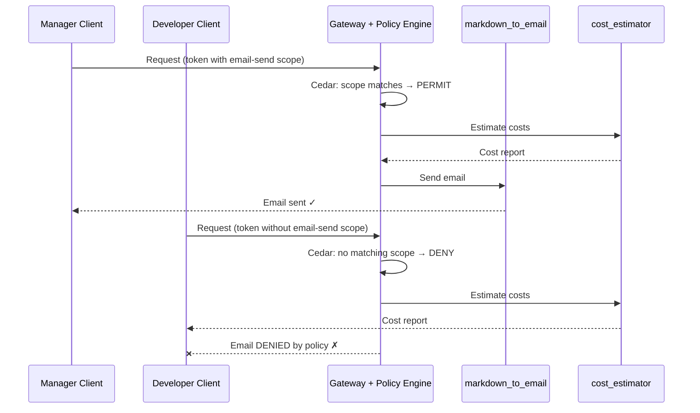

# AgentCore Policy: Fine-Grained Tool Access Control with Cedar

[English](README.md) / [日本語](README_ja.md)

## Why Do We Need Tool-Level Access Control?

In [07_gateway](../07_gateway/README.md), we built a `markdown_to_email` tool that sends AWS cost estimation reports via email. This is powerful — but also risky. Should **every** user of the agent be allowed to send emails to external clients?

Consider this scenario in an enterprise:
- A **Developer** creates cost estimations for internal review and planning
- A **Manager** reviews the estimation and sends it to a client as a formal proposal

The Developer should NOT be able to send emails to clients directly — only Managers have the authority to communicate estimations externally.

Without fine-grained control, any authenticated user who can invoke the Gateway can use ALL tools — including `markdown_to_email`. IAM alone cannot help here because IAM operates at the **AWS service level** (e.g., "can this principal call the Gateway API?"), not at the **tool level** (e.g., "can this principal use the email tool?").

This is exactly the problem **AgentCore Policy** solves.

## AgentCore Policy Overview

AgentCore Policy is a **deterministic, Cedar-based authorization layer** that sits between the Gateway and its tools. Unlike guardrails (which are probabilistic), Policy uses formal logic to make allow/deny decisions at the tool-call level.

### IAM vs AgentCore Policy

| Aspect | IAM | AgentCore Policy |
|--------|-----|------------------|
| **Scope** | AWS service-level access | Tool-level within Gateway |
| **Question it answers** | "Can this principal call the Gateway?" | "Can this principal use *this specific tool*?" |
| **Language** | JSON policy documents | Cedar (human-readable, formally verifiable) |
| **Granularity** | API actions (`bedrock:InvokeModel`) | Individual tools (`markdown_to_email`) |
| **Context** | AWS identity, resource tags | OAuth scopes, user attributes, tool input parameters |
| **Generation** | Manual or IAM Access Analyzer | NL2Cedar (natural language to Cedar) |

**Key insight**: IAM and Policy are complementary. IAM controls *who can reach the Gateway*. Policy controls *what tools each caller can use* within the Gateway.

### Types of Restrictions in Cedar Policies

Cedar policies can restrict tool access based on several dimensions:

| Restriction Type | Cedar Expression | Example |
|:---|:---|:---|
| **By OAuth scope** | `principal.getTag("scope") like "*email-send*"` | Only clients with `email-send` scope can send emails |
| **By user identity** | `principal.getTag("username") == "john"` | Only specific users can access sensitive tools |
| **By role** | `principal.getTag("role") == "manager"` | Only managers can approve transactions |
| **By tool input** | `context.input.amount < 500` | Restrict refund amounts under $500 |
| **By tool input (string)** | `context.input.region == "US"` | Only allow operations in specific regions |
| **By tool input (set)** | `["US","CA"].contains(context.input.country)` | Restrict to allowed countries |
| **Combination** | `condition1 && condition2` | Multiple conditions combined |

Cedar has two effects:
- **`permit`** — Allow the action when conditions are met
- **`forbid`** — Deny the action (always overrides `permit`)

The default behavior is **deny-all**: without any matching `permit` policy, all tool calls are blocked. This is the safest default for security.

### How M2M Authorization Works with Policy

In this workshop, we use **M2M (Machine-to-Machine) OAuth** via Cognito `client_credentials` flow. An important question arises: *Can we enforce role-based policies with M2M tokens?*

**M2M tokens don't carry user identity** (no `username`, no `role` claim) — they represent an application, not a person. However, M2M tokens **do carry OAuth scopes**, and scopes can differ per OAuth client. We leverage this:

```
Manager app client   →  token with scopes: [invoke, email-send]
Developer app client →  token with scopes: [invoke]
```

The Cedar policy checks the `scope` claim to decide whether the email tool is allowed. This effectively models "roles" as separate OAuth clients with different scope sets.

> **Note**: For true per-user policies (e.g., "allow John but deny Jane"), you would use the **Authorization Code** flow instead of Client Credentials, so that each user's JWT contains their individual claims (`username`, `role`, etc.). The scope-based approach used here is the standard pattern for M2M scenarios.

## Process Overview



## Prerequisites

1. **06_identity** — Complete (Cognito user pool + OAuth2 provider)
2. **07_gateway** — Complete (MCP Gateway with `markdown_to_email` Lambda tool)
3. **AWS credentials** — With Bedrock AgentCore and Cognito permissions
4. **Python 3.12+** — Required for async/await support
5. **Dependencies** — Installed via `uv` (see pyproject.toml)

## How to Use

### File Structure

```
08_policy/
├── README.md                # This documentation
├── README_ja.md             # Japanese documentation
├── setup_policy.py          # Create policy engine, Cedar policy, Cognito clients
├── test_policy.py           # Test role-based access (manager vs developer)
├── clean_resources.py       # Resource cleanup
└── policy_config.json       # Generated configuration (after setup)
```

### Step 1: Setup Policy Resources

```bash
uv run python 08_policy/setup_policy.py
```

This performs the following:

1. **Creates a Cognito resource server** with an `email-send` custom scope
2. **Creates two M2M app clients**:
   - Manager client — has both `invoke` and `email-send` scopes
   - Developer client — has only the `invoke` scope
3. **Updates the Gateway's `allowedClients`** so tokens from both new clients are accepted
4. **Creates a Policy Engine** — the container for Cedar policies
5. **Demonstrates NL2Cedar** — converts a natural language description into a Cedar policy using `StartPolicyGeneration`
6. **Creates the Cedar policy** — restricts `markdown_to_email` to tokens with `email-send` scope
7. **Attaches the Policy Engine** to the Gateway in `ENFORCE` mode

### Step 2: Test as Developer (email DENIED)

```bash
uv run python 08_policy/test_policy.py --role developer --address you@example.com
```

The Developer's token does NOT contain the `email-send` scope. The Cedar policy finds no matching `permit`, so the **default-deny** kicks in and the `markdown_to_email` tool is **not visible** in the tool list. The agent estimates costs but cannot send the email. Compare the tool list in the log output — `markdown_to_email` is filtered out by policy.

### Step 3: Test as Manager (email ALLOWED)

```bash
uv run python 08_policy/test_policy.py --role manager --address you@example.com
```

The Manager's token contains the `email-send` scope. The Cedar policy evaluates the scope claim, finds a match, and **permits** the `markdown_to_email` tool call. The agent estimates costs AND sends the email to the client.

### Step 4: Clean Up

```bash
uv run python 08_policy/clean_resources.py
```

## Key Implementation Details

### Cedar Policy: Scope-Based Tool Access

```cedar
permit(
  principal is AgentCore::OAuthUser,
  action == AgentCore::Action::"AWSCostEstimatorGatewayTarget__markdown_to_email",
  resource == AgentCore::Gateway::"arn:aws:bedrock-agentcore:..."
)
when {
  principal.hasTag("scope") &&
  principal.getTag("scope") like "*email-send*"
};
```

This policy reads: "Allow OAuth users to call the `markdown_to_email` tool on this Gateway, but **only** if their token's scope contains `email-send`."

Since there is no `permit` policy for users without `email-send` scope, the default-deny behavior blocks them automatically.

### NL2Cedar: Generating Policies from Natural Language

One of AgentCore Policy's most powerful features is **NL2Cedar** — the ability to generate Cedar policies from plain English descriptions using `StartPolicyGeneration`.

```python
# Describe the policy intent in natural language
nl_description = (
    "Allow users who have the email-send scope in their OAuth token "
    "to use the markdown_to_email tool on the gateway. "
    "Deny all other users from using the markdown_to_email tool."
)

# Generate Cedar policy
generation = policy_client.generate_policy(
    policy_engine_id=engine_id,
    name="demo-nl2cedar-generation",
    resource={"arn": gateway_arn},
    content={"rawText": nl_description},
    fetch_assets=True,
)

# Review the generated Cedar statement
for asset in generation["generatedPolicies"]:
    print(asset["definition"]["cedar"]["statement"])
```

The `setup_policy.py` script runs this as an informational demo so you can see the generated Cedar. In practice, you would:
1. Generate candidate policies from natural language
2. Review and optionally adjust the generated Cedar
3. Create the final policy using `CreatePolicy`

> **Tip**: For best NL2Cedar results, be specific about WHO (principal), WHAT (tool/action), and WHEN (conditions). Vague descriptions like "allow access" produce overly broad policies.

### Policy Engine Attachment

```python
gateway_client.update_gateway_policy_engine(
    gateway_identifier=gateway_id,
    policy_engine_arn=engine_arn,
    mode="ENFORCE",  # or "LOG_ONLY" for monitoring before enforcement
)
```

The `LOG_ONLY` mode is useful during initial rollout — policies are evaluated and decisions are logged, but requests are not actually blocked. Switch to `ENFORCE` when confident.

## Governance Benefits

| Benefit | Description |
|:---|:---|
| **Default-deny** | Without a matching `permit`, all tool calls are denied |
| **Forbid-wins** | A `forbid` policy always overrides `permit`, enabling explicit blocklists |
| **Human-readable** | Cedar policies are readable by non-developers and auditors |
| **Formally verifiable** | Cedar supports automated reasoning to detect overly permissive or always-deny policies |
| **Deterministic** | Unlike guardrails, policy decisions are not probabilistic — same input always gives same result |
| **Audit trail** | Policy decisions are logged for compliance review |
| **NL2Cedar** | Generate initial policies from natural language, reducing Cedar learning curve |

## Summary: Layered Security Architecture

```
┌─────────────────────────────────────────────┐
│              IAM                             │
│  "Can this principal call the Gateway?"      │
├─────────────────────────────────────────────┤
│         AgentCore Policy (Cedar)             │
│  "Can this principal use this specific tool  │
│   with these specific parameters?"           │
├─────────────────────────────────────────────┤
│       Gateway Interceptors (Lambda)          │
│  "Transform, validate, or redact request/    │
│   response content programmatically"         │
└─────────────────────────────────────────────┘
```

Each layer addresses a different concern:
- **IAM**: Service-level access (coarse-grained)
- **Policy**: Tool-level authorization (fine-grained, declarative)
- **Interceptors**: Request/response transformation (programmable, for PII redaction, custom validation, etc.)

## References

- [AgentCore Policy Developer Guide](https://docs.aws.amazon.com/bedrock-agentcore/latest/devguide/policy.html)
- [Cedar Policy Language](https://www.cedarpolicy.com/)
- [Strands Agents Documentation](https://github.com/strands-agents/sdk-python)

---

**Next Steps**: Continue with [09_browser_use](../09_browser_use/README.md) to explore browser automation with AgentCore.
