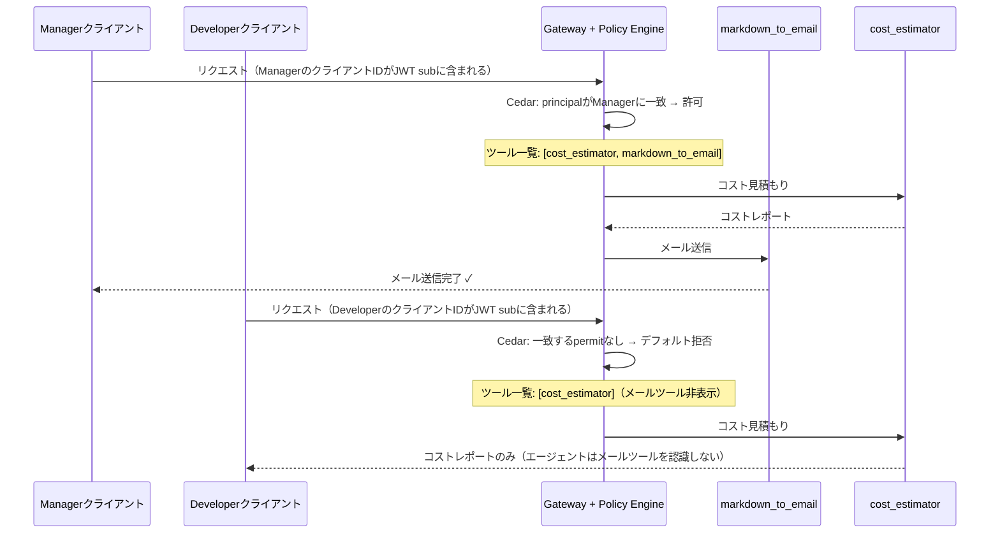

# AgentCore Policy: Cedarによるきめ細かいツールアクセス制御

[English](README.md) / [日本語](README_ja.md)

## なぜツールレベルのアクセス制御が必要か？

[07_gateway](../07_gateway/README.md) では、AWSコスト見積もりレポートをメールで送信する `markdown_to_email` ツールを構築しました。これは強力な機能ですが、リスクも伴います。エージェントを利用する **すべてのユーザー** が外部クライアントにメールを送信できてよいのでしょうか？

企業における以下のシナリオを考えてみましょう：
- **Developer（開発者）** は社内レビューや計画のためにコスト見積もりを作成する
- **Manager（マネージャー）** は見積もりをレビューし、正式な提案としてクライアントに送信する

Developerがクライアントに直接メールを送信できてはなりません — 見積もりを外部に送る権限を持つのはManagerだけです。

きめ細かい制御がなければ、Gatewayを呼び出せる認証済みユーザーは `markdown_to_email` を含む **すべてのツール** を使用できてしまいます。IAMだけではこの問題を解決できません。IAMは **AWSサービスレベル**（「このプリンシパルはGateway APIを呼び出せるか？」）で機能するものであり、**ツールレベル**（「このプリンシパルはメールツールを使えるか？」）の制御には対応していないためです。

これこそが **AgentCore Policy** が解決する問題です。

## AgentCore Policyの概要

AgentCore Policyは、Gatewayとツールの間に位置する **決定論的でCedarベースの認可レイヤー** です。確率的なガードレールとは異なり、Policyは形式的なロジックを使用してツール呼び出しレベルで許可/拒否の判断を行います。

### IAM vs AgentCore Policy

| 観点 | IAM | AgentCore Policy |
|------|-----|------------------|
| **スコープ** | AWSサービスレベルのアクセス | Gateway内のツールレベル |
| **答える問い** | 「このプリンシパルはGatewayを呼び出せるか？」 | 「このプリンシパルは *この特定のツール* を使えるか？」 |
| **言語** | JSONポリシードキュメント | Cedar（人間が読みやすく、形式的に検証可能） |
| **粒度** | APIアクション（`bedrock:InvokeModel`） | 個別ツール（`markdown_to_email`） |
| **コンテキスト** | AWSアイデンティティ、リソースタグ | OAuthスコープ、ユーザー属性、ツール入力パラメータ |
| **生成方法** | 手動またはIAM Access Analyzer | NL2Cedar（自然言語からCedarへ） |

**ポイント**: IAMとPolicyは補完関係にあります。IAMは *誰がGatewayを呼び出せるか* を制御し、Policyは *各呼び出し元がGateway内でどのツールを使えるか* を制御します。

### AgentCoreにおけるCedarポリシーの理解

#### 1. AgentCore PolicyはCedarを使用

AgentCore Policyは、AWSが開発したオープンソースのポリシー言語 **[Cedar](https://www.cedarpolicy.com/)** を使用します。Cedarは認可に特化した言語で、「このリクエストを許可すべきか？」という問いに対して決定論的かつ形式検証可能なロジックで判断します。AgentCoreはCedarをネイティブポリシー言語として採用しており、ツールレベルのアクセス制御はCedarポリシーとして記述します。

#### 2. Cedarポリシーの構造

すべてのCedarポリシーは、**効果**（`permit` または `forbid`）付きの**スコープ**と、オプションの**条件**（`when` / `unless`）で構成されます：

```cedar
permit (                           -- 効果: permit または forbid
  principal is <PrincipalType>,    -- 誰がリクエストしているか？
  action == <Action>,              -- どのツール/操作を呼び出しているか？
  resource == <Resource>           -- どのGatewayを対象としているか？
)
when {                             -- いつ: 追加条件（オプション）
  <条件式>
};
```

Cedarには2つの効果があります：
- **`permit`** — 条件が満たされた場合にアクションを許可
- **`forbid`** — アクションを拒否（常に `permit` を上書き）

デフォルトの動作は **すべて拒否** です。一致する `permit` ポリシーがなければ、すべてのツール呼び出しはブロックされます。これはセキュリティにおいて最も安全なデフォルトです。

#### 3. AgentCoreにおけるPrincipal、Action、Resourceのマッピング

Gatewayがツール呼び出しを受信すると、AgentCoreは以下の2つのソースからCedar認可リクエストを自動構築します：

1. **JWTトークン** → **principal**（誰）とその **tags**（クレーム）を決定
2. **MCPツール呼び出し** → **action**（どのツール）と **context**（ツール引数）を決定

| Cedar要素 | ソース | AgentCoreマッピング |
|:---|:---|:---|
| **principal** | JWT `sub` クレーム → エンティティID、他のクレーム → タグ | `AgentCore::OAuthUser::"<sub>"` タグ: `{ "username": "...", "role": "...", "scope": "..." }` |
| **action** | MCPツール呼び出しの `name` フィールド | `AgentCore::Action::"<TargetName>___<ToolName>"` |
| **resource** | GatewayインスタンスARN | `AgentCore::Gateway::"arn:aws:bedrock-agentcore:..."` |
| **context** | MCPツール呼び出しの `arguments` | `context.input.amount`、`context.input.orderId` など |

> **ポイント**: これらのエンティティを自分で構築する必要はありません。AgentCoreが受信したJWTを解析し、呼び出し対象のツールを特定し、Gateway ARNを取得したうえで、3つすべてをCedarエンジンに渡して評価します。
>
> **参考**: 認可フローの詳細は[Authorization Flow](https://docs.aws.amazon.com/bedrock-agentcore/latest/devguide/policy-authorization-flow.html)を参照。スコープ要素の定義は[Policy Scope](https://docs.aws.amazon.com/bedrock-agentcore/latest/devguide/policy-scope.html)を参照。条件式（`when`/`unless`句）は[Policy Conditions](https://docs.aws.amazon.com/bedrock-agentcore/latest/devguide/policy-conditions.html)を参照。

#### 4. このワークショップ: M2Mプリンシパルマッチング

このワークショップでは、Cognitoの `client_credentials` フローによる **M2M（Machine-to-Machine）OAuth** を使用します。「Manager」用と「Developer」用の2つのアプリクライアントを作成し、CedarポリシーでManagerにのみメール送信を許可します。`client_credentials` フローでは、各アプリクライアントが一意の **クライアントID** を持ち、これがJWTの `sub` クレームとしてCedarの **principal** になります。

Cedarポリシーで `principal == AgentCore::OAuthUser::"<manager_client_id>"` と指定し、Managerのみにメールツールの使用を許可します。DeveloperのクライアントIDに一致する `permit` がないため、デフォルト拒否により自動的にブロックされます。

Authorization Codeフローで `username`、`role`、`scope` などのクレームを含むJWTを利用する場合、このようなクライアント分離は不要です。

| Cedar要素 | このワークショップでのM2M値 |
|:---|:---|
| **principal** | `AgentCore::OAuthUser::"<client_id>"` — JWT `sub` クレーム、アプリクライアントごとに一意 |
| **action** | `AgentCore::Action::"AWSCostEstimatorGatewayTarget___markdown_to_email"` |
| **resource** | `AgentCore::Gateway::"arn:aws:bedrock-agentcore:...:gateway/..."` |

> **本番環境: スコープベースまたはロールベースのマッチング**
>
> ユーザー向けOAuth（Authorization Codeフロー）では、Cedar `when` 句でJWTクレームを評価し、より柔軟なアクセス制御が可能です：
> ```cedar
> // スコープベース: email-sendスコープを持つすべてのユーザーを許可
> when {
>   principal.hasTag("scope") &&
>   principal.getTag("scope") like "*email-send*"
> };
>
> // ロールベース: マネージャーのみ許可
> when {
>   principal.hasTag("role") &&
>   principal.getTag("role") == "manager"
> };
> ```
> これらのパターンはポリシーを特定のクライアントIDに依存させず、本番環境で推奨されるアプローチです。Cedar `when` 句では、ユーザーID（`principal.getTag("username")`）やツール入力パラメータ（`context.input.amount < 500`）による制限も可能です。詳細は[一般的なポリシーパターン](https://docs.aws.amazon.com/bedrock-agentcore/latest/devguide/policy-common-patterns.html)と[ポリシー例](https://docs.aws.amazon.com/bedrock-agentcore/latest/devguide/example-policies.html)を参照してください。Cedarの演算子構文については[Cedar Operators Reference](https://docs.cedarpolicy.com/policies/syntax-operators.html)を参照してください。

## プロセス概要



## 前提条件

1. **06_identity** — 完了済み（Cognitoユーザープール + OAuth2プロバイダー）
2. **07_gateway** — 完了済み（`markdown_to_email` Lambda付きMCP Gateway）
3. **AWS認証情報** — Bedrock AgentCoreおよびCognito権限付き

## 使用方法

### ファイル構成

```
08_policy/
├── README.md                # 英語ドキュメント
├── README_ja.md             # このドキュメント
├── setup_policy.py          # ポリシーエンジン、Cedarポリシー、Cognitoクライアント作成
├── test_policy.py           # ロールベースアクセスのテスト（manager vs developer）
├── clean_resources.py       # リソースクリーンアップ
└── policy_config.json       # 生成された設定（セットアップ後）
```

以下のコマンドはすべて `08_policy` ディレクトリで実行します：

```bash
cd 08_policy
```

### ステップ1: ポリシーリソースのセットアップ

```bash
uv run python setup_policy.py
```

以下を実行します：

1. **2つのM2Mアプリクライアントを作成** — ManagerとDeveloper、同じ `invoke` スコープ
2. **Gatewayの`allowedClients`を更新** — 両方の新クライアントのトークンを受け入れるように
3. **Policy Engineを作成** — Cedarポリシーのコンテナ
4. **NL2Cedarのデモ** — `StartPolicyGeneration` を使用して自然言語からCedarポリシーを生成
5. **Cedarポリシーを作成** — `markdown_to_email` をManagerのクライアントIDにのみ許可
6. **Policy EngineをGatewayにアタッチ** — `ENFORCE` モードで

### ステップ2: Developerとしてテスト（メール拒否）

```bash
uv run python test_policy.py --role developer --address you@example.com
```

DeveloperのトークンにはManagerとは異なる `sub`（クライアントID）が含まれています。CedarポリシーにはDeveloperのprincipalに一致する `permit` がないため、**デフォルト拒否** により `markdown_to_email` ツールはツール一覧に **表示されません**。エージェントはコスト見積もりを実行しますが、メールは送信できません。ログ出力のツール一覧を比較すると、`markdown_to_email` がポリシーにより除外されていることを確認できます。

### ステップ3: Managerとしてテスト（メール許可）

```bash
uv run python test_policy.py --role manager --address you@example.com
```

ManagerのトークンにはCedarポリシーで明示的に許可されたクライアントIDが含まれています。ポリシーが `principal` に一致するため、`markdown_to_email` ツールの呼び出しが **許可** されます。エージェントはコスト見積もりを実行し、結果をメールで送信します。

### ステップ4: クリーンアップ

```bash
uv run python clean_resources.py
```

## 主要な実装の詳細

### Cedarポリシー: プリンシパルベースのツールアクセス

```cedar
permit(
  principal == AgentCore::OAuthUser::"<manager_client_id>",
  action == AgentCore::Action::"AWSCostEstimatorGatewayTarget___markdown_to_email",
  resource == AgentCore::Gateway::"arn:aws:bedrock-agentcore:...:gateway/..."
);
```

このポリシーは「Managerアプリケーション（OAuthクライアントIDで識別）に、このGateway上の `markdown_to_email` ツールの呼び出しを許可する」という意味です。

`setup_policy.py` がManagerの実際のクライアントIDをポリシーに自動挿入します。DeveloperのクライアントIDに対する `permit` ポリシーがないため、デフォルト拒否により自動的にブロックされ、メールツールはDeveloperのツール一覧に表示されません。

### NL2Cedar: 自然言語からポリシー生成

AgentCore Policyの強力な機能の一つが **NL2Cedar** です。`StartPolicyGeneration` を使って、自然言語の説明からCedarポリシーを生成できます。

```python
# ポリシーの意図を自然言語で記述
nl_description = (
    "Allow users who have the email-send scope in their OAuth token "
    "to use the markdown_to_email tool on the gateway. "
    "Deny all other users from using the markdown_to_email tool."
)

# Cedarポリシーを生成
generation = policy_client.generate_policy(
    policy_engine_id=engine_id,
    name="demo_nl2cedar_generation",
    resource={"arn": gateway_arn},
    content={"rawText": nl_description},
    fetch_assets=True,
)

# 生成されたCedarステートメントを確認
for asset in generation["generatedPolicies"]:
    print(asset["definition"]["cedar"]["statement"])
```

`setup_policy.py` ではこのNL2Cedar生成をデモとして実行するため、生成されたCedarを確認できます。実際の運用では：
1. 自然言語から候補ポリシーを生成
2. 生成されたCedarをレビューし、必要に応じて調整
3. `CreatePolicy` で最終ポリシーを作成

> **ヒント**: NL2Cedarで良い結果を得るには、WHO（プリンシパル）、WHAT（ツール/アクション）、WHEN（条件）を具体的に記述してください。「アクセスを許可する」のような曖昧な記述は、過度に広いポリシーを生成します。

### Policy Engineのアタッチ

```python
gateway_client.update_gateway_policy_engine(
    gateway_identifier=gateway_id,
    policy_engine_arn=engine_arn,
    mode="ENFORCE",  # または初期ロールアウト時は "LOG_ONLY"
)
```

`LOG_ONLY` モードは初期導入時に便利です — ポリシーの評価結果はログに記録されますが、リクエストは実際にはブロックされません。問題がないことを確認できたら `ENFORCE` に切り替えます。

## ガバナンスの利点

| 利点 | 説明 |
|:---|:---|
| **デフォルト拒否** | 一致する `permit` がなければ、すべてのツール呼び出しは拒否される |
| **forbid優先** | `forbid` ポリシーは常に `permit` を上書きし、明示的なブロックリストが可能 |
| **人間が読みやすい** | Cedarポリシーは非エンジニアや監査担当者でも理解できる |
| **形式的に検証可能** | Cedarの自動推論により、過度に緩いポリシーや常に拒否するポリシーを検出可能 |
| **決定論的** | ガードレールと異なり、ポリシーの判断は確率的でない — 同じ入力には常に同じ結果 |
| **監査証跡** | ポリシーの判定結果がコンプライアンスレビュー用にログとして記録される |
| **NL2Cedar** | 自然言語から初期ポリシーを生成し、Cedarの学習コストを削減 |

## まとめ: 多層セキュリティアーキテクチャ

| レイヤー | 答える問い | 粒度 | メカニズム |
|:---|:---|:---|:---|
| **IAM** | このプリンシパルはGatewayを呼び出せるか？ | サービスレベル（粗い） | IAMポリシー |
| **AgentCore Policy (Cedar)** | このプリンシパルはこの特定のツールをこれらのパラメータで使えるか？ | ツールレベル（きめ細かい） | Cedar permit/forbidポリシー |
| **Gateway Interceptors (Lambda)** | リクエスト/レスポンスのコンテンツを変換、検証、または編集するか？ | リクエスト/レスポンスレベル | Lambda関数 |

## 参考資料

- [AgentCore Policy開発者ガイド](https://docs.aws.amazon.com/bedrock-agentcore/latest/devguide/policy.html)
- [AgentCoreにおけるCedarポリシーの理解](https://docs.aws.amazon.com/bedrock-agentcore/latest/devguide/policy-understanding-cedar.html)
- [Authorization Flow](https://docs.aws.amazon.com/bedrock-agentcore/latest/devguide/policy-authorization-flow.html)
- [Policy Scope（Principal、Action、Resource）](https://docs.aws.amazon.com/bedrock-agentcore/latest/devguide/policy-scope.html)
- [Policy Conditions（when/unless句）](https://docs.aws.amazon.com/bedrock-agentcore/latest/devguide/policy-conditions.html)
- [ポリシー例](https://docs.aws.amazon.com/bedrock-agentcore/latest/devguide/example-policies.html)
- [一般的なポリシーパターン](https://docs.aws.amazon.com/bedrock-agentcore/latest/devguide/policy-common-patterns.html)
- [Cedarポリシー言語](https://www.cedarpolicy.com/)
- [Cedar Operators Reference](https://docs.cedarpolicy.com/policies/syntax-operators.html)
- [Cedar Policy Syntax](https://docs.cedarpolicy.com/policies/syntax-policy.html)
- [Strands Agentsドキュメント](https://github.com/strands-agents/sdk-python)

---

**次のステップ**: [09_browser_use](../09_browser_use/README.md) に進んで、AgentCoreによるブラウザ自動化を体験しましょう。
