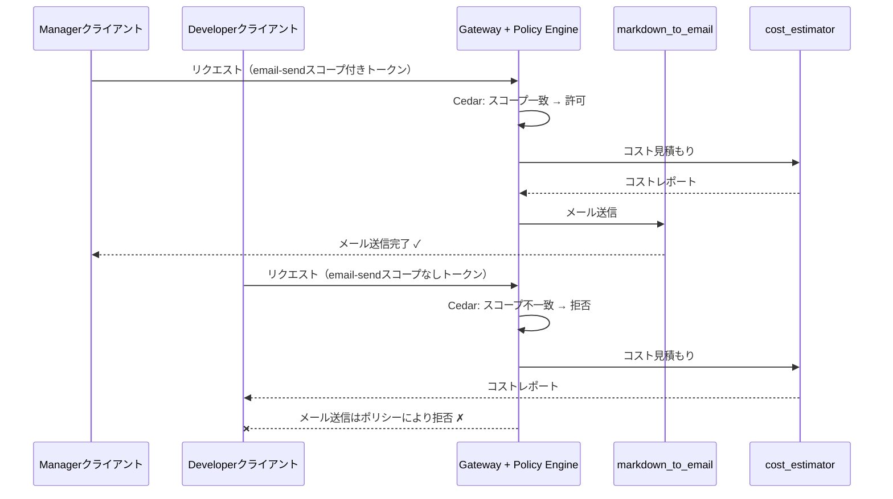

# AgentCore Policy: Cedarによるきめ細かいツールアクセス制御

[English](README.md) / [日本語](README_ja.md)

## なぜツールレベルのアクセス制御が必要か？

[07_gateway](../07_gateway/README.md) では、AWSコスト見積もりレポートをメールで送信する `markdown_to_email` ツールを構築しました。これは強力ですが、リスクもあります。エージェントの **すべてのユーザー** が外部クライアントにメールを送信できるべきでしょうか？

企業における以下のシナリオを考えてみましょう：
- **Developer（開発者）** は社内レビューや計画のためにコスト見積もりを作成する
- **Manager（マネージャー）** は見積もりをレビューし、正式な提案としてクライアントに送信する

Developerがクライアントに直接メールを送信できるべきではありません — 見積もりを外部に送信する権限を持つのはManagerのみです。

きめ細かい制御がなければ、Gatewayを呼び出せる認証済みユーザーは `markdown_to_email` を含む **すべてのツール** を使用できてしまいます。IAM単体ではこの問題を解決できません。IAMは **AWSサービスレベル**（「このプリンシパルはGateway APIを呼び出せるか？」）で動作するものであり、**ツールレベル**（「このプリンシパルはメールツールを使えるか？」）ではないからです。

これこそが **AgentCore Policy** が解決する問題です。

## AgentCore Policyの概要

AgentCore Policyは、Gatewayとツールの間に位置する **決定論的でCedarベースの認可レイヤー** です。確率的なガードレールとは異なり、Policyは形式的なロジックを使用してツール呼び出しレベルで許可/拒否の判断を行います。

### IAM vs AgentCore Policy

| 観点 | IAM | AgentCore Policy |
|------|-----|------------------|
| **スコープ** | AWSサービスレベルのアクセス | Gateway内のツールレベル |
| **答える問い** | 「このプリンシパルはGatewayを呼び出せるか？」 | 「このプリンシパルは *この特定のツール* を使えるか？」 |
| **言語** | JSONポリシードキュメント | Cedar（人間が読みやすく、形式的に検証可能） |
| **粒度** | APIアクション（`bedrock:InvokeModel`） | 個別ツール（`markdown_to_email`） |
| **コンテキスト** | AWSアイデンティティ、リソースタグ | OAuthスコープ、ユーザー属性、ツール入力パラメータ |
| **生成方法** | 手動またはIAM Access Analyzer | NL2Cedar（自然言語からCedarへ） |

**ポイント**: IAMとPolicyは補完的です。IAMは *誰がGatewayに到達できるか* を制御し、Policyは *各呼び出し元がGateway内でどのツールを使えるか* を制御します。

### Cedarポリシーの制限の種類

Cedarポリシーは複数の次元でツールアクセスを制限できます：

| 制限の種類 | Cedar式 | 例 |
|:---|:---|:---|
| **OAuthスコープ別** | `principal.getTag("scope") like "*email-send*"` | `email-send`スコープを持つクライアントのみメール送信可能 |
| **ユーザーID別** | `principal.getTag("username") == "john"` | 特定のユーザーのみ機密ツールにアクセス可能 |
| **ロール別** | `principal.getTag("role") == "manager"` | マネージャーのみ取引を承認可能 |
| **ツール入力別** | `context.input.amount < 500` | 返金額を$500未満に制限 |
| **ツール入力（文字列）** | `context.input.region == "US"` | 特定の地域でのみ操作を許可 |
| **ツール入力（集合）** | `["US","CA"].contains(context.input.country)` | 許可された国に制限 |
| **組み合わせ** | `condition1 && condition2` | 複数条件の組み合わせ |

Cedarには2つの効果があります：
- **`permit`** — 条件が満たされた場合にアクションを許可
- **`forbid`** — アクションを拒否（常に `permit` を上書き）

デフォルトの動作は **すべて拒否** です。一致する `permit` ポリシーがなければ、すべてのツール呼び出しはブロックされます。これはセキュリティにおいて最も安全なデフォルトです。

### M2M認証とPolicyの連携

このワークショップでは、Cognitoの `client_credentials` フローによる **M2M（Machine-to-Machine）OAuth** を使用しています。ここで重要な問いが生じます：*M2Mトークンでロールベースのポリシーを適用できるか？*

**M2Mトークンにはユーザーアイデンティティが含まれません**（`username` も `role` クレームもない）— アプリケーションを表すものであり、個人を表すものではありません。しかし、M2Mトークンには **OAuthスコープが含まれ**、スコープはOAuthクライアントごとに異なる設定が可能です。これを活用します：

```
Managerアプリクライアント   →  スコープ付きトークン: [invoke, email-send]
Developerアプリクライアント →  スコープ付きトークン: [invoke]
```

Cedarポリシーは `scope` クレームをチェックしてメールツールの許可を判断します。これにより、異なるスコープセットを持つ別々のOAuthクライアントとして「ロール」を効果的にモデル化しています。

> **注意**: ユーザー個人ごとのポリシー（例：「Johnは許可するがJaneは拒否する」）には、Client Credentialsの代わりに **Authorization Code** フローを使用し、各ユーザーのJWTに個別のクレーム（`username`、`role`など）を含める必要があります。ここで使用しているスコープベースのアプローチは、M2Mシナリオでチームやサービス単位のアクセス制御を行う標準的なパターンです。

## プロセス概要



## 前提条件

1. **06_identity** — 完了済み（Cognitoユーザープール + OAuth2プロバイダー）
2. **07_gateway** — 完了済み（`markdown_to_email` Lambda付きMCP Gateway）
3. **AWS認証情報** — Bedrock AgentCoreおよびCognito権限付き
4. **Python 3.12+** — async/awaitサポートに必要
5. **依存関係** — `uv`経由でインストール（pyproject.toml参照）

## 使用方法

### ファイル構成

```
08_policy/
├── README.md                # 英語ドキュメント
├── README_ja.md             # このドキュメント
├── setup_policy.py          # ポリシーエンジン、Cedarポリシー、Cognitoクライアント作成
├── test_policy.py           # ロールベースアクセスのテスト（manager vs developer）
├── clean_resources.py       # リソースクリーンアップ
└── policy_config.json       # 生成された設定（セットアップ後）
```

### ステップ1: ポリシーリソースのセットアップ

```bash
uv run python 08_policy/setup_policy.py
```

以下を実行します：

1. **Cognitoリソースサーバーを作成** — `email-send`カスタムスコープ付き
2. **2つのM2Mアプリクライアントを作成**:
   - Managerクライアント — `invoke` と `email-send` の両スコープを持つ
   - Developerクライアント — `invoke` スコープのみ
3. **Gatewayの`allowedClients`を更新** — 両方の新クライアントのトークンを受け入れるように
4. **Policy Engineを作成** — Cedarポリシーのコンテナ
5. **NL2Cedarのデモ** — `StartPolicyGeneration` を使用して自然言語からCedarポリシーを生成
6. **Cedarポリシーを作成** — `markdown_to_email` を `email-send` スコープ持ちのトークンに制限
7. **Policy EngineをGatewayにアタッチ** — `ENFORCE` モードで

### ステップ2: Developerとしてテスト（メール拒否）

```bash
uv run python 08_policy/test_policy.py --role developer --address you@example.com
```

Developerのトークンには `email-send` スコープが含まれていません。Cedarポリシーは一致する `permit` を見つけられず、**デフォルト拒否** により `markdown_to_email` ツールがツール一覧に **表示されません**。エージェントはコスト見積もりを行いますが、メールは送信できません。ログ出力のツール一覧を比較してください — `markdown_to_email` がポリシーによりフィルタリングされています。

### ステップ3: Managerとしてテスト（メール許可）

```bash
uv run python 08_policy/test_policy.py --role manager --address you@example.com
```

Managerのトークンには `email-send` スコープが含まれています。Cedarポリシーがスコープクレームを評価し、一致を検出して `markdown_to_email` ツール呼び出しを **許可** します。エージェントはコストを見積もり、クライアントにメールを送信します。

### ステップ4: クリーンアップ

```bash
uv run python 08_policy/clean_resources.py
```

## 主要な実装の詳細

### Cedarポリシー: スコープベースのツールアクセス

```cedar
permit(
  principal is AgentCore::OAuthUser,
  action == AgentCore::Action::"AWSCostEstimatorGatewayTarget__markdown_to_email",
  resource == AgentCore::Gateway::"arn:aws:bedrock-agentcore:..."
)
when {
  principal.hasTag("scope") &&
  principal.getTag("scope") like "*email-send*"
};
```

このポリシーの意味：「OAuthユーザーがこのGatewayの `markdown_to_email` ツールを呼び出すことを許可する。**ただし**、トークンのスコープに `email-send` が含まれている場合のみ。」

`email-send` スコープを持たないユーザー向けの `permit` ポリシーがないため、デフォルト拒否の動作により自動的にブロックされます。

### NL2Cedar: 自然言語からポリシー生成

AgentCore Policyの最も強力な機能の一つが **NL2Cedar** — `StartPolicyGeneration` を使用して、平易な自然言語の説明からCedarポリシーを生成する機能です。

```python
# ポリシーの意図を自然言語で記述
nl_description = (
    "Allow users who have the email-send scope in their OAuth token "
    "to use the markdown_to_email tool on the gateway. "
    "Deny all other users from using the markdown_to_email tool."
)

# Cedarポリシーを生成
generation = policy_client.generate_policy(
    policy_engine_id=engine_id,
    name="demo-nl2cedar-generation",
    resource={"arn": gateway_arn},
    content={"rawText": nl_description},
    fetch_assets=True,
)

# 生成されたCedarステートメントを確認
for asset in generation["generatedPolicies"]:
    print(asset["definition"]["cedar"]["statement"])
```

`setup_policy.py` はこれを参考用のデモとして実行し、生成されたCedarを確認できます。実際の運用では：
1. 自然言語から候補ポリシーを生成
2. 生成されたCedarをレビューし、必要に応じて調整
3. `CreatePolicy` で最終ポリシーを作成

> **ヒント**: NL2Cedarで良い結果を得るには、WHO（プリンシパル）、WHAT（ツール/アクション）、WHEN（条件）を具体的に記述してください。「アクセスを許可する」のような曖昧な記述は、過度に広いポリシーを生成します。

### Policy Engineのアタッチ

```python
gateway_client.update_gateway_policy_engine(
    gateway_identifier=gateway_id,
    policy_engine_arn=engine_arn,
    mode="ENFORCE",  # または初期ロールアウト時は "LOG_ONLY"
)
```

`LOG_ONLY` モードは初期導入時に便利です — ポリシーは評価され判断がログに記録されますが、リクエストは実際にはブロックされません。確信が持てたら `ENFORCE` に切り替えます。

## ガバナンスの利点

| 利点 | 説明 |
|:---|:---|
| **デフォルト拒否** | 一致する `permit` がなければ、すべてのツール呼び出しは拒否される |
| **forbid優先** | `forbid` ポリシーは常に `permit` を上書きし、明示的なブロックリストが可能 |
| **人間が読みやすい** | Cedarポリシーは開発者以外や監査人にも理解可能 |
| **形式的に検証可能** | Cedarは過度に許容的なポリシーや常に拒否するポリシーを検出する自動推論をサポート |
| **決定論的** | ガードレールと異なり、ポリシー判断は確率的ではない — 同じ入力は常に同じ結果 |
| **監査証跡** | ポリシー判定はコンプライアンスレビュー用にログに記録 |
| **NL2Cedar** | 自然言語から初期ポリシーを生成し、Cedarの学習コストを削減 |

## まとめ: 多層セキュリティアーキテクチャ

```
┌─────────────────────────────────────────────┐
│              IAM                             │
│  「このプリンシパルはGatewayを呼び出せるか？」    │
├─────────────────────────────────────────────┤
│         AgentCore Policy (Cedar)             │
│  「このプリンシパルはこの特定のツールを          │
│   これらの特定のパラメータで使えるか？」          │
├─────────────────────────────────────────────┤
│       Gateway Interceptors (Lambda)          │
│  「リクエスト/レスポンスのコンテンツを             │
│   プログラム的に変換、検証、または編集」          │
└─────────────────────────────────────────────┘
```

各レイヤーは異なる関心事に対応します：
- **IAM**: サービスレベルのアクセス（粗い粒度）
- **Policy**: ツールレベルの認可（きめ細かく、宣言的）
- **Interceptors**: リクエスト/レスポンスの変換（プログラム可能、PII編集やカスタム検証など）

## 参考資料

- [AgentCore Policy開発者ガイド](https://docs.aws.amazon.com/bedrock-agentcore/latest/devguide/policy.html)
- [Cedarポリシー言語](https://www.cedarpolicy.com/)
- [Strands Agentsドキュメント](https://github.com/strands-agents/sdk-python)

---

**次のステップ**: [09_browser_use](../09_browser_use/README.md) に進んで、AgentCoreによるブラウザ自動化を体験しましょう。
