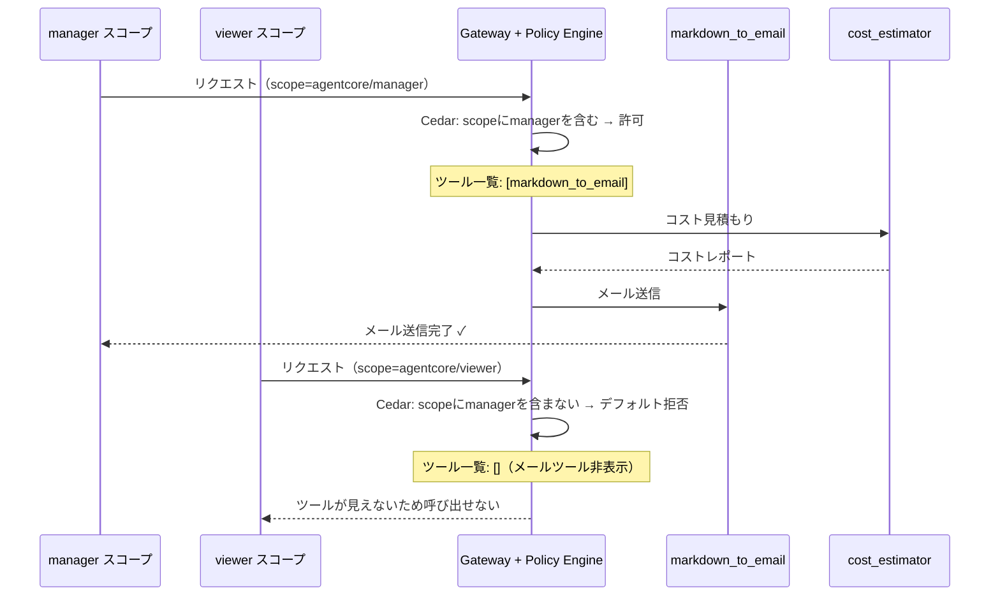

# AgentCore Policy: Cedarによるきめ細かいツールアクセス制御

[English](README.md) / [日本語](README_ja.md)

## なぜツールレベルのアクセス制御が必要か？

[07_gateway](../07_gateway/README.md) では、AWSコスト見積もりレポートをメールで送信する `markdown_to_email` ツールを構築しました。これは強力な機能ですが、リスクも伴います。エージェントを利用する **すべてのユーザー** が外部クライアントにメールを送信できてよいのでしょうか？

企業における以下のシナリオを考えてみましょう：
- **Developer（開発者）** は社内レビューや計画のためにコスト見積もりを作成する
- **Manager（マネージャー）** は見積もりをレビューし、正式な提案としてクライアントに送信する

Developerがクライアントに直接メールを送信できてはなりません — 見積もりを外部に送る権限を持つのはManagerだけです。

きめ細かい制御がなければ、Gatewayを呼び出せる認証済みユーザーは `markdown_to_email` を含む **すべてのツール** を使用できてしまいます。IAMだけではこの問題を解決できません。IAMは **AWSサービスレベル**（「このプリンシパルはGateway APIを呼び出せるか？」）で機能するものであり、**ツールレベル**（「このプリンシパルはメールツールを使えるか？」）の制御には対応していないためです。

これこそが **AgentCore Policy** が解決する問題です。

## AgentCore Policyの概要

AgentCore Policyは、Gatewayとツールの間に位置する **決定論的でCedarベースの認可レイヤー** です。確率的なガードレールとは異なり、Policyは形式的なロジックを使用してツール呼び出しレベルで許可/拒否の判断を行います。

### IAM vs AgentCore Policy

| 観点 | IAM | AgentCore Policy |
|------|-----|------------------|
| **スコープ** | AWSサービスレベルのアクセス | Gateway内のツールレベル |
| **答える問い** | 「このプリンシパルはGatewayを呼び出せるか？」 | 「このプリンシパルは *この特定のツール* を使えるか？」 |
| **言語** | JSONポリシードキュメント | Cedar（人間が読みやすく、形式的に検証可能） |
| **粒度** | APIアクション（`bedrock:InvokeModel`） | 個別ツール（`markdown_to_email`） |
| **コンテキスト** | AWSアイデンティティ、リソースタグ | OAuthスコープ、ユーザー属性、ツール入力パラメータ |
| **生成方法** | 手動またはIAM Access Analyzer | NL2Cedar（自然言語からCedarへ） |

**ポイント**: IAMとPolicyは補完関係にあります。IAMは *誰がGatewayを呼び出せるか* を制御し、Policyは *各呼び出し元がGateway内でどのツールを使えるか* を制御します。

### AgentCoreにおけるCedarポリシーの理解

#### 1. AgentCore PolicyはCedarを使用

AgentCore Policyは、AWSが開発したオープンソースのポリシー言語 **[Cedar](https://www.cedarpolicy.com/)** を使用します。Cedarは認可に特化した言語で、「このリクエストを許可すべきか？」という問いに対して決定論的かつ形式検証可能なロジックで判断します。AgentCoreはCedarをネイティブポリシー言語として採用しており、ツールレベルのアクセス制御はCedarポリシーとして記述します。

#### 2. Cedarポリシーの構造

すべてのCedarポリシーは、**効果**（`permit` または `forbid`）付きの**スコープ**と、オプションの**条件**（`when` / `unless`）で構成されます：

```cedar
permit (                           -- 効果: permit または forbid
  principal is <PrincipalType>,    -- 誰がリクエストしているか？
  action == <Action>,              -- どのツール/操作を呼び出しているか？
  resource == <Resource>           -- どのGatewayを対象としているか？
)
when {                             -- いつ: 追加条件（オプション）
  <条件式>
};
```

Cedarには2つの効果があります：
- **`permit`** — 条件が満たされた場合にアクションを許可
- **`forbid`** — アクションを拒否（常に `permit` を上書き）

デフォルトの動作は **すべて拒否** です。一致する `permit` ポリシーがなければ、すべてのツール呼び出しはブロックされます。これはセキュリティにおいて最も安全なデフォルトです。

#### 3. AgentCoreにおけるPrincipal、Action、Resourceのマッピング

Gatewayがツール呼び出しを受信すると、AgentCoreは以下の2つのソースからCedar認可リクエストを自動構築します：

1. **JWTトークン** → **principal**（誰）とその **tags**（クレーム）を決定
2. **MCPツール呼び出し** → **action**（どのツール）と **context**（ツール引数）を決定

| Cedar要素 | ソース | AgentCoreマッピング |
|:---|:---|:---|
| **principal** | JWT `sub` クレーム → エンティティID、他のクレーム → タグ | `AgentCore::OAuthUser::"<sub>"` タグ: `{ "username": "...", "role": "...", "scope": "..." }` |
| **action** | MCPツール呼び出しの `name` フィールド | `AgentCore::Action::"<TargetName>___<ToolName>"` |
| **resource** | GatewayインスタンスARN | `AgentCore::Gateway::"arn:aws:bedrock-agentcore:..."` |
| **context** | MCPツール呼び出しの `arguments` | `context.input.amount`、`context.input.orderId` など |

> **ポイント**: これらのエンティティを自分で構築する必要はありません。AgentCoreが受信したJWTを解析し、呼び出し対象のツールを特定し、Gateway ARNを取得したうえで、3つすべてをCedarエンジンに渡して評価します。
>
> **参考**: 認可フローの詳細は[Authorization Flow](https://docs.aws.amazon.com/bedrock-agentcore/latest/devguide/policy-authorization-flow.html)を参照。スコープ要素の定義は[Policy Scope](https://docs.aws.amazon.com/bedrock-agentcore/latest/devguide/policy-scope.html)を参照。条件式（`when`/`unless`句）は[Policy Conditions](https://docs.aws.amazon.com/bedrock-agentcore/latest/devguide/policy-conditions.html)を参照。

#### 4. このワークショップ: スコープベースのロールマッチング

このワークショップでは、Cognitoの `client_credentials` フローによる **M2M（Machine-to-Machine）OAuth** を使用します。「Manager」用と「Developer」用の2つのアプリクライアントを作成し、既存のCognitoリソースサーバーに **ロール固有のスコープ** を追加します：

- **Managerクライアント** — `invoke` + `manager` スコープ
- **Developerクライアント** — `invoke` + `developer` スコープ

Cedarポリシーでは `principal.getTag("scope") like "*manager*"` を使い、JWTに `manager` スコープが含まれているかを判定します。Developerのトークンには `invoke developer` しか含まれず `manager` スコープがないため、デフォルト拒否によりメール送信は自動的にブロックされます。

| Cedar要素 | このワークショップでのM2M値 |
|:---|:---|
| **principal** | `AgentCore::OAuthUser::"<client_id>"` — JWTのスコープタグ付き |
| **action** | `AgentCore::Action::"AWSCostEstimatorGatewayTarget___markdown_to_email"` |
| **resource** | `AgentCore::Gateway::"arn:aws:bedrock-agentcore:...:gateway/..."` |
| **when条件** | `principal.getTag("scope") like "*manager*"` — JWT内の `manager` スコープに一致 |

## プロセス概要


```mermaid
sequenceDiagram
    participant M as manager スコープ
    participant D as viewer スコープ
    participant GW as Gateway + Policy Engine
    participant Tool as markdown_to_email
    participant CE as cost_estimator

    M->>GW: リクエスト（scope=agentcore/manager）
    GW->>GW: Cedar: scopeにmanagerを含む → 許可
    Note over GW: ツール一覧: [markdown_to_email]
    GW->>CE: コスト見積もり
    CE-->>GW: コストレポート
    GW->>Tool: メール送信
    Tool-->>M: メール送信完了 ✓

    D->>GW: リクエスト（scope=agentcore/viewer）
    GW->>GW: Cedar: scopeにmanagerを含まない → デフォルト拒否
    Note over GW: ツール一覧: []（メールツール非表示）
    GW-->>D: ツールが見えないため呼び出せない
```

## 前提条件

1. **06_identity** — 完了済み（Cognitoユーザープール + OAuth2プロバイダー）
2. **07_gateway** — 完了済み（`markdown_to_email` Lambda付きMCP Gateway）
3. **AWS認証情報** — Bedrock AgentCoreおよびCognito権限付き
4. **AgentCore CLI** — `npm install -g @aws/agentcore`

## 使用方法

### ファイル構成

```
08_policy/
├── README.md                          # 英語ドキュメント
├── README_ja.md                       # このドキュメント
├── setup_policy_demo.py               # Cedarポリシーの生成とデモ用スコープの追加
├── policies/
│   └── email_scope.cedar.template     # Cedarポリシーのテンプレート
└── test_policy.py                     # スコープ別アクセスのテスト（manager vs viewer）
```

Policy Engine と Cedar ポリシーは `agentcore.json` に宣言し `agentcore deploy` で
作成するため、それらを作成するスクリプトは不要になりました。

以下のコマンドはすべて `08_policy` ディレクトリで実行します：

```bash
cd 08_policy
```

### ステップ1: Cedarポリシーとデモ用スコープを準備

```bash
uv run python setup_policy_demo.py
```

以下を実行します：

1. **Cedarポリシーの生成** — `policies/email_scope.cedar.template` の `__ACTION_NAME__` と
   `__GATEWAY_ARN__` を、Lab 7 のプロジェクトの `agentcore/.cli/deployed-state.json` から
   読んだ実際の値に置き換えて `policies/email_scope.cedar` を生成
2. **デモ用スコープの追加** — Cognitoのリソースサーバーに `manager` / `viewer` スコープを追加し、
   既存のアプリクライアントで両方を要求できるようにする

```
INFO: ✅ Rendered policies/email_scope.cedar
INFO: ✅ App client allowed scopes: ['agentcore/invoke', 'agentcore/manager', 'agentcore/viewer']
```

> アプリクライアントを増やすのではなく、**同じクライアントに複数のスコープを許可**しています。
> クライアントを増やすと Gateway の `allowedClients` にも追加が必要になり、Gateway の
> 再作成が発生してしまいます。

### ステップ2: Policy EngineとCedarポリシーを宣言してデプロイ

```bash
cd ../agents/MyGatewayProject

agentcore add policy-engine \
    --name cost_estimator_policy_engine \
    --attach-to-gateways AWSCostEstimatorGateway \
    --attach-mode ENFORCE

agentcore add policy \
    --name email_scope_policy \
    --engine cost_estimator_policy_engine \
    --source ../../08_policy/policies/email_scope.cedar

agentcore deploy
```

`--attach-mode` は `ENFORCE`（実際に許可/拒否を適用）と `LOG_ONLY`（記録のみのシャドーモード）を
選べます。本番導入前は `LOG_ONLY` で影響を確認してから切り替えるのが安全です。

### ステップ3: viewerスコープでテスト（メール拒否）

```bash
cd ../../08_policy
uv run python test_policy.py --scope viewer
```

`viewer` スコープのトークンには `manager` が含まれません。Cedarポリシーの条件を満たさないため、
**デフォルト拒否** により `markdown_to_email` ツールはツール一覧に **表示されません**。

```
╭─────────────────────────── Policy Effect: VIEWER ────────────────────────────╮
│ Gateway tools visible with agentcore/viewer:                                 │
│   (none)                                                                     │
│   ✗ markdown_to_email — hidden by Cedar policy                               │
│                                                                              │
│ Policy decision: DEFAULT-DENY — token scope matches no permit                │
╰──────────────────────────────────────────────────────────────────────────────╯
```

ツール一覧から消えるため、エージェントはそのツールの存在すら認識しません。

### ステップ4: managerスコープでテスト（メール許可）

```bash
uv run python test_policy.py --scope manager
```

```
╭─────────────────────────── Policy Effect: MANAGER ───────────────────────────╮
│ Gateway tools visible with agentcore/manager:                                │
│   ✓ AWSCostEstimatorGatewayTarget___markdown_to_email                        │
│                                                                              │
│ Policy decision: PERMITTED — token scope matches the Cedar policy            │
╰──────────────────────────────────────────────────────────────────────────────╯
```

引数なしで両方を続けて比較できます。`--address` を付けると実際にコスト見積りを実行して
メール送信まで行います（SESで検証済みのアドレスが必要）。

```bash
uv run python test_policy.py
uv run python test_policy.py --scope manager --address you@example.com
```

### ステップ5: クリーンアップ

```bash
uv run python clean_resources.py
```

スクリプトは 3 つのことを行います。Cognito アプリクライアントに追加したデモ用スコープを元に
戻し、Cedar ポリシーとポリシーエンジンを削除し、`agentcore deploy` で AWS に適用します。

> ポリシーエンジンはポリシーを保持している間は削除できないため、`policy` → `policy-engine`
> の順で削除する必要があります。

Gateway 自体を削除する場合は `../07_gateway/clean_resources.py --force` を実行してください。

`test_policy.py` のオプション:

| フラグ | 説明 | デフォルト |
|---|---|---|
| `--scope` | 使う OAuth スコープ (`viewer` / `manager`) | 必須 |
| `--architecture` | コスト見積り用のアーキテクチャ記述 | 既定のシナリオ |
| `--region` | AWS リージョン | プロファイルの設定 |

## 主要な実装の詳細

### Cedarポリシー: スコープベースのツールアクセス

```cedar
permit(
  principal,
  action == AgentCore::Action::"AWSCostEstimatorGatewayTarget___markdown_to_email",
  resource == AgentCore::Gateway::"arn:aws:bedrock-agentcore:...:gateway/..."
) when {
  principal.hasTag("scope") &&
  principal.getTag("scope") like "*manager*"
};
```

このポリシーは「JWTに `manager` スコープを持つ呼び出し元に、このGateway上の `markdown_to_email` ツールの呼び出しを許可する」という意味です。

アクション名は Gateway の規約により `<Target名>___<ツール名>` になります。Gateway ARN と
アクション名は `agentcore deploy` 後にしか分からないため、`setup_policy_demo.py` が
テンプレートから実際のポリシーファイルを生成します。`viewer` スコープのトークンには
`manager` が含まれないため、`when` 条件を満たさずデフォルト拒否が適用され、メールツールは
ツール一覧に表示されません。

### NL2Cedar: 自然言語からポリシー生成

AgentCore Policyの強力な機能の一つが **NL2Cedar** です。AgentCore CLI では
`agentcore add policy -g/--generate` で自然言語からCedarポリシーを生成できます。

```bash
agentcore add policy \
    --name email_scope_policy \
    --engine cost_estimator_policy_engine \
    --gateway AWSCostEstimatorGateway \
    --target AWSCostEstimatorGatewayTarget \
    -g "Allow only users whose OAuth token scope contains 'manager' to use the markdown_to_email tool"
```

`--gateway` と `--target` は Cedar のアクションスコープを決めるために使われます。

NL2Cedarは意図を表現する **相補的な2つのポリシー**（`permit` と `forbid` のペア）を生成します：

```cedar
// ポリシー1: managerスコープを持つ呼び出し元を許可
permit(principal, action == ..., resource == ...)
when { principal.hasTag("scope") && principal.getTag("scope") like "*manager*" };

// ポリシー2: managerスコープを持たない呼び出し元を明示的に拒否
forbid(principal, action == ..., resource == ...)
when { !(principal.hasTag("scope") && principal.getTag("scope") like "*manager*") };
```

AgentCoreのようなデフォルト拒否システムでは、`forbid` ポリシーは冗長です。`permit` に一致しない呼び出し元はそもそもブロックされるためです。ただしNL2Cedarは意図を明示するために両方を生成します。このラボでは意図を明確にするため手書きのCedarポリシーをファイルで管理し、`--source` で渡しています。

> **ヒント**: NL2Cedarで良い結果を得るには、WHO（プリンシパル）、WHAT（ツール/アクション）、WHEN（条件）を具体的に記述してください。「アクセスを許可する」のような曖昧な記述は、過度に広いポリシーを生成します。

### Policy Engineのアタッチ

Policy Engine は `agentcore.json` に宣言してアタッチします。`--attach-to-gateways` と
`--attach-mode` の指定は Policy Engine 側ではなく、AgentCore Gateway の
`policyEngineConfiguration` として書き込まれます。

```json
{
  "policyEngines": [
    {
      "name": "cost_estimator_policy_engine",
      "policies": [
        {
          "name": "email_scope_policy",
          "statement": "// Permit the markdown_to_email tool only for OAuth clients whose access token\n...",
          "sourceFile": "../../08_policy/policies/email_scope.cedar",
          "validationMode": "FAIL_ON_ANY_FINDINGS",
          "enforcementMode": "ACTIVE",
          "authorizationPhase": "INITIATE"
        }
      ]
    }
  ],
  "agentCoreGateways": [
    {
      "name": "AWSCostEstimatorGateway",
      "policyEngineConfiguration": {
        "policyEngineName": "cost_estimator_policy_engine",
        "mode": "ENFORCE"
      }
    }
  ]
}
```

`LOG_ONLY` モードは初期導入時に便利です — ポリシーの評価結果はログに記録されますが、リクエストは実際にはブロックされません。問題がないことを確認できたら `ENFORCE` に切り替えます。

`validationMode` は既定で `FAIL_ON_ANY_FINDINGS` です。Cedarの自動推論が過度に許容的・制限的な
記述や満たされない条件を検出した場合、デプロイが失敗します。意図的な場合は
`--validation-mode IGNORE_ALL_FINDINGS` を指定します。

## ガバナンスの利点

| 利点 | 説明 |
|:---|:---|
| **デフォルト拒否** | 一致する `permit` がなければ、すべてのツール呼び出しは拒否される |
| **forbid優先** | `forbid` ポリシーは常に `permit` を上書きし、明示的なブロックリストが可能 |
| **人間が読みやすい** | Cedarポリシーは非エンジニアや監査担当者でも理解できる |
| **形式的に検証可能** | Cedarの自動推論により、過度に緩いポリシーや常に拒否するポリシーを検出可能 |
| **決定論的** | ガードレールと異なり、ポリシーの判断は確率的でない — 同じ入力には常に同じ結果 |
| **監査証跡** | ポリシーの判定結果がコンプライアンスレビュー用にログとして記録される |
| **NL2Cedar** | 自然言語から初期ポリシーを生成し、Cedarの学習コストを削減 |
| **宣言的な管理** | Policy EngineとCedarポリシーが `agentcore.json` と `.cedar` ファイルに集約され、レビュー・バージョン管理できる |

## まとめ: 多層セキュリティアーキテクチャ

| レイヤー | 答える問い | 粒度 | メカニズム |
|:---|:---|:---|:---|
| **IAM** | このプリンシパルはGatewayを呼び出せるか？ | サービスレベル（粗い） | IAMポリシー |
| **AgentCore Policy (Cedar)** | このプリンシパルはこの特定のツールをこれらのパラメータで使えるか？ | ツールレベル（きめ細かい） | Cedar permit/forbidポリシー |
| **Gateway Interceptors (Lambda)** | リクエスト/レスポンスのコンテンツを変換、検証、または編集するか？ | リクエスト/レスポンスレベル | Lambda関数 |

## 参考資料

- [AgentCore Policy開発者ガイド](https://docs.aws.amazon.com/bedrock-agentcore/latest/devguide/policy.html)
- [AgentCoreにおけるCedarポリシーの理解](https://docs.aws.amazon.com/bedrock-agentcore/latest/devguide/policy-understanding-cedar.html)
- [Authorization Flow](https://docs.aws.amazon.com/bedrock-agentcore/latest/devguide/policy-authorization-flow.html)
- [Policy Scope（Principal、Action、Resource）](https://docs.aws.amazon.com/bedrock-agentcore/latest/devguide/policy-scope.html)
- [Policy Conditions（when/unless句）](https://docs.aws.amazon.com/bedrock-agentcore/latest/devguide/policy-conditions.html)
- [ポリシー例](https://docs.aws.amazon.com/bedrock-agentcore/latest/devguide/example-policies.html)
- [一般的なポリシーパターン](https://docs.aws.amazon.com/bedrock-agentcore/latest/devguide/policy-common-patterns.html)
- [Cedarポリシー言語](https://www.cedarpolicy.com/)
- [Cedar Operators Reference](https://docs.cedarpolicy.com/policies/syntax-operators.html)
- [Cedar Policy Syntax](https://docs.cedarpolicy.com/policies/syntax-policy.html)
- [AgentCore CLI](https://github.com/aws/agentcore-cli)
- [Strands Agentsドキュメント](https://github.com/strands-agents/sdk-python)

---

**次のステップ**: [09_browser_use](../09_browser_use/README.md) に進んで、AgentCoreによるブラウザ自動化を体験しましょう。
