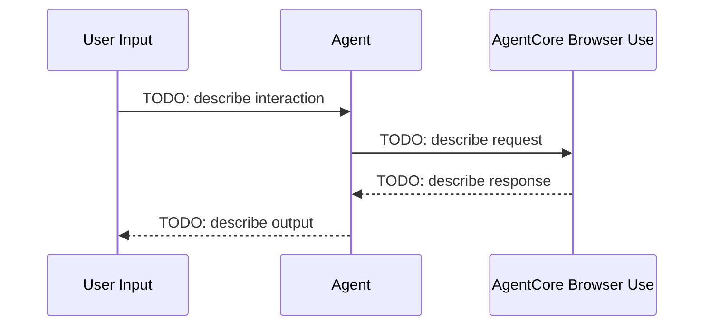

# AgentCore Browser Use Integration

[English](README.md) / [日本語](README_ja.md)

Web automation with persistent browser profiles for complex web-based workflows

## Process Overview



## Prerequisites

1. **AWS credentials** - With Bedrock AgentCore access permissions
2. **Python 3.12+** - Required for async/await support
3. **Dependencies** - Installed via `uv` (see pyproject.toml)
4. **Prior workshops** - TODO: list prerequisite workshops

## How to use

### File Structure

```
09_browser_use/
├── README.md                           # This documentation
├── README_ja.md                        # Japanese documentation
├── test_browser_use.py  # TODO: main test script
└── clean_resources.py                  # Resource cleanup
```

### Step 1: TODO: First Action

```bash
cd 09_browser_use
uv run python test_browser_use.py
```

TODO: Describe what this step does and what output to expect.

### Step 2: TODO: Second Action

```bash
cd 09_browser_use
# TODO: add command
```

TODO: Describe the second step.

## Key Implementation Pattern

### TODO: Setup Pattern

```python
# TODO: Add setup code example
pass
```

### TODO: Core Feature Pattern

```python
# TODO: Add core feature code example
pass
```

### TODO: Resource Management Pattern

```python
# TODO: Add resource management code example
pass
```

## Usage Example

```python
# TODO: Add complete working example
pass
```

## Browser Use Benefits

- TODO: Benefit 1
- TODO: Benefit 2
- TODO: Benefit 3
- TODO: Benefit 4

## References

- [AgentCore Browser Use Developer Guide](https://docs.aws.amazon.com/bedrock-agentcore/latest/devguide/)
- [Strands Agents Documentation](https://github.com/aws-samples/strands-agents)

---

**Next Steps**: Check back for more workshops coming soon.
