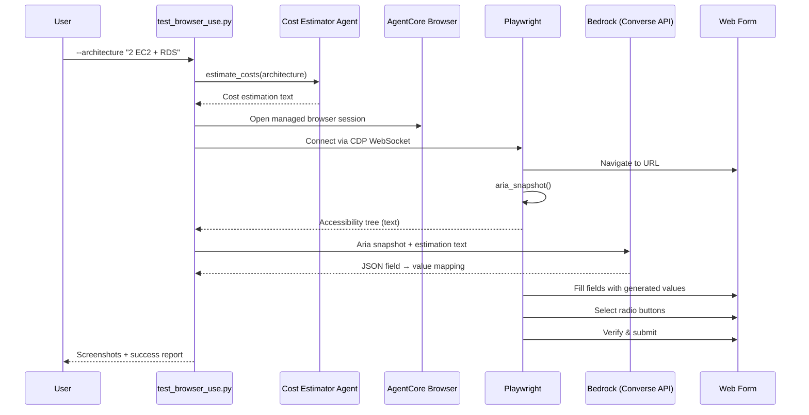

# AgentCore Browser Use

[English](README.md) / [Japanese](README_ja.md)

We have learned to connect external systems through AgentCore Identity and AgentCore Gateway. But in reality, many enterprise systems — project management tools, ticketing portals, internal dashboards, etc. — only expose **HTML forms** for data entry. There is no API, no MCP endpoint. When your AI agent produces results (like a cost estimation), how do you register them into these form-only systems?

The solution is to give our agent an AgentCore Browser. [**AgentCore Browser**](https://docs.aws.amazon.com/bedrock-agentcore/latest/devguide/browser-tool.html) is a fully managed, secure, and isolated browser environment provided by AWS. It gives AI agents the ability to open web pages, fill forms, click buttons, and take screenshots — just like a human operator.

In this workshop, you will:

1. Run the cost estimator agent (from Step 01) to generate an AWS cost estimation
2. Open a managed browser session via AgentCore Browser
3. Connect [Playwright](https://playwright.dev/) (a browser automation library) to the remote session
4. Dynamically discover form fields and use Bedrock to map estimation data to them
5. Fill and submit a web form, verifying each step with screenshots

## Process Overview



## Prerequisites

1. **Step 01 completed** — The cost estimator agent (`01_code_interpreter/`) must work
2. **IAM permissions** — AgentCore Browser and Bedrock model invocation permissions are required. See [AgentCore Browser onboarding guide](https://docs.aws.amazon.com/bedrock-agentcore/latest/devguide/browser-onboarding.html) for the required IAM policy.

## How to Use

### File Structure

```
09_browser_use/
├── README.md                  # This documentation
├── README_ja.md               # Japanese documentation
├── test_browser_use.py        # Main demo script
└── clean_resources.py         # Stop active browser sessions
```

### Step 1: Run the Script

```bash
cd 09_browser_use
uv run python test_browser_use.py \
    --architecture "2 EC2 t3.micro instances running 24/7 with an RDS MySQL db.micro"
```

This will:
1. Run the cost estimator agent to produce a cost breakdown
2. Open a managed browser session via AgentCore Browser
3. Connect Playwright to the remote browser via CDP (Chrome DevTools Protocol)
4. Navigate to the form and capture its aria snapshot (accessibility tree)
5. Send the aria snapshot to Bedrock to discover form field names
6. Send the field names + estimation text to Bedrock to generate appropriate values
7. Fill each text field, select the appropriate radio button, and verify all values
8. Submit the form and save screenshots at every step

You can customize the run with additional options:

| Flag | Description | Default |
|------|-------------|---------|
| `--architecture` | Architecture description for cost estimation | ALB + 2 EC2 + RDS |
| `--url` | Form URL to fill | `https://pulse.aws/survey/QBRDHJJC` |
| `--signature` | Your signature to identify the submission | — |
| `--region` | AWS region | boto3 session default |

### Step 2: Watch the Browser Live

While the script runs, you can watch the browser session in real-time:

1. Open the [AgentCore Browser Console](https://us-east-1.console.aws.amazon.com/bedrock-agentcore/builtInTools)
2. Navigate to **Built-in tools** in the left navigation
3. Select the Browser tool
4. In **Browser sessions**, find your active session (status: **Ready**)
5. Click **View live session** to watch Playwright interact with the form

### Step 3: Clean Up Sessions

Browser sessions auto-expire after the configured timeout, but you can stop them immediately:

```bash
cd 09_browser_use
uv run python clean_resources.py
```

## Key Implementation Patterns

### Connecting Playwright to AgentCore Browser

[Playwright](https://playwright.dev/) is an open-source browser automation library that supports programmatic control of browsers via the Chrome DevTools Protocol (CDP). AgentCore Browser exposes a CDP WebSocket endpoint, which means Playwright can connect to the remote managed browser session as if it were a local browser.

The [`bedrock-agentcore`](https://pypi.org/project/bedrock-agentcore/) SDK provides the `browser_session` context manager that handles session creation and cleanup. You obtain the WebSocket URL and SigV4 authentication headers, then pass them to Playwright's `connect_over_cdp()`:

```python
from bedrock_agentcore.tools.browser_client import browser_session
from playwright.sync_api import sync_playwright

with browser_session(region) as client:
    ws_url, headers = client.generate_ws_headers()

    with sync_playwright() as pw:
        browser = pw.chromium.connect_over_cdp(ws_url, headers=headers)
        page = browser.contexts[0].pages[0]
        page.goto("https://example.com")
```

For more details, see [Using AgentCore Browser with other libraries](https://docs.aws.amazon.com/bedrock-agentcore/latest/devguide/browser-building-agents.html).

### Dynamic Field Discovery with Aria Snapshots

Instead of hardcoding form field names, the script discovers fields at runtime using Playwright's `aria_snapshot()`. This captures the page's accessibility tree as readable text, then sends it to Bedrock along with the estimation data. Bedrock returns a structured JSON mapping of exact field names to appropriate values:

```python
# 1. Capture the accessibility tree as text
form_snapshot = page.locator("body").aria_snapshot()
# → "- textbox "Title of target system"
#    - textbox "Estimation detail : service name and cost"
#    - radiogroup "AWS Services":
#      - radio "Amazon EC2"
#      - radio "Amazon RDS"  ..."

# 2. Send snapshot + estimation to Bedrock → get field-value mapping
form_values = generate_form_values(estimation_text, form_snapshot, region)
# → {"textboxes": {"Title of target system": "Simple Web Application",
#                   "Total monthly cost": "$137.44", ...},
#    "radios": {"Amazon EC2": true}}
```

This approach works with **any form** — if the form layout changes or new fields are added, the script adapts automatically without code changes.

## Next Steps

Congratulations! You have completed all steps of the AgentCore onboarding workshop. Here is what you have learned:

| Step | Topic | What You Learned |
|------|-------|------------------|
| 01 | Code Interpreter | Building an AI agent with tool use |
| 02 | Runtime | Deploying an agent to AgentCore Runtime |
| 03 | Memory | Adding short-term and long-term memory |
| 04 | Observability | Monitoring with CloudWatch |
| 05 | Evaluation | Measuring agent quality |
| 06 | Identity | Securing agents with OAuth2 authentication |
| 07 | Gateway | Connecting agents to external services via MCP |
| 08 | Policy | Fine-grained access control with Cedar policies |
| 09 | Browser Use | Automating web forms with AgentCore Browser |

To explore further:
- [Session recording and replay](https://docs.aws.amazon.com/bedrock-agentcore/latest/devguide/browser-session-replay.html) for debugging browser sessions
- [AgentCore Developer Guide](https://docs.aws.amazon.com/bedrock-agentcore/latest/devguide/) for the full documentation
- [Strands Agents](https://strandsagents.com/) for building more sophisticated agents

Return to the [workshop overview](../README.md).
