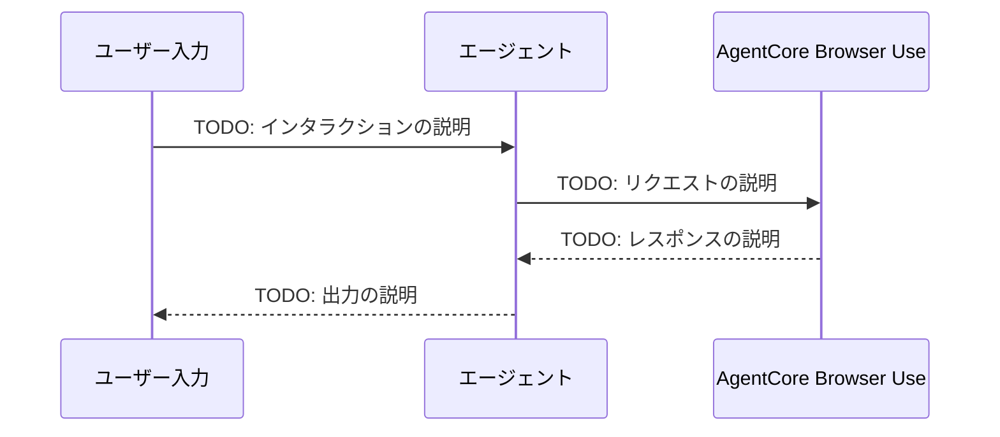

# AgentCore Browser Use統合

[English](README.md) / [日本語](README_ja.md)

Web automation with persistent browser profiles for complex web-based workflows

## プロセス概要



## 前提条件

1. **AWS認証情報** - Bedrock AgentCoreアクセス権限付き
2. **Python 3.12+** - async/awaitサポートに必要
3. **依存関係** - `uv`経由でインストール（pyproject.toml参照）
4. **前提ワークショップ** - TODO: 前提となるワークショップを記載

## 使用方法

### ファイル構成

```
09_browser_use/
├── README.md                           # 英語ドキュメント
├── README_ja.md                        # このドキュメント
├── test_browser_use.py  # TODO: メインテストスクリプト
└── clean_resources.py                  # リソースクリーンアップ
```

### ステップ1: TODO: 最初のアクション

```bash
cd 09_browser_use
uv run python test_browser_use.py
```

TODO: このステップの内容と期待される出力を説明します。

### ステップ2: TODO: 2番目のアクション

```bash
cd 09_browser_use
# TODO: コマンドを追加
```

TODO: 2番目のステップを説明します。

## 主要な実装パターン

### TODO: セットアップパターン

```python
# TODO: セットアップコードの例を追加
pass
```

### TODO: コア機能パターン

```python
# TODO: コア機能コードの例を追加
pass
```

### TODO: リソース管理パターン

```python
# TODO: リソース管理コードの例を追加
pass
```

## 使用例

```python
# TODO: 完全な動作例を追加
pass
```

## Browser Useの利点

- TODO: 利点1
- TODO: 利点2
- TODO: 利点3
- TODO: 利点4

## 参考資料

- [AgentCore Browser Use開発者ガイド](https://docs.aws.amazon.com/bedrock-agentcore/latest/devguide/)
- [Strands Agentsドキュメント](https://github.com/aws-samples/strands-agents)

---

**次のステップ**: 今後のワークショップにご期待ください。
