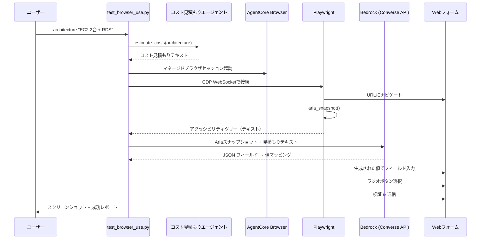

# AgentCore Browser Use

[English](README.md) / [日本語](README_ja.md)

## 課題

多くの企業システム — プロジェクト管理ツール、チケットポータル、社内ダッシュボード — はデータ入力に **HTMLフォーム** しか提供していません。プログラムから連携するためのAPI、MCPエンドポイント、Gatewayはありません。AIエージェントが結果（コスト見積もりなど）を生成したとき、このようなフォームのみのシステムにどうやって登録すればよいでしょうか？

## 解決策: AgentCore Browser

[**AgentCore Browser**](https://docs.aws.amazon.com/bedrock-agentcore/latest/devguide/browser-tool.html) は、AWSが提供するフルマネージドでセキュアな分離ブラウザ環境です。AIエージェントがWebページを開き、フォームを入力し、ボタンをクリックし、スクリーンショットを撮影できます — 人間と同じように — すべてクラウド上のコンテナ化されたセッションで実行されます。

このワークショップでは:
1. コスト見積もりエージェント（ステップ01）を実行してAWSコスト見積もりを生成
2. AgentCore Browser経由でマネージドブラウザセッションを起動
3. [Playwright](https://playwright.dev/)（ブラウザ自動化ライブラリ）をリモートセッションに接続
4. フォームフィールドを動的に発見し、Bedrockで見積もりデータをマッピング
5. Webフォームを入力・送信し、各ステップをスクリーンショットで検証

## プロセス概要



## 前提条件

1. **ステップ01完了** — コスト見積もりエージェント（`01_code_interpreter/`）が動作すること
2. **IAM権限** — AgentCore BrowserとBedrockモデル呼び出しの権限が必要です。必要なIAMポリシーは[AgentCore Browserオンボーディングガイド](https://docs.aws.amazon.com/bedrock-agentcore/latest/devguide/browser-onboarding.html)を参照してください。

## 使用方法

### ファイル構成

```
09_browser_use/
├── README.md                  # 英語ドキュメント
├── README_ja.md               # このドキュメント
├── test_browser_use.py        # メインデモスクリプト
└── clean_resources.py         # アクティブなブラウザセッションの停止
```

### ステップ1: スクリプトの実行

```bash
cd 09_browser_use
uv run python test_browser_use.py \
    --architecture "EC2 t3.micro 2台を24時間稼働、RDS MySQL db.micro"
```

実行内容:
1. コスト見積もりエージェントがコスト内訳を生成
2. AgentCore Browser経由でマネージドブラウザセッションを起動
3. PlaywrightがCDP（Chrome DevTools Protocol）経由でリモートブラウザに接続
4. フォームに移動し、Ariaスナップショット（アクセシビリティツリー）を取得
5. AriaスナップショットをBedrockに送信してフォームフィールド名を発見
6. フィールド名 + 見積もりテキストをBedrockに送信して適切な値を生成
7. 各テキストフィールドを入力し、適切なラジオボタンを選択し、全値を検証
8. フォームを送信し、各ステップでスクリーンショットを保存

追加オプションで実行をカスタマイズできます:

| フラグ | 説明 | デフォルト |
|--------|------|-----------|
| `--architecture` | コスト見積もり用のアーキテクチャ記述 | ALB + EC2 2台 + RDS |
| `--url` | 入力するフォームURL | `https://pulse.aws/survey/QBRDHJJC` |
| `--signature` | 送信を識別するシグネチャ | — |
| `--region` | AWSリージョン | boto3セッションのデフォルト |

### ステップ2: ブラウザのライブビュー

スクリプト実行中、リアルタイムでブラウザセッションを確認できます:

1. [AgentCore Browserコンソール](https://us-east-1.console.aws.amazon.com/bedrock-agentcore/builtInTools)を開く
2. 左ナビゲーションの **Built-in tools** に移動
3. Browserツールを選択
4. **Browser sessions** でアクティブなセッション（ステータス: **Ready**）を確認
5. **View live session** をクリックしてPlaywrightのフォーム操作を観察

### ステップ3: セッションのクリーンアップ

ブラウザセッションは設定されたタイムアウト後に自動期限切れになりますが、即座に停止できます:

```bash
cd 09_browser_use
uv run python clean_resources.py
```

## 主要な実装パターン

### PlaywrightをAgentCore Browserに接続

[Playwright](https://playwright.dev/) は、Chrome DevTools Protocol（CDP）を介してブラウザをプログラム制御できるオープンソースのブラウザ自動化ライブラリです。AgentCore BrowserはCDP WebSocketエンドポイントを公開しているため、Playwrightはリモートのマネージドブラウザセッションにローカルブラウザと同様に接続できます。

[`bedrock-agentcore`](https://pypi.org/project/bedrock-agentcore/) SDKの `browser_session` コンテキストマネージャーがセッションの作成とクリーンアップを処理します。WebSocket URLとSigV4認証ヘッダーを取得し、Playwrightの `connect_over_cdp()` に渡します:

```python
from bedrock_agentcore.tools.browser_client import browser_session
from playwright.sync_api import sync_playwright

with browser_session(region) as client:
    ws_url, headers = client.generate_ws_headers()

    with sync_playwright() as pw:
        browser = pw.chromium.connect_over_cdp(ws_url, headers=headers)
        page = browser.contexts[0].pages[0]
        page.goto("https://example.com")
```

詳細は[AgentCore Browserと他のライブラリの併用](https://docs.aws.amazon.com/bedrock-agentcore/latest/devguide/browser-building-agents.html)を参照してください。

### Ariaスナップショットによる動的フィールド発見

フォームフィールド名をハードコードする代わりに、Playwrightの `aria_snapshot()` で実行時にフィールドを発見します。ページのアクセシビリティツリーを可読テキストとして取得し、見積もりデータとともにBedrockに送信します。Bedrockは正確なフィールド名と適切な値の構造化JSONマッピングを返します:

```python
# 1. アクセシビリティツリーをテキストとして取得
form_snapshot = page.locator("body").aria_snapshot()
# → "- textbox "Title of target system"
#    - textbox "Estimation detail : service name and cost"
#    - radiogroup "AWS Services":
#      - radio "Amazon EC2"
#      - radio "Amazon RDS"  ..."

# 2. スナップショット + 見積もりをBedrockに送信 → フィールド値マッピングを取得
form_values = generate_form_values(estimation_text, form_snapshot, region)
# → {"textboxes": {"Title of target system": "Simple Web Application",
#                   "Total monthly cost": "$137.44", ...},
#    "radios": {"Amazon EC2": true}}
```

このアプローチは**任意のフォーム**に対応します — フォームレイアウトが変更されたり新しいフィールドが追加されても、コード変更なしで自動的に適応します。

## 次のステップ

おめでとうございます！AgentCoreオンボーディングワークショップの全ステップを完了しました。学んだ内容の一覧です:

| ステップ | トピック | 学んだ内容 |
|----------|----------|------------|
| 01 | Code Interpreter | ツール使用によるAIエージェントの構築 |
| 02 | Runtime | AgentCore Runtimeへのエージェントデプロイ |
| 03 | Memory | 短期・長期メモリの追加 |
| 04 | Observability | CloudWatchによるモニタリング |
| 05 | Evaluation | エージェント品質の測定 |
| 06 | Identity | OAuth2認証によるエージェントのセキュリティ |
| 07 | Gateway | MCP経由で外部サービスに接続 |
| 08 | Policy | Cedarポリシーによるきめ細かなアクセス制御 |
| 09 | Browser Use | AgentCore Browserによるフォーム自動化 |

さらに探求するために:
- [セッション録画・再生](https://docs.aws.amazon.com/bedrock-agentcore/latest/devguide/browser-session-replay.html) — ブラウザセッションのデバッグ用
- [AgentCore開発者ガイド](https://docs.aws.amazon.com/bedrock-agentcore/latest/devguide/) — 完全なドキュメント
- [Strands Agents](https://strandsagents.com/) — より高度なエージェントの構築

[ワークショップ概要](../README.md)に戻る。
