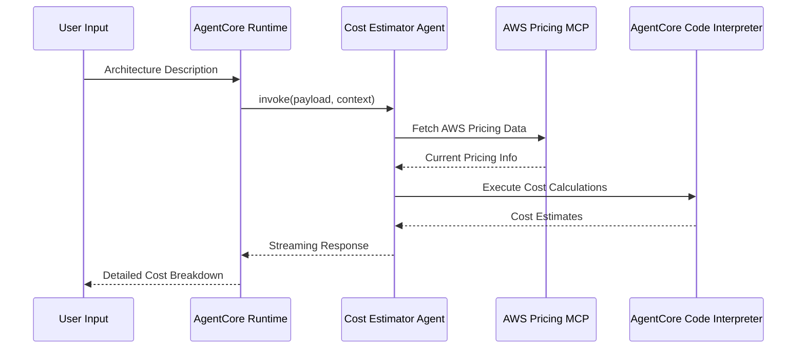

# AgentCore Cost Estimator Agent

[English](README.md) / [日本語](README_ja.md)

A secure AWS cost estimation agent deployed on AgentCore Runtime. Combines real-time AWS pricing data via MCP with sandboxed Python execution via AgentCore Code Interpreter to provide accurate cost estimates for system architectures.

## Process Overview



## Prerequisites

1. **AWS credentials** — With Bedrock access permissions
2. **Python 3.12+** — Required for async/await support
3. **Node.js** — Required for CDK (used by `agentcore deploy`)
4. **AgentCore CLI** — `npm install -g @aws/agentcore@preview`
5. **uv** — Python package manager

## Directory Structure

```
CostEstimatorAgent/app/CostEstimatorAgent/
├── main.py                     # Runtime entrypoint
├── cost_estimator_agent.py     # Agent as Cost Estimator Agent (AWSCostEstimatorAgent class)
├── config.py                   # Prompts and model configuration
├── __init__.py                 # Package initialization
└── pyproject.toml              # Python dependencies
```

## How to Use

### Deploy to AWS

```bash
# 1. Generate scaffold with agentcore create
cd agents/
agentcore create \
    --name MyCostEstimatorAgent \
    --framework Strands \
    --model-provider Bedrock \
    --protocol HTTP \
    --build CodeZip \
    --memory none \
    --skip-git

# 2. Setup agent code and configure policies
python setup.py --source CostEstimatorAgent --target MyCostEstimatorAgent

# 4. Install dependencies
cd app/MyCostEstimatorAgent
uv sync

# 5. Deploy
cd ../..
agentcore deploy

# 6. Invoke
agentcore invoke '{"prompt": "Estimate monthly cost for one EC2 t3.micro running 24/7 in us-west-2"}'
```

### Local Development

After running `agentcore create` and copying agent code, test locally without deploying:

```bash
cd MyCostEstimatorAgent/app/MyCostEstimatorAgent
uv sync
cd ../..
agentcore dev
```

## Key Implementation Patterns

### Facade/Singleton Pattern

```python
_agent = None

def get_or_create_agent() -> AWSCostEstimatorAgent:
    """Get or create the cost estimation agent (singleton).

    AWSCostEstimatorAgent is the facade that owns model, tools, and MCP client.
    Creating it once avoids repeated MCP connection and model initialization.
    """
    global _agent
    if _agent is None:
        _agent = AWSCostEstimatorAgent(region=REGION)
    return _agent
```

### AWSCostEstimatorAgent Initialization (Facade)

```python
def _initialize(self) -> None:
    """Initialize all components: Code Interpreter, MCP client, Agent.

    Facade responsibility: builds everything in one place to avoid
    implicit dependencies on external module-level state.
    """
    tools = [self._make_execute_cost_calculation_tool()]

    # MCP Pricing — graceful fallback if unavailable (e.g. Runtime uvx restriction)
    pricing_tools = self._setup_mcp_pricing()
    tools.extend(pricing_tools)

    # Code Interpreter session
    self._setup_code_interpreter()

    # Strands Agent
    self._agent = Agent(
        model=self._load_model(),
        system_prompt=SYSTEM_PROMPT,
        tools=tools,
    )
```

### Secure Code Execution Tool

```python
@tool
def execute_cost_calculation(calculation_code: str, description: str = "") -> str:
    """Execute cost calculations using AgentCore Code Interpreter."""
    code_interpreter = agent_instance._code_interpreter
    if not code_interpreter:
        return "❌ Code Interpreter not initialized"

    try:
        response = code_interpreter.invoke("executeCode", {
            "language": "python",
            "code": calculation_code,
        })

        results = []
        for event in response.get("stream", []):
            if "result" in event:
                result = event["result"]
                if "content" in result:
                    for item in result["content"]:
                        if item.get("type") == "text":
                            results.append(item["text"])
        return "\n".join(results)
    except Exception as e:
        return f"❌ Calculation failed: {e}"
```

### MCP Client with Graceful Fallback

```python
def _setup_mcp_pricing(self) -> list:
    """Attempt to start AWS Pricing MCP client. Returns tool list (may be empty)."""
    try:
        aws_credentials = self._get_aws_credentials()
        env_vars = {"FASTMCP_LOG_LEVEL": "ERROR", **aws_credentials}

        uvx_path = shutil.which("uvx")
        if not uvx_path:
            from uv._find_uv import find_uv_bin
            uv_bin = find_uv_bin()
            uvx_path = os.path.join(os.path.dirname(uv_bin), "uvx")

        uvx_path = self._ensure_executable(uvx_path)

        self._pricing_client = MCPClient(
            lambda: stdio_client(StdioServerParameters(
                command=uvx_path,
                args=["awslabs.aws-pricing-mcp-server@latest"],
                env=env_vars,
            ))
        )
        self._pricing_client.start()
        pricing_tools = self._pricing_client.list_tools_sync()
        logger.info(f"✅ AWS Pricing MCP: {len(pricing_tools)} tools loaded")
        return pricing_tools

    except Exception as e:
        logger.warning(f"⚠️ MCP Pricing tools unavailable: {e}")
        self._pricing_client = None
        return []
```

### Streaming with Delta Handling

```python
@app.entrypoint
async def invoke(payload, context):
    """AgentCore Runtime entrypoint with streaming response."""
    user_input = payload.get("prompt")
    prompt = COST_ESTIMATION_PROMPT.format(architecture_description=user_input)

    agent = get_or_create_agent()

    try:
        previous_output = ""

        async for event in agent.stream(prompt):
            if "data" in event:
                current_chunk = str(event["data"])

                # Handle delta calculation following Bedrock best practices
                if current_chunk.startswith(previous_output):
                    delta_content = current_chunk[len(previous_output):]
                    if delta_content:
                        previous_output = current_chunk
                        yield delta_content
                else:
                    previous_output = current_chunk
                    yield current_chunk
    except Exception as e:
        yield f"❌ Streaming cost estimation failed: {e}"
```

## Security Benefits

- **Sandboxed execution** — Code runs in a secure AgentCore environment
- **No local code execution** — All calculations performed in AWS sandbox
- **Resource isolation** — Each calculation runs in an isolated session

## References

- [AgentCore Code Interpreter Developer Guide](https://docs.aws.amazon.com/bedrock-agentcore/latest/devguide/code-interpreter.html)
- [AgentCore Runtime Developer Guide](https://docs.aws.amazon.com/bedrock-agentcore/latest/devguide/runtime.html)
- [AWS Pricing MCP Server](https://github.com/awslabs/aws-pricing-mcp-server)
- [Strands Agents Documentation](https://github.com/strands-agents/sdk-python)
