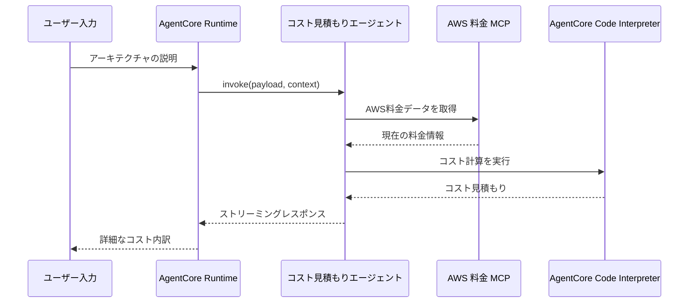

# AgentCore コスト見積もりエージェント

[English](README.md) / [日本語](README_ja.md)

AgentCore Runtime 上で動作するセキュアな AWS コスト見積もりエージェントです。MCP 経由のリアルタイム AWS 料金データと、AgentCore Code Interpreter によるサンドボックス化された Python 実行を組み合わせて、システムアーキテクチャの正確なコスト見積もりを提供します。

## プロセス概要



## 前提条件

1. **AWS 認証情報** — Bedrock のアクセス権限付き
2. **Python 3.12+** — async/await サポートに必要
3. **Node.js** — CDK に必要（`agentcore deploy` で使用）
4. **AgentCore CLI** — `npm install -g @aws/agentcore@preview`
5. **uv** — Python パッケージマネージャー

## ディレクトリ構成

```
CostEstimatorAgent/app/CostEstimatorAgent/
├── main.py                     # Runtime エントリポイント
├── cost_estimator_agent.py     # コスト見積もりエージェント (AWSCostEstimatorAgent クラス)
├── config.py                   # プロンプトとモデル設定
├── __init__.py                 # パッケージ初期化
└── pyproject.toml              # Python 依存関係
```

## 使用方法

### AWS へデプロイ

```bash
# 1. agentcore create で雛形生成
cd agents/
agentcore create \
    --name MyCostEstimatorAgent \
    --framework Strands \
    --model-provider Bedrock \
    --protocol HTTP \
    --build CodeZip \
    --memory none \
    --skip-git

# 2. エージェントコードのセットアップとポリシー設定
python setup.py --source CostEstimatorAgent --target MyCostEstimatorAgent

# 4. 依存関係をインストール
cd app/MyCostEstimatorAgent
uv sync

# 5. デプロイ
cd ../..
agentcore deploy

# 6. 呼び出し
agentcore invoke '{"prompt": "us-west-2 で EC2 t3.micro を1台24時間365日稼働した場合の月額コストを見積もってください"}'
```

### ローカル開発

`agentcore create` とエージェントコードのコピー後、デプロイせずにローカルで動作確認する場合：

```bash
cd MyCostEstimatorAgent/app/MyCostEstimatorAgent
uv sync
cd ../..
agentcore dev
```

## 主要な実装パターン

### Facade/Singleton パターン

```python
_agent = None

def get_or_create_agent() -> AWSCostEstimatorAgent:
    """Get or create the cost estimation agent (singleton).

    AWSCostEstimatorAgent is the facade that owns model, tools, and MCP client.
    Creating it once avoids repeated MCP connection and model initialization.
    """
    global _agent
    if _agent is None:
        _agent = AWSCostEstimatorAgent(region=REGION)
    return _agent
```

### AWSCostEstimatorAgent 初期化（facade）

```python
def _initialize(self) -> None:
    """Initialize all components: Code Interpreter, MCP client, Agent.

    Facade responsibility: builds everything in one place to avoid
    implicit dependencies on external module-level state.
    """
    tools = [self._make_execute_cost_calculation_tool()]

    # MCP Pricing — graceful fallback if unavailable (e.g. Runtime uvx restriction)
    pricing_tools = self._setup_mcp_pricing()
    tools.extend(pricing_tools)

    # Code Interpreter session
    self._setup_code_interpreter()

    # Strands Agent
    self._agent = Agent(
        model=self._load_model(),
        system_prompt=SYSTEM_PROMPT,
        tools=tools,
    )
```

### セキュアなコード実行ツール

```python
@tool
def execute_cost_calculation(calculation_code: str, description: str = "") -> str:
    """Execute cost calculations using AgentCore Code Interpreter."""
    code_interpreter = agent_instance._code_interpreter
    if not code_interpreter:
        return "❌ Code Interpreter not initialized"

    try:
        response = code_interpreter.invoke("executeCode", {
            "language": "python",
            "code": calculation_code,
        })

        results = []
        for event in response.get("stream", []):
            if "result" in event:
                result = event["result"]
                if "content" in result:
                    for item in result["content"]:
                        if item.get("type") == "text":
                            results.append(item["text"])
        return "\n".join(results)
    except Exception as e:
        return f"❌ Calculation failed: {e}"
```

### MCP クライアントのグレースフルフォールバック

```python
def _setup_mcp_pricing(self) -> list:
    """Attempt to start AWS Pricing MCP client. Returns tool list (may be empty)."""
    try:
        aws_credentials = self._get_aws_credentials()
        env_vars = {"FASTMCP_LOG_LEVEL": "ERROR", **aws_credentials}

        uvx_path = shutil.which("uvx")
        if not uvx_path:
            from uv._find_uv import find_uv_bin
            uv_bin = find_uv_bin()
            uvx_path = os.path.join(os.path.dirname(uv_bin), "uvx")

        uvx_path = self._ensure_executable(uvx_path)

        self._pricing_client = MCPClient(
            lambda: stdio_client(StdioServerParameters(
                command=uvx_path,
                args=["awslabs.aws-pricing-mcp-server@latest"],
                env=env_vars,
            ))
        )
        self._pricing_client.start()
        pricing_tools = self._pricing_client.list_tools_sync()
        logger.info(f"✅ AWS Pricing MCP: {len(pricing_tools)} tools loaded")
        return pricing_tools

    except Exception as e:
        logger.warning(f"⚠️ MCP Pricing tools unavailable: {e}")
        self._pricing_client = None
        return []
```

### デルタハンドリングを使用したストリーミング

```python
@app.entrypoint
async def invoke(payload, context):
    """AgentCore Runtime entrypoint with streaming response."""
    user_input = payload.get("prompt")
    prompt = COST_ESTIMATION_PROMPT.format(architecture_description=user_input)

    agent = get_or_create_agent()

    try:
        previous_output = ""

        async for event in agent.stream(prompt):
            if "data" in event:
                current_chunk = str(event["data"])

                # Handle delta calculation following Bedrock best practices
                if current_chunk.startswith(previous_output):
                    delta_content = current_chunk[len(previous_output):]
                    if delta_content:
                        previous_output = current_chunk
                        yield delta_content
                else:
                    previous_output = current_chunk
                    yield current_chunk
    except Exception as e:
        yield f"❌ Streaming cost estimation failed: {e}"
```

## セキュリティの利点

- **サンドボックス実行** - コードはセキュアな AgentCore 環境で実行
- **ローカルコード実行なし** - すべての計算は AWS サンドボックスで実行
- **リソース分離** - 各計算は分離されたセッションで実行

## 参考資料

- [AgentCore Code Interpreter Developer Guide](https://docs.aws.amazon.com/bedrock-agentcore/latest/devguide/code-interpreter.html)
- [AgentCore Runtime Developer Guide](https://docs.aws.amazon.com/bedrock-agentcore/latest/devguide/runtime.html)
- [AWS Pricing MCP Server](https://github.com/awslabs/aws-pricing-mcp-server)
- [Strands Agents Documentation](https://github.com/strands-agents/sdk-python)
